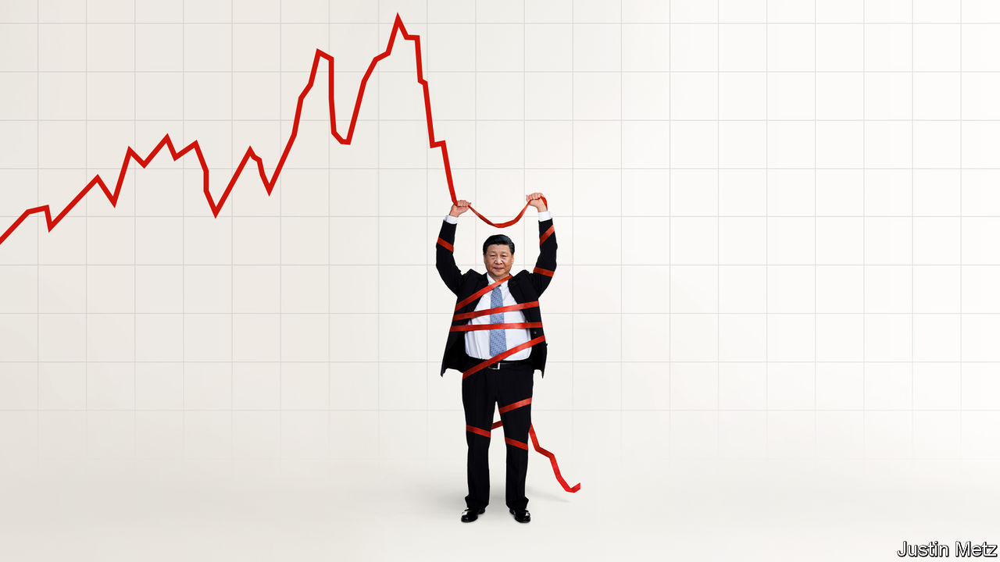

###### China’s confidence shock

# Can Xi Jinping win back the markets? 

##### As a property crisis drags the economy into deflation, confidence is seeping away 

 

> Feb 8th 2024 

ThIS YEAR investors in  have been on a hair-raising ride. Even as America’s S&amp;P 500 index reached record highs, markets in China and Hong Kong shed $1.5trn in January alone. Retail investors have taken to Chinese social media to  So brutal was the slump that on February 6th China’s president, Xi Jinping, was reportedly to be briefed; the next day Yi Huiman, the head of China’s securities regulator, was sacked. Prices recovered a little as state firms began buying stocks. In the coming days they may rise further still. 

Step back, though, and there is no mistaking the dismal bigger picture. The market value of China’s and Hong Kong’s equities is down by nearly $7trn since its peak in 2021—a fall of around 35%, even as that of America’s stocks has risen by 14%, and India’s by 60%. The decline signals a fundamental problem. Investors abroad and at home once saw China’s government as a dependable steward of the economy. Now this trust has seeped away, with severe consequences for China’s growth. 

Less than a decade ago the mood in China’s markets was ebullient. Foreign investors were eager to tap into the potential of the world’s rising economic star. China was expanding at a steady and impressive clip of over 6% a year. Foreign portfolio investment rushed in as offshore investors were given direct access to Chinese stocks via Hong Kong in 2014. Four years later msci, a financial firm, began including mainland stocks in its global indices. China’s government, for its part, hoped to professionalise its markets in order to attract foreign capital and expertise, and to build an asset class to supplant property. A cohort of wealthy businesspeople and investors were emerging who had been exhorted by Mr Xi himself to live the China dream. 

The implicit understanding was that, whatever China’s politics, its officials could be trusted to steer the economy towards prosperity. China would continue to grow at an enviable pace, its citizens would still put wealth and economic stability above political freedoms, and foreign investors would reap handsome returns. Everyone could get rich. 

What has gone wrong? One widely noted problem is Mr Xi’s skittish policymaking. A regulatory crackdown on tech that began in 2020 knocked investors’ confidence. The emergence from zero-covid was a fiasco. The government has vacillated over a property crisis that has sapped savings and sentiment and dragged the economy into deflation, with prices falling in the year to January at their fastest rate since the financial crisis of 2007-09. It rightly wants to avoid reinflating a bubble. But it also wants to avoid handouts and to focus growth on “high quality” sectors that it believes will help China rival America’s technological, economic and military might. Profits were down last year even in these sectors, however. And  it needs.

Less appreciated is how much foreign investors have fallen out of love with China. They must contend not only with poor policymaking, but also the risk that its worsening relationship with America could jeopardise their investments. They have been net sellers of mainland stocks for months. Whereas asset managers once cheered on China’s inclusion in global indices, they are now crafting products that leave it out. Instead, investors are eyeing up India, with its large population, and Japan, with its cutting-edge technology. Hong Kong, too, has suffered. Companies from the mainland account for three-quarters of its market capitalisation. On January 22nd India briefly overtook it to become the world’s fourth-biggest stockmarket. 

Most worrying of all is that investors on the mainland are also losing confidence. After three decades of extraordinary growth, China’s wealthy are experiencing a painful reversal in fortunes, as our Briefing this week reports. Both their property and their financial investments are sinking, and surveys indicate that many white-collar workers received pay cuts last year. The evidence suggests that more capital is flowing out of China. Those who cannot get round China’s capital controls are moving into safer money-market funds, or fleeing into funds listed on the mainland that track foreign stocks. 

All this will deal a blow to China’s growth. Our analysis of household surveys suggests that a small but influential group of people hold most of China’s financial assets. Their straitened circumstances will have knock-on effects, by reducing consumption and weighing on investment decisions. Investors trapped in the mainland may have little choice but to put some of their hard-earned cash into stocks. Foreigners, by contrast, may be harder to tempt back. That will come at a cost to China, even though foreign investors still own a small share of its equities. Over the years they have provided a useful external check on asset prices. Moreover, their entry into the market a decade ago was associated with more capital spending and investment in research and development by Chinese firms. Their departure, conversely, could hurt innovation. 

Mr Xi seems to know that something is going wrong. In addition to sacking Mr Yi, the government has curbed short-selling, and state-owned asset managers have been ordered to  . This may prop up stock prices for a time. But such meddling only betrays China’s mistrust of markets, underlining why investors have left. 

Far from embracing the need for broad change, Mr Xi is making things worse. At home, he is cracking down on criticism of the economy. At the same time, China is becoming more suspicious of foreign businesses. Financial data are becoming harder for offshore investors to obtain. In December new rules on the gaming industry were proposed, only to be quietly removed after markets reacted badly. In January the central bank declined to cut interest rates, despite continued deflation, catching out markets. All of this serves only to frighten investors. 

The real obstacle to change is Mr Xi’s iron belief that he and the Communist Party must be in total control. Regaining investors’ trust requires a rethink of the state’s role in the economy. But Mr Xi is unlikely to soften his grip. Investors once thought that China’s politics need not encroach on their ability to make money. Now that they know there is no escaping politics, they will tread more fearfully. ■


