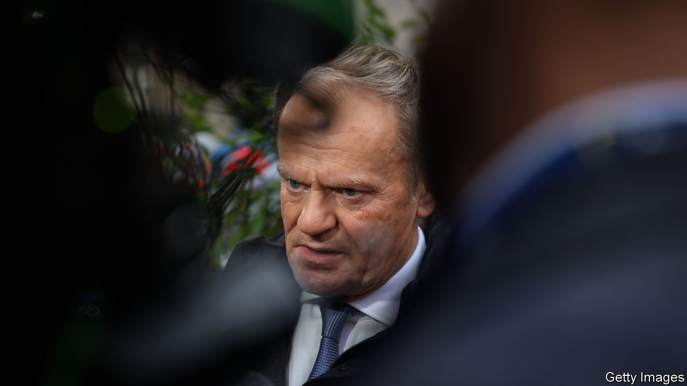

###### What happens when populists lose

# Donald Tusk tries to restore Poland’s rule of law 

##### Repairing the damage done by the last government will take grit and patience 

 

> Feb 8th 2024 

When populist parties win power they often try to capture institutions. They appoint their supporters to run the courts, bureaucracy, state-owned firms and public media. The goal is partly to make it easier to ram through decisions and win more elections. But it is also to ensure that if the populists lose power, loyalists lodged within the state can still pursue their agenda. With populism and state capture on the rise, working out how to unwind such control is becoming ever more important. An early test case, , shows how hard it is to get right.

Poland’s populist-nationalist government, run by the  party, was booted out of office by voters in October and replaced by a centrist coalition led by Donald Tusk. Over the years PiS has packed the courts, sidestepped the constitution and appointed cronies to government firms and broadcasters. Mr Tusk faces a hellish task to undo this harm. He must restore independence and sideline PiS apparatchiks without violating the very rule of law he wants to protect. 

In some cases the new government is on the right side of the line. The new justice minister, Adam Bodnar, is Poland’s prosecutor-general, too, and he wants to make that post independent. In addition, he wants to take control of the body that appoints judges away from parliament and give it back to judges themselves. Whether you are in favour of that or not, both moves enhance judicial independence and reduce government power. Mr Bodnar also fired the national prosecutor and then ignored an order to reinstate him from a PiS-controlled constitutional tribunal. He relied upon a technicality: an aggressive move but one that was probably within the law. Such legitimate, but byzantine, struggles over procedures and appointments could play out for years to come.

Regarding the media, however, the new government has gone too far. PiS had turned the public radio and television broadcasters into propaganda megaphones, and created a new (and possibly unconstitutional) media council to control them. It is essential to restore the broadcasters’ impartiality. To that end, Mr Tusk’s government has fired media firms’ senior staff using commercial law. Fair enough: the state is the owner of these businesses. 

However, the government has also ignored parts of the constitution dealing with the state media’s independence. After a first illegal attempt at reform backfired, the government is putting state media firms into liquidation to restructure them, but it has not explained its plans or opened them up for discussion. News broadcasts on public radio and TV are more neutral than in the past, but the government has not made a clear enough commitment never to exert political influence. 

Plenty of other countries, including nearby Hungary, could face the Polish dilemma in the coming years. When considering whether political detoxification efforts are legitimate, benign intent is not enough. Instead a two-part test should apply. First, any change must be within the law. Second, its result should be to disperse power, not concentrate it. Mr Bodnar’s actions pass both tests; the media clean-up gets questionable grades on both. As an additional safeguard, Mr Tusk’s government should also welcome scrutiny from the European Union, which will help affirm its reforms are sound.

Uncaptured 

Poland’s struggle will take a long time. Many liberals see Andrzej Duda, Poland’s notionally independent president, as a PiS stooge who will use his veto powers to try to block reforms. Rather than trying to circumvent the law, Mr Tusk and his allies should persuade voters to pick a different president in elections next year. In restoring the rule of law over state institutions, liberal governments must respect the law themselves. Otherwise, even when they lose at the polls, the populists will have won. ■

