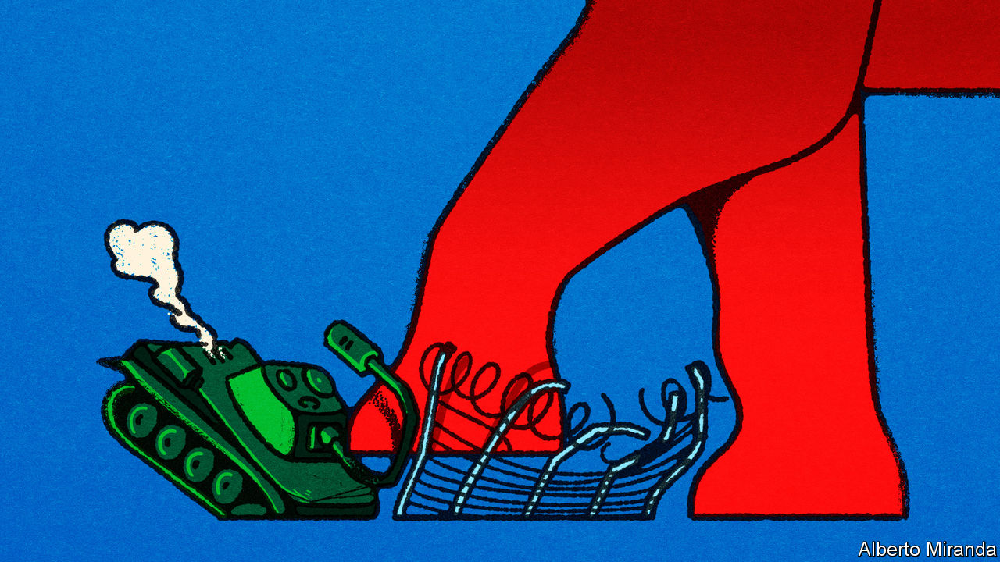

###### The arsenal of hypocrisy

# House Republicans are helping Vladimir Putin 

##### Their cynicism over Ukraine weakens America and makes the world less safe 

 

> Feb 7th 2024 

Politicians OFTEN put winning the next election above solving problems. Yet this week Republicans in the House of Representatives went a step further and sabotaged their own policy priorities to hurt . Their cynicism makes America weaker, and gives comfort to its enemies.

For the past couple of years Republicans have made much of the chaos at the southern border, with good reason. There were 302,000 attempts by irregular migrants to cross in December alone. Knowing that Democrats wanted to pass a bill to supply Ukraine with fresh military aid, the House leadership paired the two issues, thinking that by doing so they could drive a harder bargain on immigration. A bipartisan group of senators went away and worked on a border compromise, the results of which are broadly in line with what Republicans had sought. The proposals would have helped  coming across the southern border, which is a priority for voters.


Rather than take this win, the House leadership then turned around and rejected the very thing they had been asking for. It is no mystery why they did this:  wants to win votes by playing up the border chaos. He urged Republicans to kill the deal the Senate had come up with because he would rather keep the border as a livid campaign issue than see the problems there alleviated. After Mr Trump’s intervention, Republican senators abandoned it too, burying this latest Senate compromise in the crowded graveyard of failed immigration reforms, and leaving Republicans still complaining about the border and still refusing to do anything about it.

That is bad enough, but the damage Republicans have done goes far beyond America’s own shores. By killing the border bill, they have also set back the cause of Ukraine, which urgently needs more cash and kit to defend itself against invading Russians. Ukrainian soldiers cannot wait while some alternative funding idea percolates through a congressional committee. They need ammunition now. If they do not get it, they may not be able to repel the Russian spring offensive, and they could lose more of their country.

Without new legislation on Ukraine or the border, Mr Biden may tap some other Pentagon budget for a little bit of money—though nothing like enough. He can also tweak immigration enforcement through executive actions. But this will be tinkering to offset the harm caused by a massive political failure in Congress. Domestically, the consequence will be more border chaos, with tens of thousands of people crossing each month to claim asylum, and then disappearing into an overburdened immigration system. For the world, the fallout could be much worse. 

The slowdown of American support is already hurting Ukraine on the battlefield, as can be seen from the  between the country’s president and the head of its armed forces. America’s friends are watching nervously; its enemies with gleeful anticipation. 

If Uncle Sam fails to stand behind a democratic ally defending itself against an unprovoked invasion by a tyrant who is also the West’s most belligerent geopolitical foe, what good are American security guarantees in the Baltics or Taiwan or the Middle East? Ukraine has doggedly resisted Vladimir Putin’s imperial ambitions without endangering a single American soldier. To cut it loose would embolden aggressors everywhere and make the world less safe for everyone. House Republicans are no doubt congratulating themselves for making life harder for Mr Biden. If they had set out to harm America and help Mr Putin they could hardly have done a better job. ■

