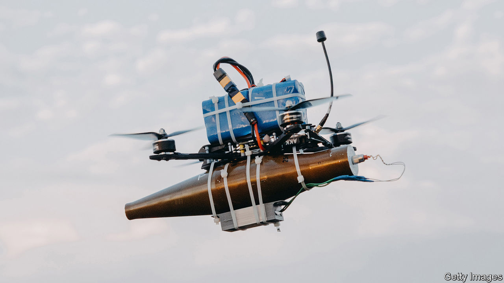

###### Weapons systems

# Killer drones pioneered in Ukraine are the weapons of the future 

##### They are reshaping the balance between humans and technology in war 

 

> Feb 8th 2024 

PRECISION-GUIDED weapons first appeared in their modern form on the battlefield in Vietnam a little over 50 years ago. As armed forces have strived ever since for accuracy and destructiveness, the cost of such weapons has soared. America’s gps-guided artillery shells cost $100,000 a time. Because smart weapons are expensive, they are scarce. That is why European countries ran out of them in Libya in 2011. Israel, more eager to conserve its stockpiles than avoid collateral damage, has rained dumb bombs on Gaza. What, though, if you could combine precision and abundance?

For the first time in the history of warfare that question is being answered on the battlefields of Ukraine.  shows how first-person view (FPV) drones are mushrooming along the front lines. They are small, cheap, explosives-laden aircraft adapted from consumer models, and they are making a soldier’s life even more dangerous. These drones slip into tank turrets or dugouts. They loiter and pursue their quarry before going for the kill. They are inflicting a heavy toll on infantry and armour. 

The war is also making FPV drones and their maritime cousins ubiquitous. January saw 3,000 verified FPV drone strikes. This week Volodymyr Zelensky, Ukraine’s president, created the Unmanned Systems Force, dedicated to drone warfare. In 2024 Ukraine is on track to build 1m-2m drones. Astonishingly, that will match Ukraine’s reduced consumption of shells (which is down because  are shamefully denying Ukraine the supplies it needs).

The  is not a wonder weapon—no such thing exists. It matters because it embodies big trends in war: a shift towards small, cheap and disposable weapons; the increasing use of consumer technology; and the drift towards autonomy in battle. Because of these trends, drone technology will spread rapidly from armies to militias, terrorists and criminals. And it will improve not at the budget-cycle pace of the military-industrial complex, but with the break-things urgency of consumer electronics. 

Basic FPV drones are revolutionarily simple. The descendants of racing quadcopters, built from off-the-shelf components, they can cost as little as several hundred dollars. FPV drones tend to have short ranges, carry small payloads and struggle in bad weather. For those reasons they will not (yet) replace artillery. But they can still do a lot of damage. In one week last autumn Ukrainian drones helped destroy 75 Russian tanks and 101 big guns, among much else. Russia has its own fpv drones, though they tend to target dugouts, trenches and soldiers. Drones help explain why both sides find it so hard to mount offensives. 

The exponential growth in the number of Russian and Ukrainian drones points to a second trend. They are inspired by and adapted from widely available consumer technology. Not only in Ukraine but also in Myanmar, where rebels have routed government forces in recent days, volunteers can use 3D printers to make key components and assemble airframes in small workshops. Unfortunately, criminal groups and terrorists are unlikely to be far behind the militias.

This reflects a broad democratisation of precision weapons. In Yemen the Houthi rebel group has used cheap Iranian guidance kits to build anti-ship missiles that are posing a deadly threat to commercial vessels in the Red Sea. Iran itself has shown how an assortment of long-range strike drones and ballistic missiles can have a geopolitical effect that far outweighs their cost. Even if the kit needed to overcome anti-drone jamming greatly raises the cost of the weapons, as some predict, they will still count as transformationally cheap.

The reason goes back to consumer electronics, which propel innovation at a blistering pace as capabilities accumulate in every product cycle. That poses problems of ethics as well as obsolescence. There will not always be time to subject novel weapons to the testing that Western countries aim for in peacetime and that is required by the Geneva Conventions.

Innovation also leads to the last trend, autonomy. Today, fpv drone use is limited by the supply of skilled pilots and by the effects of jamming, which can sever the connection between a drone and its operator. To overcome these problems, Russia and Ukraine are experimenting with autonomous navigation and target recognition. Artificial intelligence has been available in consumer drones for years and is improving rapidly.

A degree of autonomy has existed on high-end munitions for years and on cruise missiles for decades. The novelty is that cheap microchips and software will let intelligence sit inside millions of low-end munitions that are saturating the battlefield. The side that masters autonomy at scale in Ukraine first could enjoy a temporary but decisive advantage in firepower—a necessary condition for any breakthrough. 

Western countries have been slow to absorb these lessons. Simple and cheap weapons will not replace big, high-end platforms, but they will complement them. The Pentagon is belatedly embarking on Replicator, an initiative to build thousands of low-cost drones and munitions able to take on China’s enormous forces. Europe is even further behind. Its ministers and generals increasingly believe that they could face another major European war by the end of the decade. If so, investment in low-end drones needs to grow urgently. Moreover, ubiquitous drones will require ubiquitous defences—not just on battlefields but also in cities at peace. 

Kalashnikovs in the skies

Intelligent drones will also raise questions about how armies wage war and whether humans can control the battlefield. As drones multiply, self-co-ordinating swarms will become possible. Humans will struggle to monitor and understand their engagements, let alone authorise them.

America and its allies must prepare for a world in which rapidly improving military capabilities spread more quickly and more widely. As the skies over Ukraine fill with expendable weapons that marry precision and firepower, they serve as a warning. Mass-produced hunter-killer aircraft are already reshaping the balance between humans and technology in war. ■


