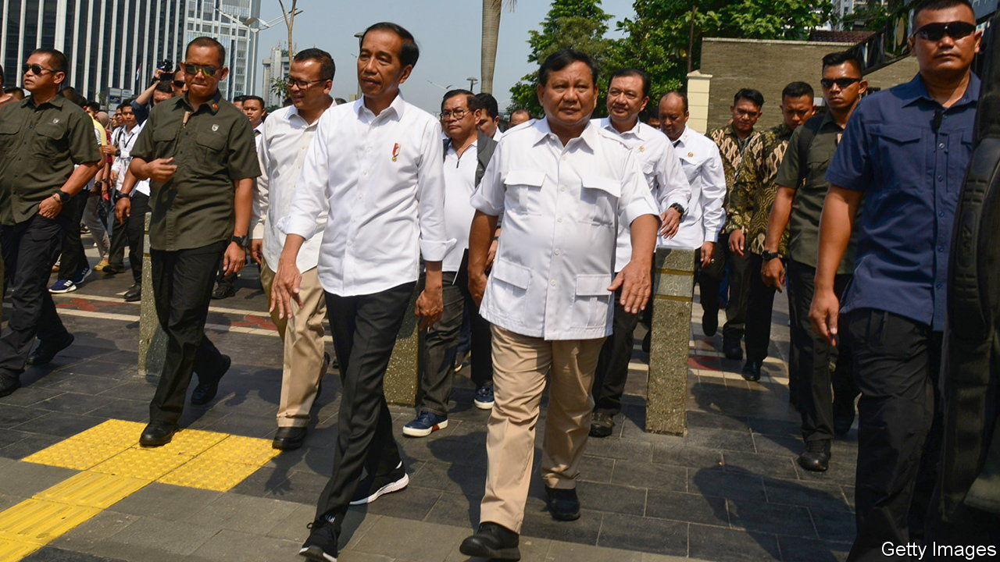
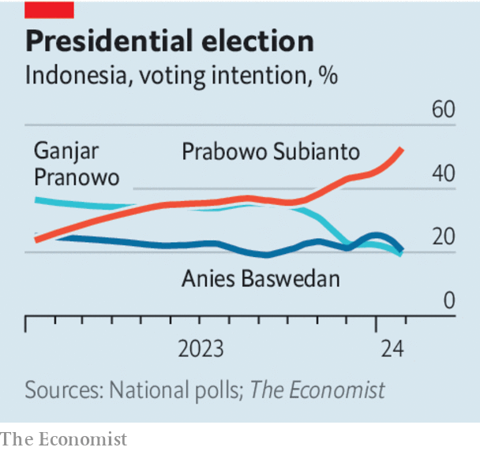

###### Indonesia’s election

# What Jokowi’s inglorious exit means for Indonesia 

##### The outgoing president is playing kingmaker to a controversial ex-general 

 

> Feb 8th 2024 

JOKO WIDODO is leaving Indonesia’s presidency less creditably than he entered it. A decade ago the former furniture salesman, popularly known as , swept to power on a promise to defy the elites who had stage-managed the world’s third-biggest democracy since the fall of the dictator Suharto in 1998. But instead of beating the power brokers, Jokowi (pictured centre-left) has joined them.

In the run-up to an election due on February 14th, the outgoing president has thrown his weight behind  (pictured centre-right), a former general and son-in-law of Suharto, who has an appalling human-rights record and a professed ambivalence towards democracy. Jokowi’s eldest son is Mr Prabowo’s running-mate—courtesy of Jokowi’s brother-in-law, who, as chief justice of Indonesia’s highest court, lifted an age limit standing in his 36-year-old nephew’s way.

 


Jokowi’s endorsement has made Mr Prabowo the favourite to win the presidency at the third attempt (he lost elections in 2014 and 2019, then falsely claimed they were stolen). His main rivals, Anies Baswedan and Ganjar Pranowo, both competent former governors, claim their rallies have been disrupted or cancelled by shadowy officials. This is a worrying augury for Indonesia, and an unworthy end to Jokowi’s tenure.

Though he has not overseen the tearaway growth he also promised, his  has helped make Indonesia one of the best-performing economies in recent years. Its vulnerability to a strong dollar and shifts in global capital flows once made it a member of the “Fragile Five” emerging markets. Thanks to prudent management, the public finances have improved and the economy is more stable. Indonesia has grown at around 5% a year pretty consistently. 

Infrastructure has been overhauled, with thousands of miles of road and rail added. A package of reforms passed last year eased restrictions on foreign investment. By pressing firms to process nickel domestically, Jokowi has supported the development of an industry responsible for half the world’s output. Improved governance has contributed, among other things, to a fall in the rampant deforestation that has long made Indonesia one of the biggest emitters of greenhouse gases. The country’s traditional “non-aligned” foreign policy has put it safely between America and China on most issues. 

Mr Prabowo has vowed to continue most of Jokowi’s policies, reassuring investors. They are too complacent. The recent progress has come about in spite of Jokowi’s authoritarian instincts and delusions of grandeur, which Mr Prabowo seems likelier to emulate. The former general backs an epic white-elephant scheme of Jokowi’s to carve a new $34bn capital city out of the Bornean rainforest. He appears keen to extend protectionist nickel policies—which will pay off only if demand for the metal remains high—to less promising sectors. Tarnished by his alleged Suharto-era abuses—on account of which America and Australia once barred him—he remains prone to clumsy outbursts, including a speech last year in which he floated a Putin-friendly peace plan for Ukraine. Jokowi’s support for him has reportedly alienated the president’s technocratic colleagues, including Sri Mulyani Indrawati, the finance minister behind much of the progress.

Mr Prabowo’s victory need not be the end of liberal politics in Indonesia: the advances that 200m voters have enjoyed may make them more demanding in future. Nonetheless the cronyism so evident in his campaign is dispiriting. Jokowi arrived in 2014 as a breath of fresh air. But by failing to entrench Indonesia’s democracy, even as he has strengthened its economy, he leaves behind a rotten smell. ■

