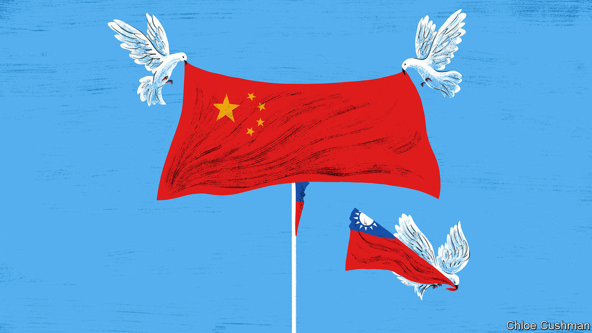
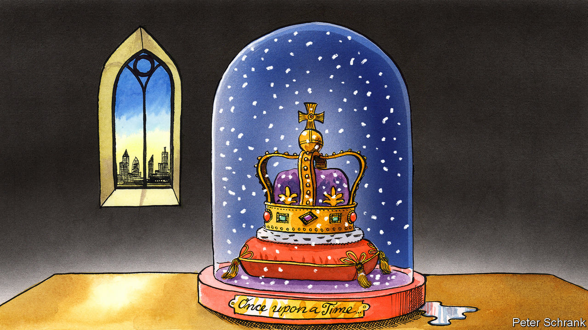

###### On China and Taiwan, royalty, artificial intelligence, activist investors, retirement

# Letters to the editor 

##### A selection of correspondence 

 

> Feb 8th 2024 


China’s claims on Taiwan

It is certainly true, as Chaguan observed, that the obsession of China’s Communist Party with Taiwan is a political choice, one that actually contradicts the party’s original position (). In the party’s first couple of decades it did not view the people of Taiwan as Chinese to be reunified, and it supported the Taiwanese Communist Party’s demands for the island’s independence from Japan (not reunification with China). In the 1930s, Mao Zedong himself saw Taiwan as no different from Korea, Vietnam, or other imperialist possessions that deserved self-determination. In fact, neither the Chinese Communist Party nor its rival Kuomintang of China began to view Taiwan through the lens of Chinese reunification until well into the 1940s.

One other consequential choice by Beijing was to decide that there could be only one China. However, by asserting that the People’s Republic of China is this one China, the Communist Party just makes it easier for those who reject the PRC to reject also any political connection to any China, regardless of who is ruling. Rather than reflexively blame Taiwan’s people or America for the cross-strait dispute’s longevity and intractability, the Communist Party ought to engage in a little reflection and self-criticism.

Brian C. Chao

Assistant professor 

National Security Affairs Department

Naval War College


 


The royal appendage

Charlemagne unfairly derides the human appendix by comparing it to Europe’s royal highnesses, who are “essentially vestigial” and “serve little obvious purpose” (). In fact, recent research has shown that the appendix has a valuable role in human health by providing a haven for bacteria to repopulate the bowel following a diarrheal illness. Yet before scientists recognised these benefits, generations of doctors were taught that the appendix was better out than in. 

The same goes for the crowned heads of Europe. If a hereditary monarch wants to follow the path of the appendix from scorn to admiration, then he or she needs to do a better job of advertising their benefits to society.

Michael Phillips

Menssana Research


Does monarchy work? In Transparency International’s 2022 Corruption ratings, 11 of the least-corrupt 20 countries were monarchies (none were in the most corrupt). In the World Happiness rankings for 2023, ten of the happiest 20 countries were monarchies (admittedly, Jordan was the 15th least happy). In all cases, monarchies perform disproportionately well. Even if the existence of their monarchy had no effect whatever on the happiness or corruption of these countries, it doesn’t seem to be doing much harm.

Kieron O’Hara


 


Tracking AI fakery

Plaudits for your leader on defending against fake content generated by artificial intelligence (“” January 20th). You concluded that attributing trusted sources is the best way to avoid being misled. However, “assuming trustworthy sources can continue to identify themselves securely” just shifts the problem. AI is already skilled at impersonation. Strong authentication of creators will be the key to stopping AI fakes. AI may not be able to detect AI content, but it will continue to detect AI-generated faces trying to fool biometric authentication. When we set the rules that the AI fakes have to dance to, we can spot them stumble.

Andrew Bud

Chief executive

iProov


 


I agree that the AI hype-cycle is probably now shifting downwards as people realise that ChatGPT and related technologies have a long way to go before consistently hitting professional levels of output (“”, January 13th). However, we may be using the wrong measure and therefore drawing the wrong conclusions. Most firms interested in harnessing the power of AI won’t be buying graphics processing units or ramping up investment in data-centre hardware in response to the hype. This is because they will consume or modify ready-made solutions from vendors that will show up on balance-sheets as additional operational expenditures. And most of that spending will go to suppliers that already have contracts with these firms (Amazon, Google and Microsoft). 

Most of the contacts that I have across industries are intending to increase investment in these technologies and harness them in a firm’s products and services in the coming year. If that’s the case, the hype-cycle may be waning, but the investment will trend upwards from here.

Zach Arnold

Executive director

MSCI


 


Constructivism delivers

There is certainly a time and a place for activist investors like Bill Ackman to take more public, assertive approaches with their targets and stick to their guns on their demands (, January 13th). However, evidence from the past six years suggests that a more flexible strategy delivers the best results.

Data from Europe and America show that, two years after being targeted by an activist, company share prices outperformed the market by an average of 5.5%, if the activists’ demands were met in full. When only some activist demands were met, however, the average share price performance over the market rose to 8.8%. This demonstrates that constructive compromise, or “constructivism”, where the company board and activist investor work productively together, delivers the best result for all. No one has a monopoly on good ideas.

André Medeiros

Managing director

Alvarez &amp; Marsal


 


Charities reporting

If “no strings” grant-making (, January 13th) does not include accountability for impact, it will simply be a way to waste more money faster. Our foundation has done unrestricted-only funding for 25 years, but we don’t fund NGOs that can’t make a credible case for impact. They’re flying blind and we would be too. Although it’s true that “there is no single metric for charitable success comparable to profit in business,” a thorough understanding of what an organisation is trying to accomplish (admittedly not always achievable) almost always suggests a useful way to measure impact. 

The “no strings” wave will help clear the logjam of dumb reporting requirements, but that will accomplish little if the subsequent flow is not directed by an understanding of impact. That requires accountability for impact on the part of both NGOs and their funders, and as to the latter, it is telling, and more than a little depressing, that I’ve never heard of anyone in my job getting fired for lack of impact.

Kevin Starr

Chief executive

Mulago


You mentioned the promising rise of “trust-based philanthropy”, where donors provide unrestricted funding to charities. But who should donors trust? Is there a sensible, evidence-based way to determine where resources can make the biggest difference?

Fortunately, there is. We can rely on questions like “Overall, how happy are you, 0-10?”. This approach is used in the “World Happiness Report”, and has been endorsed by the British Treasury. It is then possible, in principle, to capture wildly different outcomes by their overall effect on Wellbeing Life Years. 

In reality, very little such research exists, for either donors or governments. We advise donors that, if they want to buy happiness for other people, the leading candidate is funding the treatment of depression in low-income countries. We estimate this is about five times more cost-effective than cash transfers to the very poor.

The idea we should focus on happiness is old; it goes back to the Enlightenment, if not Aristotle. What’s new is that we have data. We should use it.

Dr Michael Plant

Research fellow

Wellbeing Research Centre

Oxford University

 


You’re never too old

Bartleby wrote about the dangers of retiring, giving us the examples of some highly successful octo- and nonagenarian outliers who still work (). The problem for many successful (or mildly so) professionals who achieve some authority in the later stages of their professions is that they kid themselves into believing people genuinely appreciate their point of view, rather than the authority granted with long service.

Most of us aren’t really so gifted that our advice is really sought after. I’d like to offer an alternative view: embrace the later stages of life, have a purpose, be it a hobby or voluntary support to a cause, and let the next generation do things unencumbered by your suggestions and “wisdom”.

Jonathan Tottman

Nakhon Si Thammarat 

Province


For those of us not blessed with 89-year-old Giorgio Armani’s role as head of a multi-billion-dollar company (a rare counterfactual), the prospect of an eternity ingesting the soul-sapping gruel of corporate life is truly horrific. Endless meetings, ghastly hotels, budget reviews, office politics, technical committees, audit reviews, performance appraisals, terrible IT, wearying travel, egregious management, awaydays, policy forums, marketing initiatives, programme boards, risk sessions, customer complaints; all these combine to rinse out any joy or meaning you may experience from Monday to Friday (and frequently Saturdays and Sundays too). 

I am retired and spent 35 minutes this afternoon staring at a large and majestic acacia tree in my garden, because I could and wanted to. I gained more spiritual nourishment from this episode than anything that had occurred in my 40 years in corporate life. 

Will Moss


