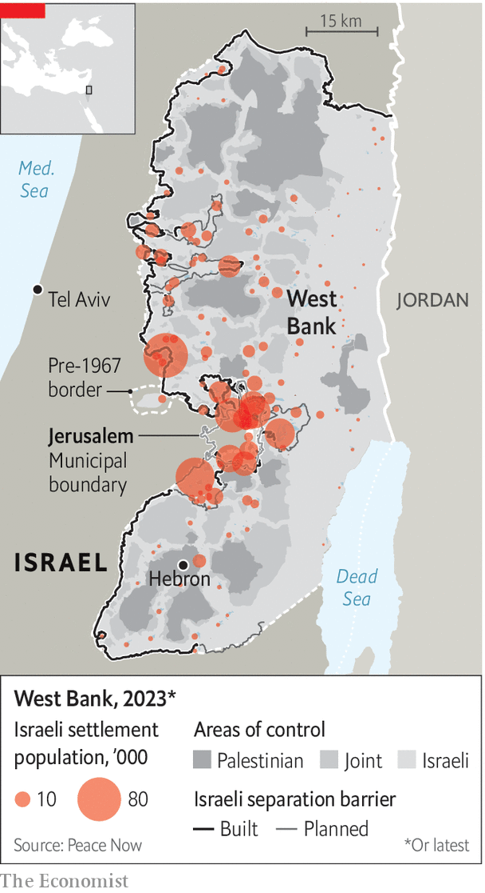

###### Israel’s obstructive settlers

# America is trying to peg Israel’s settlers back 

##### But their power in politics and on the ground shows no sign of waning 

 

> Feb 8th 2024 

At first the Israeli settlers in the West Bank tried to laugh off the executive order signed by Joe Biden, America’s president, on February 1st imposing sanctions on “persons undermining peace, security and stability in the West Bank”. The editor of a popular far-right website posted a cartoon of a Jewish shepherd in the West Bank. “What am I going to do now with all my assets in New York?” said the caption. 

The laughter faded when Israeli banks began blocking the accounts of the settlers targeted by America’s sanctions regime. Bezalel Smotrich, the finance minister and himself an ultra-nationalist settler, vowed to prevent financial institutions from implementing the sanctions. But his power in this matter is negligible. “If anyone thinks that for the sake of a few settlers’ accounts Israeli banks are about to jeopardise their access to the global financial system controlled by the Americans, they’re in for a rude awakening,” said a senior banker.


Mr Biden is a self-proclaimed Zionist who has backed Israel to the hilt since Hamas’s attack last year. But the order is a sign that his patience with Binyamin Netanyahu’s hardline coalition is wearing thin. 

The Jewish settlers in the West Bank, the heart of a future Palestinian state, are among the biggest obstacles to America’s ambitious plans for peace. So far the sanctions have hit only four fairly minor settler activists, who are accused of violence against Palestinians. But the wording of the presidential order leaves little doubt that bigger figures, including cabinet ministers, could be affected. “It’s a warning shot and the target is Netanyahu,” says an Israeli official involved in talks with the Americans. Mr Biden seems to be trying to drive a wedge between the settlers and the rest of Israel, leaving Mr Netanyahu with the choice of either dumping his toxic partners or going down with them. 

 


The settlers’ number belies their political weight. Of 10m Israelis, around 460,000 live in the West Bank (not including east Jerusalem). Most live in urban settlements near the pre-1967 border where they have been lured by cheap housing. In any peace deal, it is assumed that these “settlement blocs” would be absorbed into Israel. In return, chunks of land currently within Israel would be swapped into the new Palestinian state. 

More problematic are the smaller settlements deep in the West Bank that would have to be dismantled. Most of their residents are religious ideologues who comprise less than 2% of Israel’s population but enjoy wide and fervent support. Parties representing them did well in the 2022 election, helping return Mr Netanyahu to office; indeed, he depends on them for his majority. They have been lavishly rewarded. Five ministers are settlers.

Their power was clear on January 28th when 12 ministers attended a convention in Jerusalem calling for the re-establishment of Jewish settlements in the Gaza Strip after the war. Mr Netanyahu said this was “unrealistic” and promised that Israel had no intention of doing so. But he did not prevent ministers from his own Likud party from attending the conference, where speakers called for the reoccupation of Gaza and for the 2.3m Palestinians living there to be displaced. 

Even after Hamas’s attack on October 7th, only a quarter of Jewish Israelis support such a plan, according to a poll carried out in November. But settler representatives, who are already signing up families to settle in these would-be new outposts, have consistently proved capable of moving government policy in the West Bank in their favour. For over half a century they have challenged governments, including those on the right, by building deeper into the West Bank, eventually getting retrospective government support.

Mr Netanyahu is now floundering in the polls. If elections were to be held soon, his coalition would almost certainly lose power. But even without their supporters in government, the settlers would still be a force, in politics and on the ground. Many serve in combat units and are heavily involved in the fighting in Gaza. They will argue that their sacrifice is being dishonoured if their West Bank homes are threatened. This will resonate with many Israelis, even those not in their political camp.

Going by past experience, some will try to block any concessions to the Palestinians with violence. Emboldened and armed by supporters in government, settlers killed at least ten Palestinians last year, according to a report by Yesh Din, an Israeli human-rights group. If the establishment of a Palestinian state looks more likely, such action may increase. Yet if American plans for peace are to stand a chance, this threat must be countered. Mr Netanyahu’s government shows little interest in doing so. But even a centrist one could struggle to face the settlers down. ■

