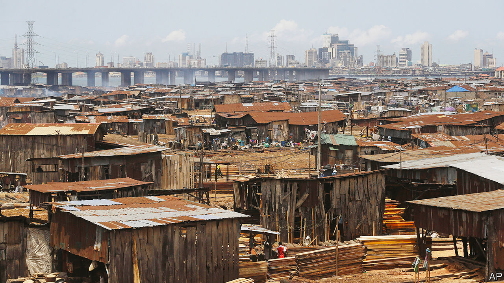
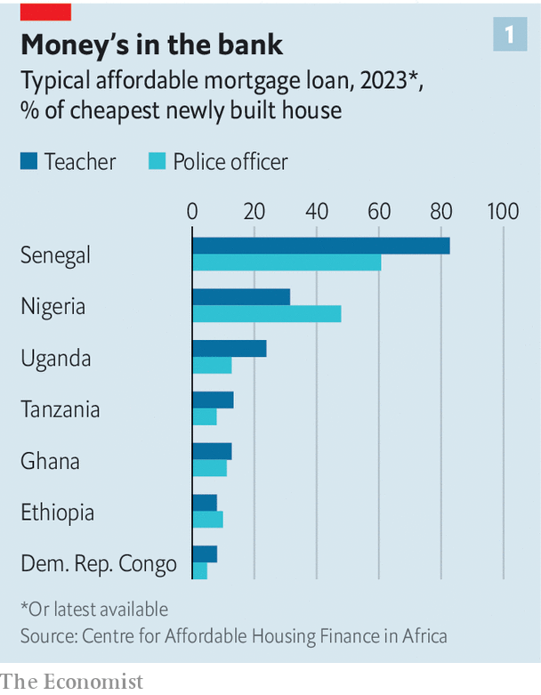
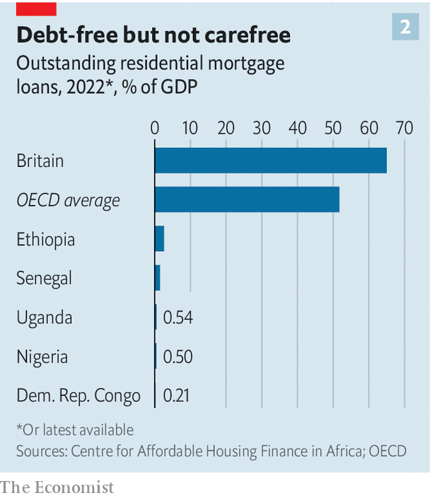

###### House and home

# How to house the world’s fastest-growing population 

##### About 70% of buildings needed in Africa by 2040 are not yet built 

 

> Feb 7th 2024 

Shiny cars line the streets of Ngor, a suburb of Dakar. Beside the occasional passing sheep are telltale signs of wealth—ice-cream shops and gyms—that should be enticing to banks offering mortgages. Yet loans are hard to come by. Sam Thianar and his family live in two rooms of the apartment block he is building. The rest he hopes to rent out. Although construction started years ago, the building is a mess of concrete and exposed wires. “When I save a little money, I buy some sand and cement and build a little more,” he says. He applied for a loan of 10m CFA francs ($16,500) from a credit mutual, but was rejected. Nearby Ibrahima Diouf shovels sand to make bricks. Could he ever get a mortgage? “Never, never, never,” he replies. 

 


The struggle to finance and build homes is contributing to a profound housing crisis in sub-Saharan Africa. In almost all African countries even the very cheapest new home is too expensive for a typical teacher or police officer with the mortgage they could obtain, according to the Centre for Affordable Housing Finance in Africa (CAHF), a research outfit based in Johannesburg (see chart 1 ). Instead many Africans live in housing without toilets or reliable electricity. Some 230m people, half of all urban dwellers in Africa, live in slums, a number that is rising because of urbanisation and population growth. 

Yet Africa’s need for housing is also a tremendous opportunity. A mind-bending 70% of the buildings expected in Africa in 2040 do not exist, reckons the UN. Building them could be a boon not just for slum-dwellers but for growth, jobs and, potentially, climate-friendly construction. Africa will be the construction site of the world, enthuses Ian Shapiro of Reall, an investor in African housing.

 One reason for this chronic shortage of decent housing lies with how homes are built now. Perhaps 90% are self-built, usually incrementally over many years. Cities are thus riddled with unfinished buildings. Some buy their homes from developers, where they pay a portion upfront, more during construction and the rest on completion. Yet if developers do not sell enough apartments in the building or hit other troubles, then everything stops. “It puts the risk on the buyer,” says Seeta Shah of FSD Kenya, a financial think-tank. “You could get burned, or you could get your home.” Both ways of building tie up scarce capital in cement that houses no one and earns nothing for years. And because of the tight finances, truly large-scale housing projects are rare. 

Building quality homes in Africa also involves a fiendishly complex set of tasks—from buying land and wrangling title to persuading governments to install water to the area and finding a buyer. Finishing one step often depends on progress in all the others. And each needs financing. “It’s a dance, it’s not a straight line,” says Kecia Rust of CAHF.

 The cheapest new house generally costs the equivalent of $20,000-40,000. Yet income per person is only about $1,700 a year. The high cost is partly caused by red tape. In Kenya, for example, there are 140 laws, policies and regulations relating to affordable housing. Building codes, which often date back to the colonial era, also set inappropriate standards. In Kenya a car park is required for any two-bedroom home. The result is that those who build formally cannot build cheaply. Many small builders dodge regulations altogether. That makes the homes they build cheaper but often more dangerous. 

The lack of land titles hits supply and drives up prices. Developers need this paperwork before they can build; without it they risk losing the entire investment. Yet just 4% of countries in Africa have mapped and registered the private land in their capital cities. On average it costs more than 7% of the value of the property to register it. In parts of Nigeria this cost reaches 20%.

 


Weak titles also make it harder for people to borrow. This is because banks will generally refuse to lend against a property if its ownership is fuzzy. That is one reason why there are vanishingly few mortgages in Africa. Uganda, with almost 50m people, has about 7,000 mortgages outstanding. It is not an extreme case. In most sub-Saharan countries the stock of mortgage debt to GDP is lower than 1%. By comparison, in Britain it is 65% (see chart 2). 

A second reason is that perhaps 85% of people have informal jobs, such as selling fruit at the market or riding a motorbike taxi. As such, they do not have pay slips that could prove to banks that they have a regular income and can afford to repay a loan. A third reason is that many Africans need a loan to start building a home, but banks are especially reluctant to lend if the only collateral is undeveloped land. 

Bigger financial forces push up mortgage rates and sharply limit the number of loans available, too. A rule of thumb is that mortgage rates need to be in single digits to have a chance of being affordable, says Simon Walley of the World Bank. Yet just 15 out of 48 countries for which there are data in sub-Saharan Africa have rates below 10%. That is firstly because central-bank interest rates, a floor for mortgages, are persistently high to curb inflation. Compounding the problem is the scarcity of long-term finance in Africa and the fact that governments grab most of it by borrowing heavily. Banks and investors can earn 13-15% a year simply by buying government bonds. Setting up a retail bank, finding customers and then trying to measure the credit risk of people with no pay slips and fuzzy collateral involves an awful lot of effort —and risk—in comparison. 

There have been efforts in recent years to make mortgages cheaper, often by setting up mortgage-refinance companies. These are usually owned by clubs of banks, backed by governments and get cheap loans and equity from development-finance institutions (DFIs), such as the World Bank. This allows them to borrow more cheaply in capital markets than banks can. The refinance companies then pass on their lower borrowing rates to banks to allow them to offer cheaper mortgages. Eight countries in west Africa jointly have such a firm while Kenya, Tanzania and Nigeria each have one. These have helped, but nowhere near enough. 

In Tanzania, which has a population of 67m, the mortgage-refinance company directly backs only 1,500 outstanding mortgages. In Kenya, with a population of 56m, the mortgage-refinance company has backed just 2,876 loans in almost five years, less than a tenth of its target. Mr Walley of the World Bank, which has lent to most of these companies, says the problem is that “the housing-supply response hasn’t happened, or not to the scale we would have liked.” High underlying interest rates also limit their impact, says Aliou Maïga of the International Finance Corporation (IFC), the private-sector arm of the World Bank. He also points to a tougher problem: poverty. “Whatever you do, it’s very, very difficult to fit income levels into the housing equation,” he says. 

All this is prompting a radical rethink. Mr Walley believes mortgages can reach a wider scale in Africa some day, but says that currently, at best, they are going to serve the richest 5-15% of the population. Mr Maïga is blunter: “Acquisition by individuals and the mortgage, to me, are not necessarily the right instrument in Africa.” That is striking, given that the IFC partly owns and finances the mortgage-refinance companies in west Africa, Tanzania and Kenya. The IFC is now resetting its housing strategy altogether. 

If mortgages modelled on the rich world are not right for Africa, what is? One answer is to embrace the reality that African houses are often self-built in stages. Banks are starting to offer smaller shorter-term loans to enable families, for example, to build an extra room to rent out. Housing Finance Bank (HFB) in Uganda does just this. Its loans are typically for three years and are worth about $4,000 on average. The bank requires some collateral, but dodges the headaches of formal title by accepting guarantors and sales agreements for land or even just belongings like a motorbike or fridge. “The performance of these loans is good,” says Michael Mugabi, HFB’s managing director. “They don’t default.” Because the loan allows a building extension to be completed without delay, it is an efficient use of capital. 

Tinker, tailor

Such loans still require clever ways of assessing the creditworthiness of informal workers. Syntellect, an Indian startup, is trying to help with machine learning. An algorithm is fed the results of a questionnaire tailored to the borrower’s trade—from street-food vendor to tailor—and also uses utility payments, mobile-money records and geolocation intelligence about whether, say, a street vendor has a wealthy potential clientele nearby. It recently signed up with Kenya’s largest microfinance organisation to help with credit decisions for housing loans. 

Others see more hope in bigger developers because they may solve the problem of bank loans for new builds. Unity Homes, a developer in Kenya and Nigeria, uses the value of its undeveloped land to provide mortgage banks with financial guarantees that it will complete construction projects. This gives the banks the security they need to lend to customers buying homes before they are completed. 

Still, full mortgages are out of reach for people who are not in formal employment. To help them, some DFIs and private firms are experimenting with rental and rent-to-own models. Housing needs to be approached like big infrastructure projects, says Mr Maïga of IFC. By that he means very large developments built by private firms where governments, institutional investors and DFIs guarantee to buy the homes. Families then rent or rent-to-buy from these institutional owners. Rent-to-buy removes the need for an upfront deposit. Instead tenants slowly accumulate ownership over time. The IFC has recently agreed to pilot programmes in this style with three governments in west Africa. 

Private firms are also turning to rentals. After more than a decade as a developer of large housing projects in Africa for sale to families, Daniel Font came to a worrying conclusion: “In some ways we were completely wrong.” Most people had no access to mortgages and those who did buy their units rented them out anyway, he explains. Mr Font now leads a new company, SIV Africa, which is building rental homes in Africa. The company plans to own, maintain and operate the projects over the long term while also selling a share of the portfolio on capital markets. The goal is to build quality homes for people who have no access to banks. “That is 90% of the population in Africa,” says Mr Font. 

For the hundreds of millions of Africans with no chance of getting a mortgage and who live in cramped, poorly lit and often unsanitary homes, the rethink cannot happen quickly enough. ■

