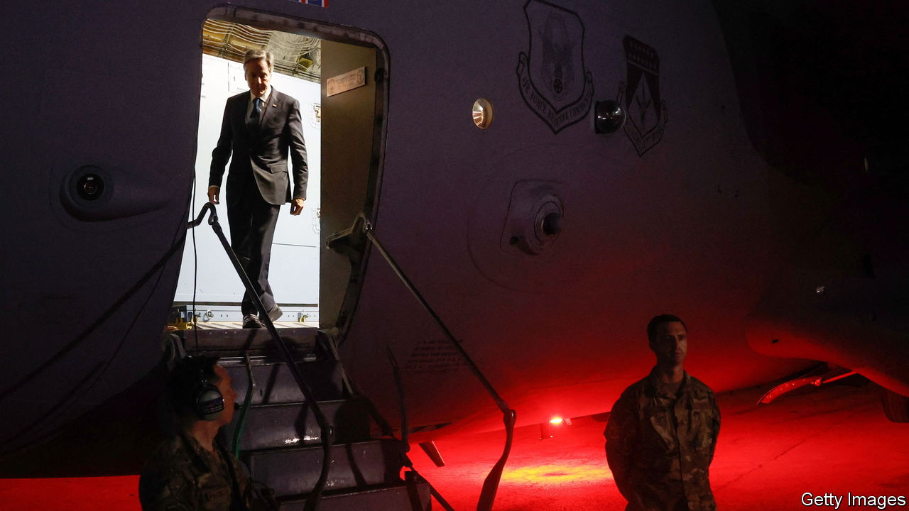

###### Antony Blinken’s shuttle diplomacy

# Israel scorns America’s unprecedented peace plan 

##### Arab states offer remarkable “security guarantees” to Israel 

 

> Feb 7th 2024 

Israel’s triumpH in the Six Day War of 1967 was met by the “three nos” at an Arab summit in Khartoum: no peace with Israel, no recognition, no negotiations. The  seems to be having the opposite effect, American officials say. Saudi Arabia, the most important Arab state, is saying yes to peace, negotiations and recognition of the Jewish state—if Israel agrees to a “clear and credible pathway” to the creation of a Palestinian state in the  and Gaza Strip, which it occupied in 1967. There may be two more yeses on offer: yes to Arab security assurances to Israel, beyond diplomatic relations; and yes to Arab states’ help with reforming the Palestinian Authority (pa) so it is fit to run Gaza.

Such is the message carried to Israel this week by Antony Blinken, America’s secretary of state, —his fifth regional tour since Hamas’s attack of October 7th. But to judge from the scornful reaction of Israel’s prime minister, Binyamin Netanyahu, Israel is now the naysayer.


The outlook in the Middle East seems dire. Iran’s allies in Lebanon are exchanging regular fire with Israel; and those in Syria, Iraq and Yemen have been attacking American forces, provoking rounds of retaliation, before and during his trip (see next story). More than 27,000 Palestinians are reported dead in Gaza. Most of the territory’s population is displaced and facing disease and hunger. Israel  in the International Court of Justice. In the eyes of many, America’s reputation has also been stained by President Joe Biden’s support for Israel.

Yet Mr Blinken is seeking to turn the horror of Gaza into a chance for peace. And American officials seemed elated by their talks with Saudi Arabia’s crown prince and de facto ruler, Muhammad bin Salman.

Once treated as a “pariah”, in the past words of Mr Biden, Saudi Arabia has become central to America’s ambitious diplomatic strategy. This involves securing an “extended” pause in the fighting in Gaza with a hostage and prisoner exchange, followed by a permanent ceasefire, Israeli acceptance of a Palestinian state, Saudi Arabia’s recognition of Israel and new American security commitments. Mr Blinken seems convinced that, rather than 1967, the moment in Israel today is more akin to the aftermath of the Arab-Israeli war of 1973 and the Palestinian intifada (uprising) of 1987-93. Then, the pain of conflict led to the peace treaty with Egypt in 1979 and the Oslo accords of 1993 that created the pa.


Even so, the path to a regional deal is far from assured. The hostage deal—the essential first step in America’s plan—rests on a man whom the Israelis are determined to kill: Yahya Sinwar, the leader of Hamas in Gaza. He is thought to be hiding with hostages in tunnels under Gaza.

That said, Mr Blinken brought hopeful news. On February 6th the emir of Qatar told him Hamas had responded to a hostage deal drafted by Israel, America, Egypt and Qatar. The answer was deemed “positive” by Qatar and promising by Mr Blinken (albeit with some “non-starters”). Yet Mr Netanyahu dismissed it as “delusional”. 

The sticking point is whether the fighting will continue after the pause, as Israel wants. Hamas insists on an eventual permanent ceasefire and Israel’s withdrawal from Gaza. The likeliest compromise is a deal that unfolds in phases. America’s hope is that even a temporary pause will change the mindset of both sides, allowing them to consider the “day after”.

This turns the spotlight on Mr Netanyahu, who has declared his intention to fight for “absolute victory” and his opposition to a Palestinian state. “The day after is the day after Hamas. All of Hamas,” he said. Arab leaders want America to exert more pressure on him. The Biden administration thinks that halting the flow of weapons to Israel would encourage Hamas and the rest of Iran’s “axis of resistance”. Instead Mr Blinken chastised Israel for a death toll that was “too high”, pushed for more humanitarian aid and insisted that it “put civilians first and foremost in mind”. On February 1st America also imposed sanctions on four Jewish settlers accused of violence against Palestinians, irking Mr Netanyahu.

Mr Blinken thinks the region is at a fork. One way lies salvation, with a “future for the better for Israelis, for Arabs, for Palestinians”. The other way leads to damnation, with “an endless cycle of violence and destruction and despair”. Mr Blinken also seems worried about Israeli forces pushing on to Rafah at the southern end of Gaza. Palestinians are increasingly concentrated there and the risk is of their being pushed across the border into Sinai. Seeking to reassure Egypt’s president, Abdel-Fattah al-Sisi, Mr Blinken earlier expressed America’s “rejection of any forced displacement of Palestinians from Gaza”.

America wants Israel to agree to “a practical, timebound, irreversible path to a Palestinian state” as part of an agreement between America, Israel, the pa and Saudi Arabia. America would offer a defence treaty with Saudi Arabia and civilian nuclear technology. The pa would agree to reform.

To sweeten the deal, Mr Blinken said, Arab states were offering Israel unspecified “security guarantees’‘. These are unlikely to involve a formal defence treaty; Gulf states do not have big armies, nor do they want to be at the forefront of an American-Israel confrontation with Iran. But informed sources suggest options might include more intelligence-sharing, a common air-defence zone and joint military exercises. Some of this already takes place, but the aim would be to make it more visible and institutionalised. Mr Blinken said Arab states were ready “to do things with and for Israel that they were never prepared to do in the past”; America, too, would agree to do the same.

Moreover, Arab states seem ready to help the pa reform. Foreign ministers from Saudi Arabia, the United Arab Emirates (uae), Qatar, Egypt and Jordan are set to meet pa officials in Riyadh on February 8th to discuss governance. Some Arab sources suggest Jordan could help train Palestinian security forces, and the uae could help improve the pa’s administration.

Arab states have made clear they will not send peacekeepers to Gaza if and when the Israelis leave; nor will they pay to rebuild it unless there is an Israeli commitment to Palestinian statehood. Nevertheless, they seem to understand that they must take greater charge of settling the question of Palestine, or risk Iran and other radicals exploiting it to their advantage.

In private Mr Netanyahu is said to be more flexible than he lets on. Can he bring himself to say yes to the Saudis? And if he refuses, would those who replace him be more willing? Neither Mr Blinken nor anyone else is certain. ■

