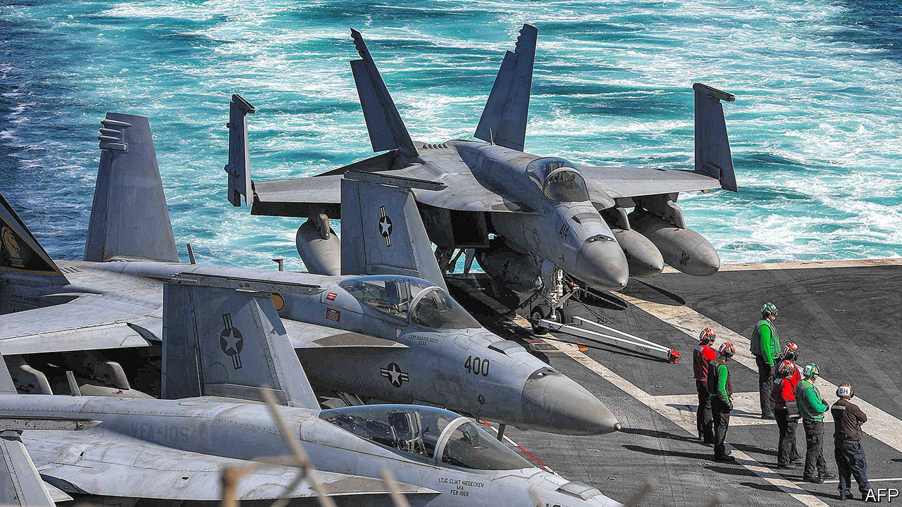

###### America’s reverse-Goldilocks strategy

# Why Iran is hard to intimidate 

##### US soldiers are a bull’s-eye target for Iranian militias 

 

> Feb 6th 2024 

DETERRENCE IS A simple concept: using the threat of force to stop an enemy from doing something. America ought to have no trouble restraining Iran thus. The former has a globe-striding army; the latter relies on warships and fighter jets that predate the Moon landing. In practice, though, Iran has proved devilishly difficult to deter. It is hard to put off insurgents and militias with air campaigns; their goals are attrition and survival, not well-ordered governance, and they are willing to take casualties. Full-scale invasion may be the only sure way to deter them but the history of such interventions is salutary.

Since October the Islamic Republic’s  in Syria and Iraq have carried out more than 160 attacks on American troops. Some were harmless—more theatre than threat—but not the one on January 28th, which killed three American soldiers at a base in north-eastern Jordan. The Houthis, meanwhile, an Iranian-backed militia in Yemen, have for months waged a campaign of missile and drone attacks against commercial ships in the Red Sea, choking off a waterway that handles perhaps 30% of global container trade.

. On February 3rd it bombed more than 85 targets in Iraq and Syria, the first round of what Joe Biden, America’s president, promised would be a multi-stage response to the drone attack in Jordan. It struck the Houthis the next day and again on February 5th. Two days later an American strike in Baghdad killed a leader of Kataib Hizbullah, an Iranian-backed militia in Iraq. Yet the attacks from Iran’s proxies continue.

Mr Biden’s hawkish critics think they know why: American threats are not credible because America is unwilling to strike Iran itself. They point to Operation Praying Mantis, during the “tanker wars” of the 1980s, in which America sank five of Iran’s warships and destroyed two of its oil platforms in the Persian Gulf.

Critics on the left make a different argument. They see talk of deterrence as misguided warmongering and instead offer what they say is a simple solution: end the war in Gaza. If Israel stops killing Palestinians, Iranian-backed militias might stop their own violent acts.

Both arguments miss the mark. It is true that hitting Iran’s navy in 1988 compelled it to reduce its attacks on oil tankers (and to stop targeting Americans altogether). But the Iran of 1988 was exhausted from a ruinous eight-year war against Saddam Hussein’s Iraq and bereft of strong allies. It had no choice but to back down. The Iran of today, by contrast, has a powerful network of proxies and a degree of support from both Russia and China. A round of American strikes might make it even more inclined to use those proxies—and, perhaps, to dash for a nuclear bomb as insurance against future attacks.

As for the Gaza war, many of Iran’s proxies cite the conflict as justification for their acts. But history did not start on October 7th. Militias in Syria and Iraq have carried out dozens of attacks against American troops in the past decade. The Houthis, too, have a record of attacks on shipping; the war is merely an excuse to escalate what they were already doing.

America’s struggle to deter Iran stems from deeper contradictions in its Middle East policy, namely its desire to pivot away from the region while still keeping troops in it, leaving a military presence big enough to present a menu of targets but too small actually to constrain Iran.

This reverse-Goldilocks arrangement had deadly consequences on January 28th. The drone attack in Jordan hit an outpost known as Tower 22, a logistics hub for nearby al-Tanf, a remote American garrison in Syria. Established during the campaign against Islamic State, no one can quite explain why al-Tanf still exists. American officials cite a range of missions, but in practice it mostly serves as a bull’s-eye for Iranian-backed groups whenever they want to lash out at America.

The Iranian regime views its proxies as vital for its survival: they are fighting a long war of attrition to drive American troops from the Middle East and hobble Israel and America’s allies in the Gulf. Deterrence can work only if that perception changes. 

Perhaps Iran could be dissuaded from using its proxies if it thought America was prepared to topple its regime. After two decades of failed American adventures in the Middle East, though, neither Americans nor Iranians believe that is on the cards.

America’s allies in the region do not believe it either. A decade ago, Israel and some Gulf states might have cheered American strikes on Iranian proxies. Then as now, the region was ablaze: Iran was helping Bashar al-Assad turn Syria into a charnel house, and the Houthis were sweeping down from their northern redoubts to seize control of most of Yemen’s population centres. A sustained campaign of American strikes might have changed the course of civil wars in both countries.

Today, though, those wars are basically settled—in favour of Iran’s allies. The regime has its hooks deep in four Arab countries. A few scattered sorties will not dislodge it. That is why Saudi Arabia and the United Arab Emirates have tried to improve their relations with Iran: if America cannot protect its partners, they reckon detente via diplomatic engagement and economic incentives is a safer alternative.

In a briefing with reporters after the strikes in Syria and Iraq, American officials talked not of deterrence but of trying to “degrade” the capabilities of Iranian-backed groups. That might be more realistic: if America blows up enough Houthi anti-ship missiles, they will have to stop firing (at least until Iran can deliver more).

But that would require a prolonged campaign of the sort that Mr Biden may wish to avoid, which gets back to the crux of the problem. In the Middle East, America is torn between leaving and staying and cannot decide what to do with the forces it still has in the region. The status quo is not working—and, paradoxically, it is Iran that has deterred America from changing it. ■


