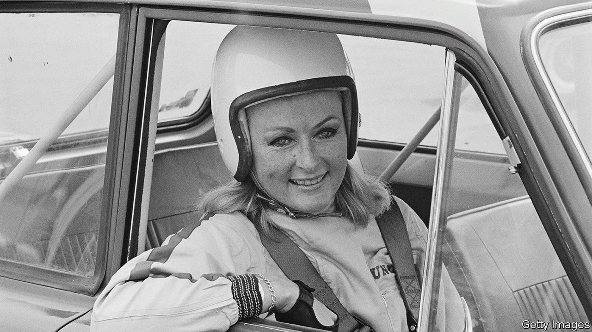

###### Backwards up the Kyber

# Rosemary Smith set out to prove that women drivers could do as well as men 

##### The queen of world rallying died on December 5th, aged 86 

 

> Feb 7th 2024 

As she battled through her first Monte Carlo rally in 1962, Rosemary Smith learned later, a man was closely observing her. For fully two hours he followed her twists and turns in the terrible weather, the snow and sleet. It wasn’t so much her driving he was appraising, though she could pull out of a skid on an icy road as well as anybody, having learned that when driving the big old family Vauxhall on wet Irish grass at the age of 11. No; he was enjoying the rarity of seeing a woman in a rally at all.

They made quite a carload, it was true. She and her co-driver had a passenger, Sally Anne Cooper, who wore a mink coat and carried a picnic basket. She herself, mostly at the wheel, was impeccably turned out, make-up and crimson nails perfect, her blonde hair stylishly waved beneath her helmet. She looked every inch the fashion icon she had been not long before, modelling Christian Dior’s New Look in Dublin and designing dresses for her boutique; never dreaming, moreover, that she would spend most of her life forging through mud, floods and deserts, keen as mustard to prove that women, too, could be good at it. 

And she was very good. In a sport where to finish at all was something of a miracle for anyone, she finished 21 out of 24 international rallies she entered. These included eight Monte Carlo rallies, the 17,000km London to Sydney Marathon and the 27,000km rally in 1970 from London to Mexico City. The East African Safari in 1974 was the hardest, with so much mud that her car could hardly move. She and her co-driver were so tired, late and filthy after the first leg that they could barely go on. But from a field of 99 only 16 cars finished, and one was theirs, and they won the Ladies Prize. 

One rally, too, she won outright, beating all the boys. That was the 1965 Tulip Rally, the oldest in the Netherlands, which ran for 3,000km through five countries. The weather, again, was awful, with thick snow, but she and her co-driver triumphed, and Richard Burton and Elizabeth Taylor, no less, sent her flowers. She had become, as she fully intended to be, the queen of world rallying, toasted in Swinging London, Paris, Sydney and New York as well as in the pubs at home. 

So the man who trailed her on her first Monte Carlo rally and pretty soon recruited her for his car company—Norman Garrad, competition manager of Rootes—was on to a better thing than he realised. At the time he was mostly thinking how good she would look draped over the bonnets of Rootes’s cars and flashing her long legs around. His marques might not be winning races but, with her in the picture, they would definitely draw the eye. 

She didn’t object to that. If the boys wanted to call her a dolly bird and that sort of carry-on, fine. She had spent enough of her life being horribly shy about her height; now, confident that she looked good, she was happy to pose on an unfolded road map or winsomely change a tyre. Besides, it was a fact that she had no clue what the various parts of an engine were, and couldn’t actually read a map for toffee—which was why, having been plucked from the fashion world for her very first rally as a navigator, she was firmly the driver ever after. Nevertheless, behind the technical gaps lay a will to win as steely as any man’s. With her at the wheel of Rootes’s Hillman Imps and Sunbeam Rapiers, the company was soon in the spotlight for the right, rallying, reasons.

To drive any car at all was glorious to her. It was her life. Once inside the car, strapped in, she was completely in control. She was free, herself against the world, well away from the mother who constantly nagged her, the men who disappointed her, the pregnancies that didn’t work out and the business ventures that turned sour. She especially forgot all that at the wheel of her faithful blue-and-white Hillman Imp, EDU 710C, the boxy but brave little car in which she had won the Tulip Rally and driven her many Circuits of Ireland. It was less speedy even than a Mini, but for traction on gravel or ice, and taking narrow lanes, she found nothing better. For some years it disappeared from her life, only to be rediscovered in an English hay barn, dismantled but still, by great fortune, owning its original number-plate. 

Other cars let her down quite badly. One lost its brakes on a road so precipitous that she had to smash into a rock face to stop. Between Herat and Kabul, engine trouble meant the car would not move at all; she had to be towed for 600 miles. The same thing, failing cylinders, struck as she was going over the Khyber Pass; with no hope of climbing in first gear, she drove up for 33 miles in reverse. She also tumbled down a mountain or two. But risks like that were part of the job, and she bounced back all the more determined, fortified by her stock of Liquorice Allsorts and wine gums. 

More annoying than the scrapes, in any case, were the little humiliations dished out routinely to a woman in a man’s world. On test teams, even after years, some men would still ask why she was there, and the men mostly got the better cars. Le Mans was closed to women in her peak rallying days. Though she won 12 Ladies Cups or Coupes des Dames, she felt a sting of separation from the men; it was a great day when they were all just drivers, competing together. That long, kind tow into Kabul, too, was annoying because the “girls” had to be rescued by the men. How much she preferred to roar past the boys and force them to respect her! Still, chivalry had its uses, as when in the Andes the bandits who had blocked the road with rocks politely moved them aside to let her Austin Maxi past, while stopping and robbing the men. 

 The fastest Imp she drove in her heyday of competing had 65 brake horsepower (bhp) and a top speed of 92mph. But she dreamed of wildly swifter rides. In 2017 her chance came, when she was invited to drive an 800bhp Renault Sport Formula 1 car. She was 79, the oldest person ever to try, but that didn’t deter her. The racing suit, black with yellow trim, looked great. On the day, as she wedged herself into a car that felt more like a submarine, she was shaking, but once she sensed her roaring speed the fire in her belly returned. In that fire, her troubles simply burned up. The song she wanted for her funeral was “Blaze Away”. ■

