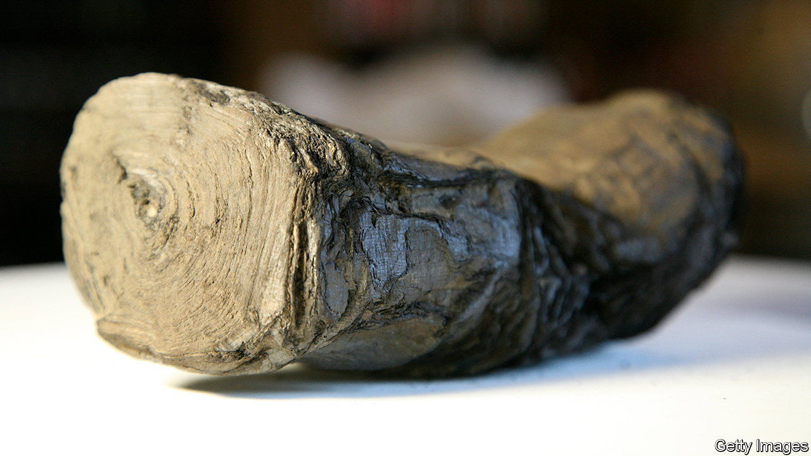
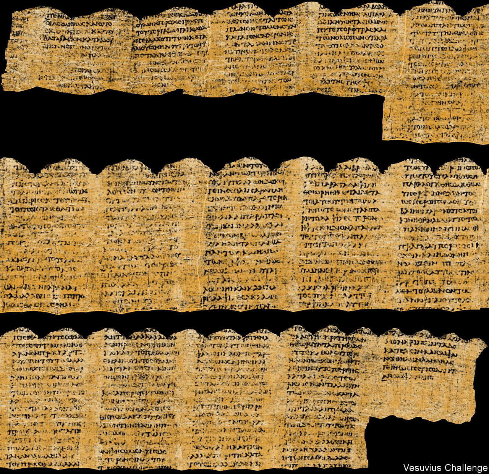

###### They’re on a roll

# Ancient, damaged Roman scrolls have been deciphered using AI 

##### The new techniques could help rediscover lost works from antiquity 

 

> Feb 6th 2024 

“I can’t believe it worked!” says Nat Friedman, co-founder of the Vesuvius Challenge, which offered $1m in prizes to anyone who could use artificial intelligence (AI) to decipher papyrus scrolls carbonised by the eruption of Mount Vesuvius in 79AD. But work it did. On February 5th Mr Friedman announced that a three-person team had been awarded $700,000 for successfully extracting four passages of text, each at least 140 characters long, and with at least 85% of the characters legible, from a scroll known as Banana Boy. The three winners, Luke Farritor, Youssef Nader and Julian Schilliger, are all computer-science students.

The scroll is one of hundreds found in the library of a Roman villa in Herculaneum, which is thought to have belonged to the father-in-law of Julius Caesar. Along with hundreds of other scrolls in the villa’s library, it was damaged by scorching gases that engulfed the town during the same eruption that also buried the nearby town of Pompeii.

Reading text from the scrolls is difficult because the heat turned them into brittle charcoal logs; all efforts to unroll them physically caused them to disintegrate. So attention shifted towards finding ways to unwrap them virtually, through computer analysis of 3D scans of the scrolls made using X-rays. This turned deciphering the scrolls into a software problem—but a very complex one.

Virtual unrolling is a two-stage process pioneered by W. Brent Seales, a computer scientist at the University of Kentucky. The first stage, called segmentation, involves tracing the edges of the rolled-up papyrus sheet inside the 3D scan, then extracting 2D images of the scroll’s surface. The second stage, ink detection, analyses the resulting images to pluck the ink of the scroll’s text from the papyrus background. This is particularly tricky for the Herculaneum scrolls, which are written in carbon-based ink, so there is very little contrast with the background of carbonised papyrus.

Dr Seales, along with Mr Friedman and Daniel Gross, two technology entrepreneurs, thought AI techniques might fruitfully be brought to bear on these two problems, and launched a prize challenge to find out. A community of thousands of enthusiasts has since developed a range of tools and tricks to speed up the fiddly process of segmentation, and to detect the ink of individual letters, and then whole words. In October 2023 Mr Farritor and Mr Nader were awarded smaller prizes for independently extracting the first legible word (“porphyras”, which means “purple” in ancient Greek) from the Banana Boy scroll (so named because of its size and shape).

 


The two students then teamed up and, joined by Mr Schilliger, further improved the machine-learning technique involved in ink detection. By manually labelling areas known to be ink, they could train a neural network to find more of them; these were fed back into the model to improve its detection abilities. Mr Nader also switched the neural network to a novel architecture called a TimeSformer, which produced sharper results. Mr Schilliger, meanwhile, devised a tool to automate more of the segmentation process (much of which must still be done manually).

The deadline to submit results for the grand prize was at the end of December, and the trio was awarded the prize after an assessment of the entries by a team of papyrologists. (Three runners up will receive smaller prizes of $50,000 each.) The winning entry revealed 15 columns of text, written in Greek. Reading it was “mind-blowing”, says Federica Nicolardi, a papyrologist at the University of Naples Federico II, who was one of the judges. The text is thought to be a previously unknown work on pleasure by Philodemus, an Epicurean philosopher who lived in Herculaneum.

Mr Friedman now wants to scale up the whole process. With ink detection solved, he says, “the bottleneck is now segmentation”. Mr Schilliger’s auto-segmentation tool is a big step forward, and he has agreed to make it open source, and to collaborate with others to improve it. Further prizes are being offered as an incentive. Mr Friedman, meanwhile, aims to scan more scrolls using the Diamond Light Source, a particle accelerator in Britain, and to standardise the scanning process.

That will cost money. Having given out $1.2m in prizes, some of it from his own pocket, Mr Friedman is looking for other backers to help support the project. He hopes that deciphering ancient scrolls will lead to the rediscovery of lost works from antiquity—“each scroll is a mystery box”, he says—and, ultimately, revive interest in further excavating the villa in Herculaneum, which may contain thousands more of them. ■


