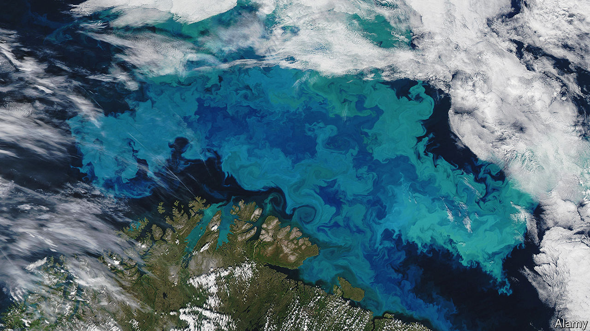

###### Very small things

# NASA’s PACE satellite will tackle the largest uncertainty in climate science 

##### It will monitor tiny particles in Earth’s atmosphere and oceans 

 

> Feb 7th 2024 

Small things can have big effects. Take the plant plankton that populate the Earth’s oceans. When zooplankton eat them, the phytoplankton release a chemical called dimethyl sulphide (DMS) and it is this that people are referring to when they speak of the “smell of the sea”. Chemical reactions in the atmosphere turn DMS into sulphur-containing particles that offer a surface for water vapour to condense on. Do that enough times and the result is a cloud. Clouds, in turn, affect both the local weather and, by reflecting sunlight into space, the world’s climate.

Other tiny things have similarly extensive effects. Sulphur from ships’ funnels also makes particles that seed clouds, producing strings of puffy white “shiptracks” that can be seen in satellite pictures. Soot from burning fossil fuels, meanwhile, has the opposite effect. It is made of dark particles that absorb solar energy, warming the air around them and discouraging cloud formation. If sulphur particles make it high enough in the atmosphere (thanks to a volcanic eruption, perhaps) they can form a haze that blocks some sunlight from reaching Earth’s surface.

But although scientists know in general terms how these processes work, quantifying them is much harder. Uncertainties about the behaviour of “aerosols”, as various small particles in the air are collectively known, are one of the main sources of scientific uncertainty in climate models. They are therefore a big reason for the error bars that surround projections of how hot Earth will become for a given increase in the amount of carbon dioxide in its atmosphere.

Climate scientists hope that NASA’s new satellite, PACE (for “Plankton, Aerosol, Cloud, ocean Ecosystem”), which was launched into Earth orbit on February 8th, will reduce those uncertainties around aerosols. PACE’s cameras will sweep the planet every one to two days to create a continually updated census of the very small things that are suspended in the oceans (plankton) and the air (aerosols). 

PACE’s main camera is sensitive to the spectrum of light between the ultraviolet and the near infrared. For the oceans, that means PACE will be able to distinguish different types of phytoplankton. “That is powerful because diatoms fuel fisheries [and] cyanobacteria can be harmful,” says Jeremy Werdell, an oceanographer at NASA who is PACE’s chief scientist. Two other instruments mounted on PACE will offer information about the size and shape of aerosols, making it possible for the first time to distinguish soot from sea spray and particles produced by burning fossil fuels.

That could be “transformative” for climate models, says Gavin Schmidt, a climate scientist who also works at NASA. Modellers have had to compensate for the limited nature of the existing aerosol data with informed guesswork. As a result, different climate models vary considerably in their estimates of how powerfully aerosols affect the climate.

Such uncertainties affect questions about how air pollution influences climate change. Laws in Europe and North America have cut the amount of air pollution from fossil fuels since the 1980s. This is a boon for human health. But it has also lifted a smoggy veil that was masking some of the warming caused by greenhouse-gas emissions. Cleaning up air pollution could be one of the most important influences on the climate in the coming decades. Better data will allow better modelling.

Similarly, climatologists are divided on the effect of rules adopted by the International Maritime Organisation, part of the United Nations, which capped the amount of sulphur in ship fuel starting in January 2020. Some believe the reduction in sulphur in ship exhausts may have contributed to the exceptionally hot temperatures recorded around the world in 2023. Others think the effect was minimal.

There are plenty more questions climatologists would like answered. Scribbled on the whiteboard in Kirk Knobelspiesse’s office at NASA’s Goddard Space Flight Centre in Greenbelt, Maryland, is a list of 18 projects. It ranges from gathering live data on volcanoes and forest fires to answering what happens when soot from agricultural clearing fires that burn annually in west Africa ends up on the tops of marine clouds, darkening the face they present to the sun. The answers to all those questions depend on the behaviour of tiny things. After decades of uncertainty, answers may be on the way. ■


