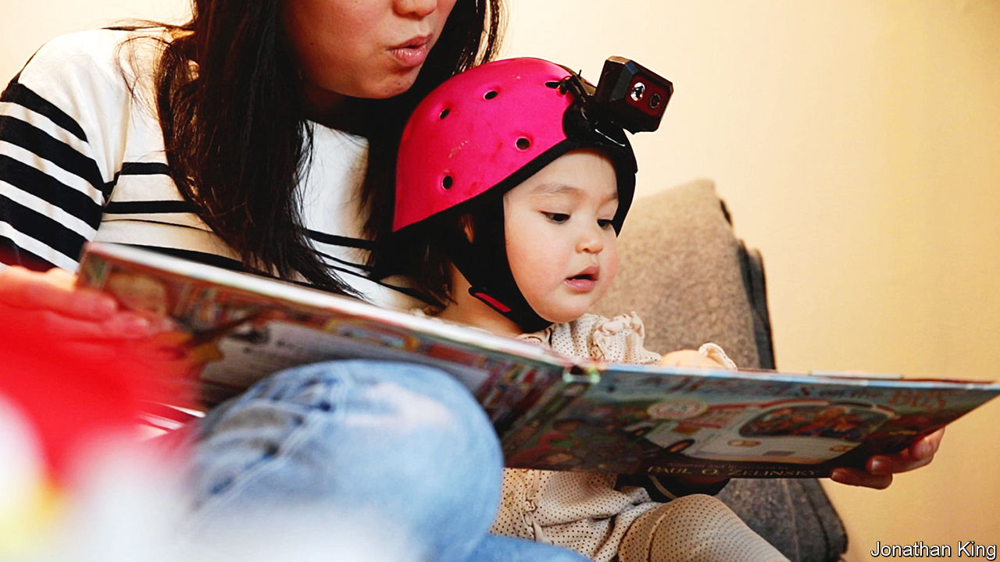

###### Baby AI

# Scientists have trained an AI through the eyes of a baby 

##### “Chair” and “ball” were among little AI’s first words 

 

> Feb 7th 2024 

For decades linguists have argued over how children learn language. Some think that babies are born as “blank slates” who pick up language simply from experience—hearing, seeing and playing with the world. Others argue that experience is not enough and that babies’ brains must be hardwired to make acquiring language easy.

AI models such as GPT-4 have done little to settle the debate. The way these models learn language—by trawling through reams of text data from millions of web pages—is vastly different to the experiences of babbling babies. 

A team of scientists at New York University examined the question by training an AI model on the experiences of a single infant. Between the ages of six and 25 months, a toddler called Sam wore a head-mounted camera for an hour a week—around 1% of his waking hours. The camera recorded everything he saw and heard while he played with toys, enjoyed days at the park and interacted with his pet cats. The recordings and transcribed audio were fed into an AI, which was set up to know that images and words that appeared at the same time were related, but was otherwise left to make sense of the mess of colours and speech that Sam experienced.

Despite the limited training data, the AI was able to pick out objects and learn the matching words. The researchers tested the model by asking it to identify objects that Sam had seen before, such as a chair from his home or one of his toy balls. Given a list of four options the model picked the correct word 62% of the time, far above the chance level of 25%. To the researchers’ surprise, the model could also identify chairs and balls that Sam had never seen. The AI learnt at least 40 different words, but it was far from matching Sam’s vocabulary and language abilities by the end of the experiment.

The researchers, published recently in the journal , argue that, to match words to objects, learning from experience may well be enough. Sceptics, however, doubt that the AI would be able to learn abstract nouns or verbs, and question how similar the learning processes really are. The mystery of language acquisition lives on.■


