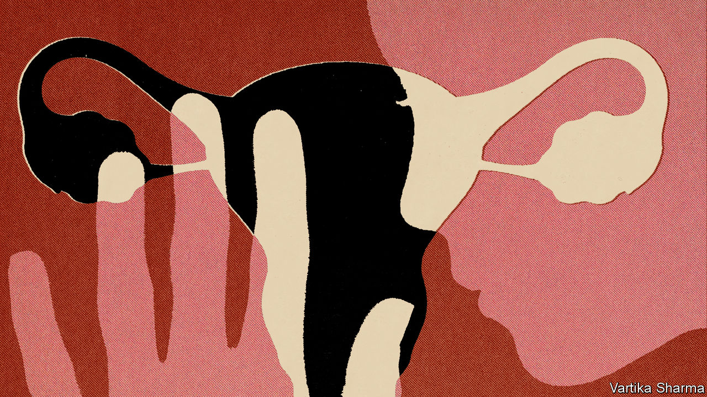

###### A long and winding road

# The first endometriosis drug in four decades is on the horizon 

##### At last, progress is being made on a condition that affects one woman in ten 

 

> Feb 7th 2024 

In 1690 Daniel Schrön, a German physician, described a patient with “ulcers” throughout her peritoneum, bladder, intestines, uterus and cervix. It was long thought to be the first documented appearance in medical literature of endometriosis, a painful and debilitating gynaecological condition that today affects as many as 190m women worldwide.

Uteruses are lined with the endometrium, a layer of tissue that thickens during a menstrual cycle. If a fertilised egg does not become implanted, the lining thins and is shed as a period. If endometrial tissue grows abnormally outside the uterus, however, it can cause havoc. In extreme cases of endometriosis, adhesions can “bind” a woman’s organs together—from ovaries to bladder to bowels—and freeze them in place. Milder cases come with severe pain, heavy menstruation, inflammation and scar tissue caused by internal bleeding, fatigue and infertility. There is no known cure, and treatment focuses on controlling symptoms, normally through some combination of hormonal birth control, pain relief or surgery.

The World Health Organisation estimates that endometriosis affects around one in ten women during their lifetime—roughly the same as the proportion of the global population with diabetes. But whereas doctors understand why diabetes occurs and how to treat it, their understanding of endometriosis is languishing “30 to 40 years” behind, according to Andrew Horne, a professor of gynaecology and reproductive sciences at the University of Edinburgh and president-elect of the World Endometriosis Society. He blames it on a lack of research and awareness, driven by funding shortages. 

Things are starting to change. A clinical trial of the first non-hormonal, non-surgical treatment for endometriosis, started in 2023 in Scotland, is showing promising results. Dr Horne says that the trial, which he co-leads, grew out of closer examinations of how endometriosis lesions form. By taking samples from patients during diagnostic laparoscopies, his team found that those with peritoneal endometriosis—meaning disease on the lining of the pelvic cavity, which represents around 80% of cases—had significantly higher levels of a chemical called lactate in their pelvises than those without. 

Lactate is produced when the body breaks down glucose (and is also the cause of the uncomfortable stitches that can suddenly strike runners). Its increased presence, the researchers reckoned, suggested a hand in the development of endometriosis lesions, possibly similar to the role lactate plays in helping cancer cells proliferate. Scientists then looked for a drug that had already been tested in cancer patients, settling eventually on dichloroacetate (DCA). This is also used to treat rare types of metabolic disorders in children in which excess lactic acid builds up in the blood.

Lead me to your door

A small group of human patients who were treated with DCA reported lessened pain and better quality of life. A trial with a larger cohort, plus a placebo arm, is next. If the drug is approved, which may be possible within the next five to seven years, DCA will be the first new endometriosis treatment discovered in four decades.

“There is still an issue—and I hate to say it—with issues that only affect women,” Dr Horne says. That observation is borne out elsewhere. A report released last month by McKinsey, a consultancy, concluded that “systematic lack of disease understanding” led to a loss of 40m-45m disability-adjusted life years for women annually, amounting to four lost days of “healthy life” per year per woman worldwide. 

In terms of endometriosis, lack of medical understanding impedes diagnosis as well as treatment. A study conducted by academics at Manchester Metropolitan University, published in January in the interviewed British women at different stages of obtaining a diagnosis, which takes ten years on average. Many respondents said their symptoms were initially (and sometimes repeatedly) dismissed as either normal period pains, the result of lifestyle factors such as being overweight, or as psychological. One reason that diagnosing endometriosis is such a drawn-out, gruelling process is that it almost always requires surgery: most lesions can be found only by inserting a camera (though those which cause cysts generally show up on scans). To speed things up, scientists have therefore been looking for “biomarkers”—the signatures of proteins or processes related to a disease, which show up somewhere easy to test, like a patient’s blood or urine.

Ziwig, a French pharmaceutical firm, claims to have found such a solution for endometriosis. Its test looks for specific microRNAs—tiny strands of genetic material—which, one study shows, appear in the saliva of women with existing endometriosis diagnoses. In January the health-care authority of France approved a pilot scheme to assess the effectiveness of Ziwig’s “Endotest” ahead of a possible rollout. In 2022 Emmanuel Macron, the country’s president, declared endometriosis “society’s problem” and made improving treatment a national priority.

These developments do not mean that the problem of diagnosis is solved, warns Dr Horne, who believes that more research is required to test how endometriosis biomarkers appear in larger, more disparate populations. But, after years of relative inaction, he now sees endometriosis research as “a fast-moving field” at last. “I think I feel confident,” he says. ■


