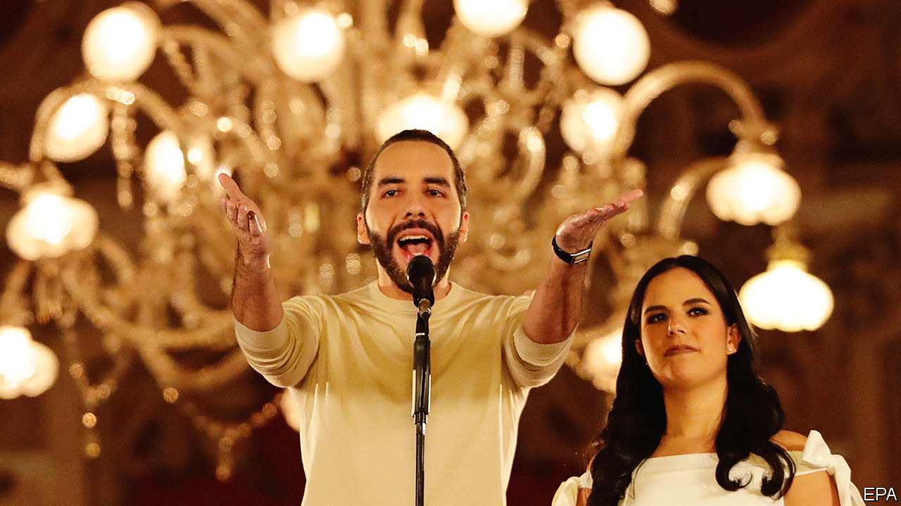

###### El Salvador

# After Nayib Bukele’s crushing, unconstitutional victory, what next? 

##### El Salvador’s “philosopher king” is already hinting at a third term 

 

> Feb 5th 2024 

EL SALVADOR’S PRESIDENT reacted to his re-election victory on February 4th with his usual understatement. Before any official results were announced, Nayib Bukele claimed to have won at least 85% of the vote. In a speech from the presidential palace he called this “the record in the entire democratic history of the world”. 

Mr Bukele has indeed won with a landslide. With 70% of the votes tallied, he had 83%. His party, New Ideas, has probably won a majority in the slimmed-down national legislature, too, though perhaps not to the degree he claims. A problem with the electronic system means the votes for lawmakers now need to be counted by hand. 

Sticklers for the rule of law noted that it was unconstitutional for Mr Bukele to run for a second consecutive term. But in 2021 he got the top court to rule  if he took a six-month leave of absence, which he did, at least on paper. He insists that voters should be able to decide whether they want him to remain in office. “Why discard the path if it’s working?” he asked when announcing his run.

The immaculately coiffed, jeans-clad leader is popular largely thanks to his crackdown on crime. Before he took office in 2019, Salvadoreans lived in terror of gangsters, who extorted money from local businesses with impunity and fought deadly turf wars with each other. Gang crime used to cost a staggering 16% of gdp, by one estimate. 

Mr Bukele first tried negotiating with the gangs. Then he switched to a  (iron fist) approach. He let the police arrest anyone they suspected of gang ties. More than 74,000 people—equivalent to over 8% of the young male population of the country—have been . Few have had trials yet, though they may eventually get “collective” ones, with hundreds of suspects judged simultaneously. 

With so many gangsters behind bars, previously dangerous neighbourhoods have been transformed. The national homicide rate fell from 51 per 100,000 in 2018 to three last year. Shops and restaurants that previously had to pay protection money—a huge drain on their livelihoods—no longer have to. Ordinary folk can walk the streets without fear. 

Eyes on the prize

“We lived through 50 horrible years of wars and killings and everything has changed,” says Ana Rodríguez, a 70-year-old leaving a polling station in Izalco, an hour to the west of San Salvador, the capital. The country is now a much safer place to live in: the number of Salvadoreans trying to cross the border from Mexico into the United States fell by a third in the last fiscal year. 

Mr Bukele shunned traditional campaigning for PR stunts. He hosted the Miss Universe contest, shook hands with Lionel Messi and presided over a mighty communications machine, including trolls who steamrolled critics and drowned out unfavourable narratives. His public-relations push has helped change the international image of his country of 6.3m, too. He has marketed it as a surfers’ paradise riding the wave of the future. In 2021 El Salvador was the first country . (Shopkeepers are much less impressed by this than by his gang crackdown.) 

Critics worry about Mr Bukele’s appetite for power and scorn for . From the start he has lavished benefits on the police and army to secure their loyalty. He is also doubling the size of the army, from 20,000 to 40,000. In 2020 he marched troops into the legislature to intimidate lawmakers into approving funds for his security plan. A year later his party won a super-majority in the assembly, and he moved to increase his sway over the courts. , and forcibly retired a third of the country’s regular judges, replacing them with loyalists. His inner circle consists of his brothers.

Before the election he changed the rules to favour his own party and made it easier for Salvadoreans who live abroad to vote. Ballots cast by the diaspora—740,000 of the 6.2m registered voters—all go to San Salvador, where the number of undecided seats is highest.

So what will Mr Bukele decide to do with a second term? Félix Ulloa, the vice-president, says now the administration has “cleaned the house” of crime, the focus will be on education, health and infrastructure. He says that El Salvador is for the first time spending annually over 5% of GDP on education and has distributed laptops and tablets to all students. This fits with a push to turn the country into a tech hub, he says, pointing to the adoption of bitcoin and to laws encouraging investment by tech firms. He touts future infrastructure projects such as airports, a train along the Pacific coast and a cable car.

Bitcoin bro meets Miss Universe

Rather than worry about crime, Salvadoreans now see the economy as the country’s biggest problem, according to a survey in January by the University of Central America in San Salvador. As public safety has improved, the economy has somewhat, too. The price of the country’s government debt, which had collapsed to distressed levels in 2022, has bounced back. JPMorgan, a bank, reckons El Salvador’s potential annual growth rate has risen from 2% to about 3%. But figures remain lacklustre: annual growth in GDP is forecast to remain lower than in Honduras and Guatemala for at least the next three years. No doubt Mr Bukele will want to secure a much-ballyhooed deal with the IMF.

The government hopes to attract further cash from China, which paid for a fancy national library that opened in November. And El Salvador is offering a “freedom visa” and a ten-year tax holiday to anyone who invests $1m of cryptocurrency in the country. Mr Ulloa says the government will soon issue bitcoin bonds. But Lourdes Molina, an economist, frets that the increased use of bitcoin could turn El Salvador into a money-laundering paradise. 

A state of exception (ie, emergency) to fight crime was first declared in March 2022 and has since been renewed 22 times. Mr Bukele asked voters to give him a super-majority in the assembly so he can keep renewing it. This would hand him a potent tool to scare his remaining critics. It has already been used against union members and environmental campaigners, notes Ruth López of Cristosal, a human-rights group. Only a few civil-society organisations and journalists remain active, says Bertha Deleón, formerly one of the president’s lawyers. Mr Bukele cites their continued existence as proof that El Salvador is a democracy. But in 2021 he tried to pass a bill to class some civil-society organisations and journalists as foreign agents, similar to laws in Nicaragua and Russia. 

Not all Salvadoreans are cheering their strongman’s victory. Families of the arrested are furious. In a poor, rural area a couple in their 50s weep as they describe how three of their four sons, aged 15, 17 and 25, and a grandson, aged 15, were taken in November. Their kids were not gang members, they say; one worked for the government until he fell ill and the other two were at school all day. “We are now scared of the police and army,” they say. In the UCA poll, 63% of respondents said they were “being more careful” about whom they discuss their political opinions with. Diego, a 19-year-old soldier, says he admires the president but worries: “It’s not good that one party has all the power.”

Transparency and accountability are dismal under Mr Bukele, critics charge. Before he was sacked, a former attorney-general was investigating members of the government for misdirecting funds during the pandemic, among other things. If a regime can lock people up indefinitely without charge, officials may one day demand pay-offs not to do so, some fear. 

Meanwhile, a third term is already being discussed. Mr Bukele has said that the law doesn’t “currently” allow for one. But he added that every generation has the right to decide its own laws. ■

