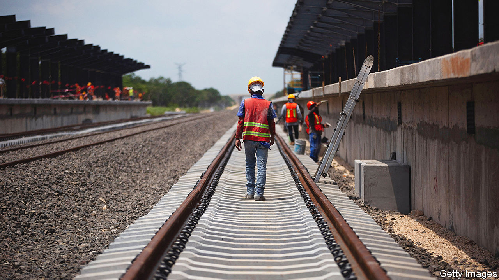

###### Pensions bonanza

# Andrés Manuel López Obrador splashes out as elections loom 

##### The trouble is Mexico can’t pay the president’s bill 

 

> Feb 8th 2024 

On February 5th Mexico’s outgoing president, Andrés Manuel López Obrador, sent a package of 20 reforms to Congress. Most are previously rejected ideas, such as electing judges by popular vote and abolishing independent regulators. The opposition will find one measure harder to block in the run-up to elections in June: the president wants workers’ pensions to equal their final salary, up to a limit of 16,777 pesos ($984) a month. 

Presumably he thinks this massive bung to the relatively well-off will win votes. It only applies to workers with formal jobs—under half the total. (The government also gives a “well-being pension”—a cash transfer—to everyone over 65.) The private pension funds to which formal workers and their employers contribute cannot afford to pay 100%-of-salary pensions. Somehow the government would have to make up the difference. 

That will be hard. The average pension replacement rate (combining public and private pensions) in the OECD, a rich-country club, is 61% of the wage. Public spending on Mexico’s pensions has already risen from 18% of the budget in 2018 to 22% this year. Citibanamex, a bank, says the measure would cost 1.5% of GDP a year by 2025, rising to 2% in a decade as Mexico ages. 

Mr López Obrador has lately proved willing to splash out, even if it harms both Mexico and his successor. Take cash transfers. By slashing administrative costs, initially he gave more to households than his predecessors had without significantly raising the budget. But in 2023 he upped the budget for them by 8% in real terms. The well-being pension’s value has jumped more than three-fold in real terms since 2018, to 6,000 pesos every two months.

Citibanamex bluntly describes Mexico’s budget for this year as ”designed to win the elections”. Given Mexico’s history of fiscal irresponsibility, it is risky. The net debt-to-GDP ratio is expected to rise this year from 46% to 48% and weighs more heavily than it did for much of the 2010s because of higher interest rates. The fiscal deficit will widen from 3.5% to 5% of GDP: ratings agencies warn that the country may risk a credit downgrade. “A red flag” is being waved because this year part of the borrowing is going on current spending rather than investment, says Javier Aparicio of CIDE, a university in Mexico City.

Mr López Obrador had long been seen as a peso-pincher, partly because of his campaign of “republican austerity” and partly because he spent less than 2% of GDP to support people during the pandemic. Yet he has not so much cut as rejigged the budget to suit his populist priorities. He spurns spending on government machinery, hollowing out the civil service. Too little is spent on health care and education. Mexico shells out only 0.6% of GDP a year on domestic security, the lowest level in Latin America and the Caribbean.

Yet the president keeps the tab open for infrastructure projects, says Mr Aparicio. They have consumed billions of dollars. Just one, the Tren Maya, a tourist train for the south-east, will cost at least $28bn, up from its original budget of $7.5bn. He has also propped up Pemex, the state oil company. It has received at least $70bn since 2018 in transfers and tax breaks, says Vanessa Rubio, a former opposition senator now at the London School of Economics.

All this will put the next president in a bind, even if Congress refuses to splurge on pensions. Claudia Sheinbaum, the candidate for Morena, the ruling party, looks set to win. Both she and Xóchitl Gálvez, the candidate for an opposition coalition, say they will keep paying for cash transfers. Even if Mr López Obrador’s mega-projects are completed before he leaves office, his successor will need to reassign money to neglected roads and ports.

Fiscal reform is becoming inevitable. Mexico’s annual tax take is only around 17% of GDP; in Chile it is 24%. Income taxes are already high, but the government could incentivise workers to move from the informal sector into the formal one, where they pay tax. Value-added and property taxes could probably raise more cash. Meanwhile Pemex also needs reform. 

Mexico’s multidimensional measure of poverty shows clearly where cash should be spent, says Ms Rubio. Mexico has many old people who need more help, but a lot of its younger people do, too. ■

