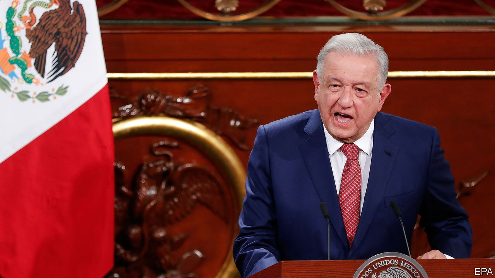

###### The C word

# Mexico’s president and his family are fighting claims of corruption 

##### The truth is that Andrés Manuel López Obrador has done too little to tackle the problem in society 

 

> Feb 8th 2024 

MEXICO’S PRESIDENT, Andrés Manuel López Obrador, has long railed against corruption. But on January 30th a consortium of news outlets reported that in 2006 his campaign team had accepted $2m from drug gangs in return for favours. The reports, based on information from the US Drug Enforcement Administration, do not show that the president knew what was going on. But a close aide did, they allege. Mr López Obrador completely rejects the allegations, calling them slander.

These reports follow others. A recent article on a local news site alleged that Mr López Obrador’s third son, Gonzalo López Beltrán, ran a network overcharging contractors supplying materials for the Tren Maya, a tourist train that is one of his father’s pet projects. In 2022 his eldest, José Ramón, was revealed to have been living in a luxury pad in Houston connected to a contractor for Pemex, the state oil company. Mr López Obrador and his family have denied any wrongdoing in all of these cases.

Some scorn the credibility of the allegations surrounding Mr López Obrador’s 2006 campaign. They put them down to political skulduggery ahead of elections in June. Though he cannot run again, wounding him would also harm his preferred successor, Claudia Sheinbaum of the ruling party, Morena. She is almost certain to win. But others, like Fernando Nieto of the College of Mexico in Mexico City, think the latest reports need further investigation.

Overall Mr López Obrador’s management of corruption has been appalling, whatever else he claims. Surveys reveal that 86% of Mexicans say acts of corruption are frequent when dealing with the government. The biggest reported case of embezzlement by a government agency, involving more than $800m, happened on Mr López Obrador’s watch. Functionaries at Segalmex, an agricultural agency, used fake contracts to siphon off cash. But there have been a “very low number of complaints of corruption and an extraordinarily low number of investigations,” says Issa Luna Pla of the Autonomous University of Mexico.

State processes hardly help. Fully 80% of public contracts are still awarded without tendering, despite the president’s promises of change. He has also cut funding for the transparency body which looks into impropriety, and has just introduced a bill, albeit one unlikely to pass, to get rid of it entirely.

The president enjoys an approval rating of over 60%. And the new allegations are meagre compared with those hurled at the previous government. Nonetheless a grubby new phase in the presidential race may have begun. ■

