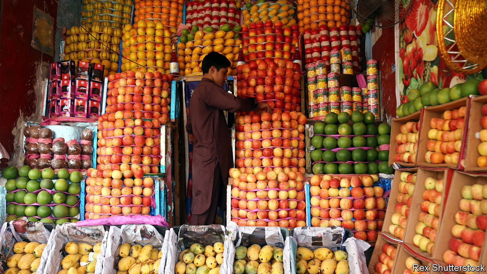

###### The Economist reads

# What to read about Pakistan 

##### Six books provide an introduction to a troubled, nuclear-armed country 

 

> Feb 6th 2024 

AS PAKISTAN HEADS for a parliamentary election on February 8th the country has rarely been in such a mess. It is on its 23rd bail-out from the IMF, which demands in return painful fiscal measures, including cuts in subsidies for electricity and fuel. The Pakistani Taliban are resurgent. In January Pakistan exchanged missile fire with Iran; both sides say they were aiming at militants based in the other’s territory. Hopes that the toppling of Pakistan’s last military dictator——in 2008 would lead to a steady strengthening of democracy have been dashed. The generals are ensuring their role as the most important political players through a continuing “soft coup”. The army is doing all it can to prevent the return to power of , the former prime minister who was once a military favourite and has been  to multiple jail terms. Pakistan has 230m people, nuclear arms and borders with Asia’s two biggest powers, China and India. Here are six books on a large and strategically important country. 

By Ayesha Jalal. 

Seventy-five years after his death Muhammad Ali Jinnah still casts a shadow over the country he created in 1947 to be the homeland of South Asia’s Muslims. The frustrated actor turned Lincoln’s Inn barrister is at the centre of the endless arguments about what Pakistan is for. Fundamentalists say that Pakistan should be ruled by sharia law. Liberals endorse Jinnah’s exhortation that it should be a secular state in which Hindus “are free to go to your temples”. Ayesha Jalal, a historian at Tufts University near Boston, Massachusetts, contends that Jinnah did not really want a separate Muslim homeland at all. He spent most of his political career campaigning for India’s independence from Britain. But he began to worry that the Hindu-dominated Indian National Congress, the main pro-independence party, would sweep away privileges enjoyed by elite Muslims like him. When he latched onto the idea of Pakistan, he saw it as a “bargaining chip” to strengthen the position of the Muslim minority within an independent India. But Congress did not yield, and so Pakistan was born. When Ms Jalal made this argument in 1985 Pakistani scholars and patriots condemned it as heresy. The thesis is no longer taboo in Pakistan.

By Christophe Jaffrelot. 

“The Pakistan Paradox” examines the country’s internal contradictions. Christophe Jaffrelot, a French scholar of South Asia, identifies three major problems. One is Pakistan’s unhappy attempts to manage its ethnic and cultural diversity. For the sake of national unity, Pakistan has long promoted a common culture based on Urdu, the language of the old Mughal court. But its attack on linguistic diversity helped lead to the secession of Bangladesh in 1971, four insurgencies in , a province in the south-west, and violence in Karachi, Pakistan’s megacity. Mr Jaffrelot goes on to discuss the perpetual tussle between the army and politicians, arguing that the conflict is not simply caused by the power-hungry generals who have periodically seized control. Politicians from Benazir Bhutto to Nawaz Sharif have also been authoritarian. Mr Jaffrelot finally tackles the civil war within Pakistani Islam between secular-minded reformers and Islamists. In 1974 the zealots changed the constitution to redefine the members of the minority Ahmadi sect as non-Muslims. The Islamists have been in the ascendant ever since, often helped by the armed forces.

. By Christine Fair. 

This short, scholarly book is one of the best primers on why Pakistan’s army persists with its unwinnable struggle with India, a far larger and more powerful country. Christine Fair, an American academic, makes her case using 60 years of the army’s own publications and generals’ memoirs. They reveal a paranoid “strategic culture” shared by military men convinced that they are engaged in a civilisational battle with a neighbour that rejects the legitimacy of partition. Rather than merely seeking to dominate the subcontinent (which would be bad enough), India wants to reabsorb Pakistan, the generals believe. They consider Hindus to be meek and treacherous, and deem Muslims to be brave and committed to justice. From this flows much else, including the tactic of backing a myriad of anti-India jihadi groups while protected by a “nuclear umbrella”. The generals’ fear of Indian influence in Kabul, Afghanistan’s capital, explains their obsession with “strategic depth”, ie, ensuring that India has no foothold in Pakistan’s northern neighbour. The contest for influence there is reminiscent of the “great game”—Britain’s competition with Russia for clout in Afghanistan during the Raj—Ms Fair points out.

By Abubakar Siddique.

This is a thoroughly readable account of the Pashtuns, Pakistan’s second-largest ethnic group, which is settled on both sides of the border with Afghanistan. Abubakar Siddique is a Pashtun who has covered his fellow tribespeople for years for Radio Free Europe. Much of his work has focused on the Pashtuns’ tragic entanglement with Islamist militancy. The Taliban and its various offshoots on both sides of the border are an almost exclusively Pashtun movement. Militancy began after the British split the Pashtuns’ historic lands between India and Afghanistan, triggering numerous “frontier jihads”. After independence Pakistan backed Pashtun Islamists against nationalists who dreamed of creating a united Pashtunistan. Pakistan’s government in Islamabad also sponsored Islamist rebellions against the government in Kabul and, during Afghan resistance to the Soviet occupation in the 1980s, directed American resources to the most extreme Pashtun fundamentalists. This helped dislodge the Russians but radicalised and militarised many Pashtuns. More than a million have died since 1979 in wars involving Russia, American-led forces and other Afghans. Support for Islamists also backfired on Pakistan. Even though Pakistan helped the Afghan Taliban seize power from an American-backed government in 2021, the Taliban refuse to do Pakistan’s bidding. The Pakistani Taliban—an offshoot—have repeatedly turned their guns on Pakistan itself. 

By Mohammed Hanif. 

Perhaps because it is such a troubled place, Pakistan produces fabulous art. “Joyland”, a film from 2022 about a man who falls in love with a transgender dancer, was rightly praised. The paintings of Salman Toor sell for more than $1m. The country also has many fine authors writing in English, including Mohammed Hanif. His debut novel, “A Case of Exploding Mangoes”, is a satire about the death of Zia ul Haq, the military dictator who seized power in 1977 and was largely responsible for Pakistan’s Islamisation. The book imagines the events leading up to the explosion of his plane on August 17th 1988 through a series of darkly comic episodes. Many of Mr Hanif’s characters want the pious and paranoid general dead. A bomb in a consignment of mangoes (Pakistan’s national fruit) is just one of the weapons that would-be assassins consider. The cruelty and absurdity of Zia’s rule is captured by the story of a blind woman who is gang-raped, then stoned for committing adultery. Mr Hanif trained to become an air-force pilot during the Zia era. One of Zia’s would-be assassins is also a trainee pilot. The sequences set in the Pakistan Air Force Academy are worthy of Joseph Heller.

 By Isambard Wilkinson. 

For all its maddening problems, Pakistan is a beguiling place. Isambard Wilkinson identifies much of what it is that captivates. He was the ’s correspondent in Pakistan (and also wrote for ) at a tumultuous time, covering the fall of Musharraf, the Taliban takeover of the Swat valley and the assassination of Benazir Bhutto. But these great events are secondary to his search for “the quiddity of Pakistan”. It helps that he fell in love with the place as a teenager, when he accompanied his grandmother, a Raj-era Anglo-Indian, on visits to see her old friend, a grande dame of Lahore known as “the Begum”. A beautiful writer, Mr Wilkinson paints a warm and generous picture of a diverse country of tribal chiefs and mountain valleys still populated by pagan tribes. But the problems are never far away. The Sufi shrines that he regards as the “pulses of Old Pakistan” are blown up by jihadis who hate tolerant, syncretic strains of Islam. Mr Wilkinson’s warnings that the “Heath Robinson contraption” of the Pakistani state could fall apart are all the more powerful coming from such an admirer of the country.


This article gives the  to the soft coup under way in Pakistan. Here a former Pakistani ambassador to America argues that the country needs a “” between its politicians and its generals. Our sister magazine, , has described  in Pakistan. , our Asia columnist, points out that as India becomes richer and more powerful, its relations with Pakistan are both getting worse and becoming less important to the bigger country. Here  that both Pakistan and China have less influence than they had expected on the Taliban in Afghanistan. 

