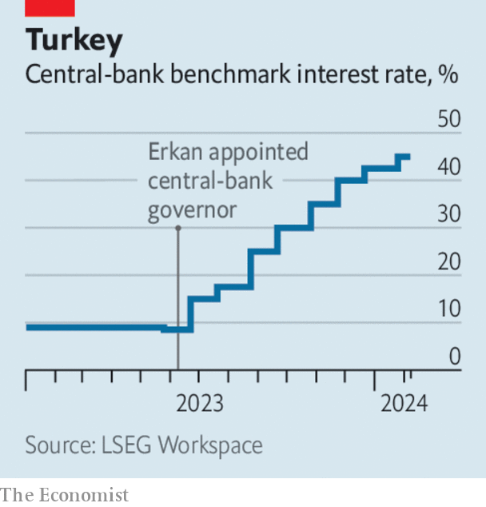

###### The world this week

# Business 

#####  

 

> Feb 8th 2024 

The big oil giants reported bumper profits for 2023.  underlying profit of $13.8bn was its second-largest in a decade. Murray Auchincloss, the new chief executive, announced that the company would extend its share buy-back programme. net profit of $21.4bn was a record.  net income, also $21.4bn, was its second-highest since 2013, as was  $36bn since 2012. Exxon also claimed a big victory when two activist investors withdrew their proposed shareholder motion for the company to speed up its emissions reductions. Exxon is still ploughing ahead with a lawsuit questioning the investors’ motives.  recently reported a profit of $28bn.

A conflict of interests

War in the Middle East has hurt sales at  in the region. The fast-food retailer said its business in Malaysia, Indonesia and France, which has a large Muslim population, had also been affected. The chain was targeted by protesters after a franchised outlet in Israel offered free meals to soldiers. Starbucks has also reported that similar boycotts are affecting its business. 

 tried to reassure investors that its business was still sound, after its credit rating was cut to junk status by Moody’s. NYCB, which bought the assets of Signature Bank after it went to the wall last year, has spooked investors by reporting a quarterly loss related to its exposure to commercial-property loans. Its share price has since plummeted, wiping 60% off its market value. 

 has fallen further into a . Consumer prices in January were 0.8% lower than in the same month last year, the biggest such drop since 2009. It is another headache for policymakers in Beijing, who are contending with a weak economy, a crashing property market and feeble stockmarkets.

The value of  plunged by 4.6% in December compared with November, a much sharper drop than had been expected. The value of exports fell to €125bn ($137bn), the lowest since March 2022; they declined by 1.4% over the whole year. There was some good news for the beleaguered German economy. Industrial orders rose by 8.9% in December, the most since June 2020. 

 


Markets took a positive view of Fatih Karahan’s appointment as the new governor of . Hafize Gaye Erkan abruptly resigned after just eight months in the job, over what she claimed was a “character assassination campaign” against her in sections of the press. Mr Karahan used to work as an economist at both the Federal Reserve Bank of New York and Amazon. With inflation in Turkey running at 65%, he is expected to continue with the bank’s aggressive round of interest-rate rises. 

Investors reduced further their expectations of the Federal Reserve making a cut to interest rates in March, after American employers added 353,000 in January, double the number that analysts had forecast. 

After 18 months of negotiations, the parent company of , Russia’s Google, agreed to sell all its business in Russia to a consortium of Yandex managers and Russian investors. The $5.2bn sale by the Dutch-registered Yandex marks the biggest corporate exit from Russia since the start of its war against Ukraine. Yandex’s managers stressed that it would remain “private and independent”. 

 share price fell back a bit from the 20% jump it registered after reporting solid quarterly results and announcing its first-ever shareholder dividend. The company’s revenues from digital ads surged in the last three months of 2023 (as they did at Google and Amazon). Meanwhile, Meta announced that it will encode artificial-intelligence generated images on its platforms with new technological specifications that it hopes will become a labelling standard across the wider social-media industry. 

In other earnings news, reported its first annual net profit since its IPO.  share price took a dive after its results disappointed investors; the operator of Snapchat is cutting about 10% of its 5,000 strong workforce.  narrowed the losses in its streaming business. And  stock hit a record, after the Japanese carmaker raised its profit forecast; its finance chief said sales of electric-hybrid vehicles were soaring. 

The lucky country

The Australian government readied a bill that will give employees the right to  from their bosses outside working hours, with fines for employers who break the rules. The Greens, who pushed for the change, reckon Australians work six weeks unpaid overtime a year. The “right to disconnect” was first introduced in France (of course) and the revolution has spread to around 20 countries. Australia also has an unofficial Go Home on Time Day, first observed in 2009. 

