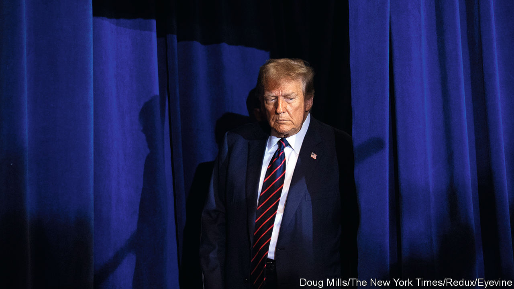
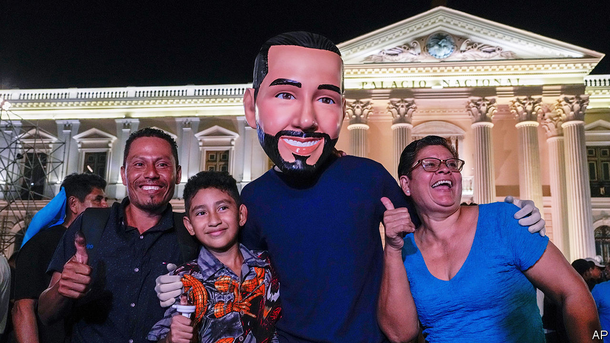

###### The world this week

# Politics 

#####  

 

> Feb 8th 2024 

A panel of three judges at the federal appeals court in Washington, DC, rejected  claim that he is immune from prosecution for allegedly trying to overturn the result of the election in 2020. Mr Trump had argued that he could only face prosecution in relation to “official acts” if Congress impeached and convicted him first, but the judges ruled that the former president is now merely “citizen Trump”. His trial in the case was due to start on March 4th, but the judge overseeing those proceedings has postponed the date indefinitely. 

They couldn’t run a bath

 in the Senate , which they themselves had spent months helping to craft, that tied military aid to Ukraine and Israel to stricter measures on border control. Mr Trump had made it clear that the party should not make a deal with Democrats on the border, as he wants to keep the issue alive for the election. The Democrats then separated the military-aid package into a different bill for a second vote. 

In another fiasco, the Republican-controlled House of Representatives rejected a vote to impeach Alejandro Mayorkas, America’s secretary of . It was a fruitless gesture that was in essence based on Mr Mayorkas’s remarks that the border with Mexico was secure. A few Republicans joined Democrats in opposing the measure. The Republican leadership vowed to hold another vote. 

America and its allies struck  in Iraq and Syria in retaliation for an attack that had killed three American soldiers at a base in Jordan. The Pentagon said that one of its strikes killed one of the commanders of the Kataib Hizbullah militia who had planned the attack. 

, the American secretary of state, visited Saudi Arabia,  and elsewhere in the Middle East in an effort to negotiate a hostage deal and ceasefire in  between Israel and Hamas. Binyamin Netanyahu, the Israeli prime minister, rejected Hamas’s demands as “delusional”, but talks continue. Arab states hinted they might be willing to offer security guarantees to Israel if it agreed to the establishment of a Palestinian state. 

presidential election was postponed for ten months, sparking a constitutional crisis. It was supposed to be held on February 25th. President Macky Sall will remain in power beyond the end of his legal term in office, which finishes on April 2nd. 

Hage Geingob, the 82-year-old president of , died weeks after being diagnosed with cancer. Nangolo Mbumba, the vice-president, has taken over as interim head of state until elections are held in November.

The UN called for $4.1bn in humanitarian aid to support 17.4m people in war-torn  and neighbouring countries. 

Support for the African National Congress, which has been in power in  since the end of apartheid in 1994, has fallen below 40% just months ahead of a general election in which the party is expected to lose its parliamentary majority. 

Michelle O’Neill, the leader of Sinn Féin in , became the first-ever Irish-nationalist head of the province’s government. She was sworn in as first minister following the decision of the pro-British Democratic Unionists to return to the power-sharing executive. 

It was announced that  of Britain has cancer. He had recently been in hospital for a procedure on his prostate, but “a separate issue of concern” was found. The king has stepped back from making public appearances. 

 suffered a wave of violence ahead of a general election on February 8th. At least 30 people were killed by bomb blasts in two towns close to the border with Afghanistan. And ten policemen died when their station in Khyber Pakhtunkhwa was attacked by around 30 militants. A candidate for the national parliament was shot dead in the province a week earlier. 

Five years after being detained in  on espionage charges, , an  citizen, was handed a suspended death sentence by a court in Beijing. Mr Yang was born in China and blogged about its affairs. The Australian government said it was “appalled” by the decision. The sentence may be commuted to life imprisonment after two years. 

 


Nayib Bukele, who describes himself as the world’s coolest dictator, romped home to re-election in . Mr Bukele is popular because of his crackdown on crime, though he has retained power by circumventing a one-term limit on the presidency.

At least 130 people were confirmed dead and hundreds were missing after wildfires swept through  central region. Separately, Sebastián Piñera, a two-time president of Chile, died after the helicopter he was piloting crashed in the south of the country. 

The governor of Donetsk province in eastern  said that Russia was pounding the area with between 1,500 and 2,500 artillery shells and rockets a day. Meanwhile rumours continued to swirl that Volodymyr Zelensky, Ukraine’s president, is about to replace several senior generals and government officials. “A reset is necessary,” he said in an interview.

The  that have swept across Europe spread to Italy and Spain. The farmers have a wide range of complaints, including stringent green targets which they say are hurting their industry. The European Commission said that it would ditch a proposal to halve the use of pesticides, an apparent concession to the farmers. It also removed firm targets for agriculture from an ambitious plan to reduce greenhouse-gas emissions by 2040. 

Meanwhile, the European Parliament backed a measure where certain vegetables grown using  may be exempted from the EU’s strict regulations on genetically modified crops. Supporters of NGTs say the technology reduces the use of fertilisers and pesticides and makes crops more resilient to climate change. The measures will now be put to the EU’s member states. 

The European Commission began disciplinary procedures against  over a recently enacted measure that targets activities by foreigners deemed to be subversive. The measure falls under Hungary’s “sovereignty law”, the latest in a long list of legal codes that run contrary to EU jurisprudence. The commission says the new law threatens democratic values. Hungary has two months to respond. 

The negotiations being overseen by Geert Wilders to form a coalition government in the  received a setback when NSC, a centre-right party, pulled out of the talks. The Party for Freedom (PVV), which is led by Mr Wilders, a veteran far-right politician, won the most seats at an election last November. But the NSC now says that deteriorating government finances mean that the proposed coalition will not be able to keep its promises. 

Aliyev and kicking

Ilham Aliyev cruised to victory in election. The result was never in doubt. The autocratic president brought the poll forward from October 2025 to take advantage of a surge in his popularity following the army’s swift victory over Armenian fighters in Nagorno-Karabakh last September. Amnesty International said Azeri authorities had intimidated government critics even more than usual ahead of the election. 

 voted in favour of tripling the parking fees on SUVs, the latest green policy from the Socialist mayor, Anne Hidalgo. Critics said family cars would be caught up in the scheme. Less than 6% of the French capital’s electorate bothered to vote. Christophe Béchu, the French government’s minister for ecological transitioning, who is a centrist, described it as “punitive environmentalism”.

