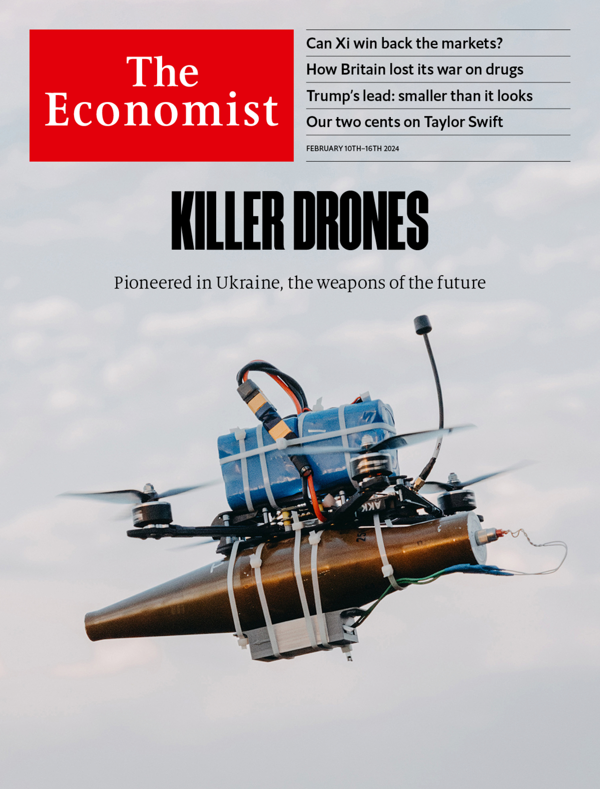

###### The world this week

# This week’s covers 

##### How we saw the world 

> Feb 8th 2024 

WE HAD TWO covers this week. In most of the world, we look at the rise of killer drones. The weapons, pioneered in Ukraine, offer precision warfare at scale and could one day become as dominant as artillery. 

 


 


In Asia and America we consider China’s stockmarket nightmare. Xi Jinping’s skittish policymaking has knocked investors’ confidence, both at home and abroad. We ask whether China’s president can win them back.

 


 

 

 

