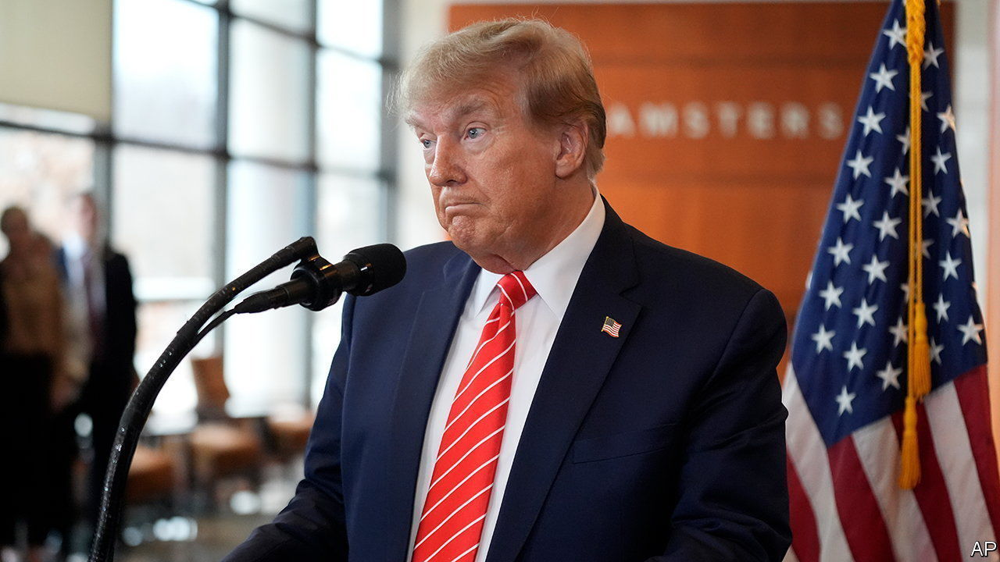

###### Citizen Trump

# A court rejects Donald Trump’s claim to absolute immunity 

##### The former president will now take his outlandish plea to the Supreme Court 

 

> Feb 7th 2024 

ON THE campaign trail, Donald Trump has been saying he would be a “dictator” on the first day of his second presidency. Mr Trump may be half-joking when he announces this plan to cheering throngs. But the  has a track record of swelling presidential power past its traditional limits, from declaring a national emergency to build a wall on the southern border, to withholding his financial records and White House communications related to the January 6th riot. 

On February 6th Mr Trump’s latest pretension—that years after leaving office he is immune from criminal prosecution for actions he took as president—met with thorough rejection by a federal appeals court in Washington, DC. “Former President Trump has become citizen Trump,” the ruling read, “with all of the defences of any other .” The three-judge panel that dismantled Mr Trump’s case included two appointed by Joe Biden and a staunch conservative appointed by George H.W. Bush.


Mr Trump’s pitch for immunity stems from the federal case brought by Jack Smith, the special counsel, concerning the former president’s attempt to overturn the results of the 2020 election. The appeals-court hearing, which began on January 9th after a district-court judge also ruled that Mr Trump did not enjoy the “divine right of kings”, exposed the extraordinary nature of the argument. When asked whether, for example, a president who had a political rival assassinated by SEAL Team Six could face a legal reckoning after leaving office, Mr Trump’s lawyer answered no—unless Congress had impeached and convicted him first. The judges were unimpressed. Making former presidents wholly immune from criminal exposure, they wrote, would abrogate “the primary constitutional duty of the judicial branch to do justice in criminal prosecutions”. 

Mr Trump’s lawyers had argued that presidents might be “chilled” into inaction if a blanket of immunity does not await them upon leaving office (a claim Mr Trump repeated after the ruling). And yet, wrote the judges, past presidents have always “understood themselves to be subject to impeachment and criminal liability”, so any purported chilling effect has been in place throughout American history. 

Gerald Ford, for example, pardoned Richard Nixon after he resigned—which was necessary only because both men knew that Nixon faced criminal prosecution for his involvement in the Watergate scandal. And Bill Clinton “agreed to a five-year suspension of his law licence and a $25,000 fine” to avoid having criminal charges filed against him after his presidency. Even if some presidents were to temper their actions through fear of “vexatious litigation”, the court wrote, that risk is outweighed by the public interest in holding former chief executives responsible for criminal misdeeds. 

After expediting the briefing and oral argument, the DC circuit took nearly a month to issue its ruling. That has delayed Mr Trump’s trial for election interference, originally due to begin on March 4th. Yet the 57-page decision—presented by a united front of ideologically diverse judges—may ultimately help get the trial started in time for a verdict before the presidential election in November. 

One more tribunal could stand in the way, however. The DC circuit panel put its ruling on hold until February 12th to give Mr Trump time to request a stay, and ask for full review, by the Supreme Court. If the justices decline, the case will return to the district court and the trial could begin in the spring. But more likely, in a season rife with fraught election-year battles, is an accelerated trip to the Supreme Court.■

■


