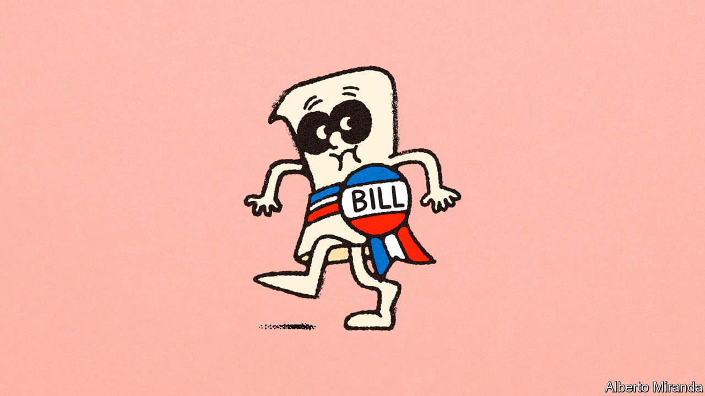

###### Shh! Legislation in progress

# Congress might just pass an astonishingly sensible tax deal 

##### But too much attention could scupper it 

 

> Feb 8th 2024 

THE “SECRET CONGRESS” theory holds that bills which attract public attention are born to partisan rancour, endure a life of torture and usually die a miserable death. For a recent example, look only to the much-hyped bipartisan deal that sought to patch up America’s broken immigration system and steer much-needed funds to Ukraine. It took months of work to craft ; when it was unveiled on February 4th it barely lasted one business day before being left for dead. But the theory also holds that successful compromises happen all the time as long as no one makes a fuss over it.

It is with some trepidation, then, that we mention the rather good bipartisan tax deal that the House of Representatives passed by an overwhelming margin of 357-70 on January 31st. (This article will be short to avoid attracting too much additional attention.) The $78bn package trades something Democrats want—more generous tax credits for families with children—for something Republicans want: more generous tax credits for businesses. It plans to completely pay for this by eliminating a tax credit unloved by anyone, a covid-era relief programme for firms that kept employees on staff that was notoriously abused by fraudsters (95% of the time, according to one whistleblower). 


If the bill actually became law there would be plenty to crow about. Capital and labour would split the spoils almost equally. Businesses would be able to immediately deduct their research and development costs. (Under current law, these must be amortised over five years.) They would also be able to deduct more aggressively some capital and, less justifiably, interest expenses. The revision of the child-tax credit would ensure that families at the bottom of the income distribution receive greater sums. (Because benefit levels scale down at low levels of income, middle-income families are currently more likely to receive the maximum credit amount of $2,000 per child than poor families.)

This proposal would not be as generous (or as expensive) as the brief policy experiment conducted in 2021, when the child-tax credit was converted into a de facto monthly child allowance, which had the effect of reducing child poverty by as much as 40%. But it would still be significant. The Centre on Budget and Policy Priorities, a left-leaning think-tank, calculates that the changes would increase benefits for 16m children in poor families and that 400,000 of them would be pulled above the official poverty line in the first year. 

Some objections are already being voiced above a whisper. A handful of Republican senators have complained that the more generous child-tax credits do not come with enough work requirements on parents. There are technical reasons to think that their objections could be assuaged. The proposed redesign still preserves the “phase-in” structure whereby poor taxpayers earn more of the credit as their income increases, creating an incentive to work. A study by the Joint Committee on Taxation, the non-partisan research body in Congress, pointed out that “the proposed expansion of the child tax credit on net increases labour supply.”

What could really scupper the deal is even more attention to it. The White House called it a “welcome step forward” and urged its passage. But one side endorsing a bill often risks greater opposition by the other. “Passing a tax bill that makes the president look good—mailing out cheques before the election—means he could be re-elected,” Chuck Grassley, a nonagenarian Republican senator from Iowa, admitted a bit too truthfully to reporters. If the deal is to pass, future discussions might have to happen . ■


