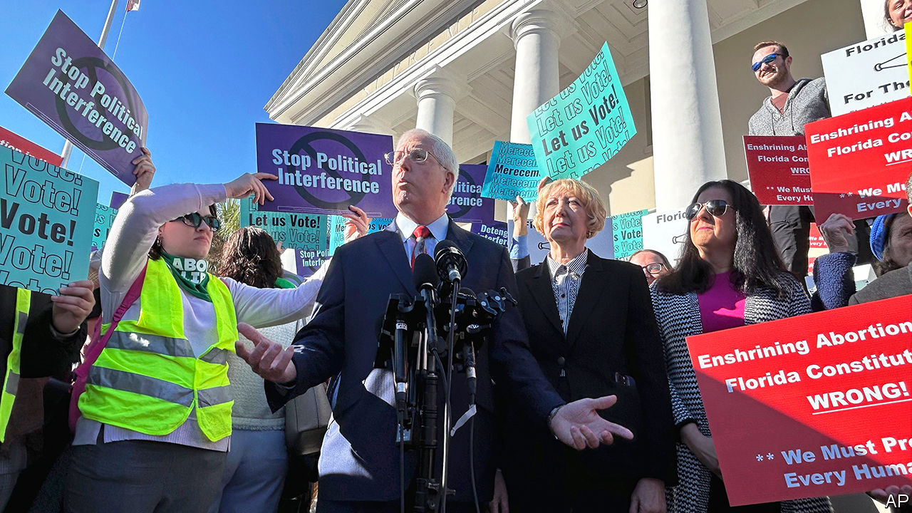

###### Direct democracy

# Florida too may have an abortion referendum in November 

##### It could influence the presidential election. It would be an even bigger deal for abortion access 

 

> Feb 8th 2024 

AS A PROTEST slogan, “Stop Political Interference” does not trip lightly off the tongue. But to abortion-rights activists brandishing signs with the phrase on the steps of Florida’s Supreme Court on February 7th, it cut to the heart of their precarious campaign. Inside the court that morning, judges were debating whether to allow Florida voters to decide a ballot question in November that would codify a right to abortion in the state constitution. Campaigners collected more than a million signatures to qualify the initiative, but it remains uncertain whether voters will be permitted to have a say.

Florida is one of 13 states considering ballot measures related to abortion this year. National attention is likely to turn to those in Arizona and Nevada, where Democrats hope the initiatives will bolster turnout in the swing states. A successful referendum in Florida would have a greater impact on abortion access. Currently, the procedure is legal in the state up to 15 weeks of pregnancy—the most liberal regime in the Deep South. Florida has become a destination for women living in  and is now third in the country for number of abortions, according to the Society of Family Planning, a non-profit group. 


Florida’s abortion law is likely to change this year, one way or another. Last April, Governor Ron DeSantis  banning abortion after six weeks, stopping access to the procedure before many women know they are pregnant. The law is tied up in the courts, but is expected to take effect at some point this year. A quite different regime would take hold if the proposed ballot initiative were to pass. It would establish a state right to abortion until viability—generally around 23 weeks—and after that time if the life and health of the mother were at stake. 

Since June 2022, when the Supreme Court overturned  and ended a federal constitutional right to abortion, seven states have held  on the issue. Each time, abortion rights have won out, including in deep-red Kansas and ruddy Ohio. Florida, however, has one of the most challenging environments for ballot initiatives, says Jonathan Marshfield of the University of Florida’s law school. He compares the process to a freshwater fish in the ocean: it is hard to survive, but “it could be worse and totally out of the water,” since Florida at least allows ballot initiatives, unlike some states.

Collecting the signatures to qualify required 10,000 volunteers as well as paid collectors. Now the ballot language must be approved by the state Supreme Court. It has leeway to decide whether the wording will be sufficiently comprehensible to a typical voter. 

Florida’s high court judges are not sympathetic to abortion rights. Mr DeSantis appointed five of the seven who heard the arguments, in no small part because they held dependably pro-life views. One of the other two judges introduced a restrictive abortion law while serving previously in the US House of Representatives. 

Florida’s attorney-general, Ashley Moody, argued against the proposed amendment, saying that its language “vastly understates [its] potentially sweeping scope”. The judges seemed sceptical that voters would be misled, with the state’s chief justice, Carlos Muñiz, calling the language, “self-evidently broad”. He added, “The people of Florida aren’t stupid. They can figure this out.” Abortion-rights campaigners are playing it cool, assuring nervous supporters that the language was designed to withstand expected legal challenges. Court watchers are more cautious and give the referendum even odds of appearing on the ballot in November.

If it does go forward, it will require heavy support to prevail. Florida ballot initiatives must earn a 60% supermajority to succeed. Aaron DiPietro of the Florida Family Planning Council, which is campaigning against the amendment, cites this high threshold as the chief difference with earlier anti-abortion amendment campaigns in other states. “No red or purple-leaning state in any of these abortion amendments has received over 60% support,” he points out. Abortion-rights campaigners did come close, however, attracting 59% support in Kansas and just under 57% in Ohio and Michigan.

Florida’s voters have occasionally met the supermajority requirement, including in a ballot initiative that returned voting rights to felons. However, that result was subsequently undermined by a determinedly conservative state government. Former felons now have to pay fees before they can vote, disqualifying nearly 80% of them. Similarly, after medical marijuana was made legal at the ballot box, the state house banned smoking it. Even if the latest initiative is adopted, the struggle over access to abortion in Florida is all but certain to continue. ■


