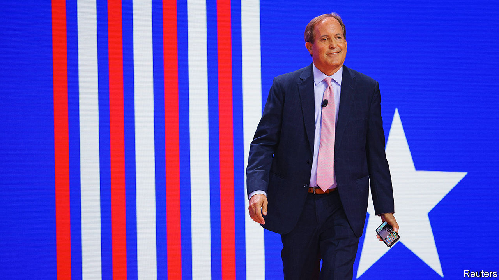

###### Generalising

# State attorneys-general are shaping national policy 

##### Despite not being elected to do so 

 

> Feb 8th 2024 

To foreigners looking in, it is unusual enough that America elects most of its top prosecutors. More shocking is the amount of money going into . Now the two have come together in a way that would make even the least wonky American curious. Between 2008 and 2022 the cost of state attorney-general races rose from $17m to $222m. Over that period governors’ contests became only eight—rather than 12—times pricier and those of state senators merely doubled. 

The cashflow reflects something much bigger: the role of state attorney-general has been recast. The job used to be about defending state laws and prosecuting cheats, fraudsters and corporate bullies. Today attorneys-general shape nationwide politics and policy by pushing strategic lawsuits through their favourite courts. Their quiet rise to power has made the states’ top lawyers some of America’s most unchecked partisan players.

Two attorneys-general, one a Republican and one a Democrat, exemplify the new breed. First there is  of Texas. Between 2021 and 2023 he refused to represent state agencies in court at least 75 times, according to  and the , both news outlets—often seemingly for ideological reasons. He has dropped child-sexual-assault cases after losing track of the plaintiffs, let payments to crime victims lapse and taken decreasing interest in catching Medicaid cheats. Instead he chose to energise his Trumpian base by relentlessly suing the Biden administration. Mr Paxton has blocked vaccine mandates and banned abortion when it was still protected under the federal constitution. Most recently he brought the country’s attention to a bitter row over whether Texas can enforce its own immigration regime at the southern border.

“I am sickened by his disregard for the safety of Americans,” Letitia James wrote after one such case. Though Ms James is Mr Paxton’s ideological opposite, as New York’s attorney-general she goes about her job in rather similar fashion. An Empire State judge will soon decide whether to side with her and strip Donald Trump of his property business for lying to lenders about his finances. Her case alleging that the bosses of the National Rifle Association, a gun lobby, schemed to enrich themselves is . These charges may have more legal merit than some of Mr Paxton’s. But they have also given progressives reason to swoon over her. When asked last summer to represent the state’s more centrist Democratic governor—in theory her primary client—on immigration issues she recused herself, telling , a news website, that this was due to “a philosophical difference”.

New York and Texas are not isolated examples. How did the attorney-general’s office come to be held by partisans who pursue flashy lawsuits rather than defending the laws of their states? The story dates back to a Supreme Court case on environmentalism. In the early 2000s non-profit groups, cities and states teamed up against the Bush administration for not regulating greenhouse gases. They argued that pollutants were a health risk and that the Clean Air Act required the feds to do something. The plaintiffs’ argument was strong; the question was who had standing to sue. The Supreme Court ruled that due to the threat of rising sea-levels the Massachusetts attorney-general could lead the charge.

 set the precedent for a single state to challenge the federal government in court. That drastically expanded the reach of attorneys-general—Republicans soon raced to sue Barack Obama when he took office. Over time attorneys-general realised that if they banded together with like-minded colleagues across the country, they could handpick the district with the most sympathetic judges in which to bring their case. One federal judge’s injunction in their favour, and against Washington, could shut down a policy for the whole country until a higher court ruled on its appeal. “Not only can they play on their home-turf, they can now choose the referee,” says Steve Vladeck of the University of Texas at Austin.

The strategy took off when Mr Trump became president. Democratic attorneys-general sued the federal government more times in four years than they had in the previous 16, says Paul Nolette, a political scientist. Republicans took it a step further under Joe Biden, aiming their litigation not just at Democratic policies but at the administrative state itself. Today these lawsuits are masterfully co-ordinated to maximise partisan wins, says James Tierney, a former attorney-general of Maine who teaches at Harvard University. With that in mind it is less surprising that Mr Trump’s Muslim travel ban was halted by a judge in Honolulu and mifepristone, an abortion pill, was  by a judge in the Texas Panhandle.

Follow the money

 Dark-money groups caught on to the fact that attorneys-general had sway and that their races were cheaper to influence than . The Concord Fund, a conservative one, has pumped at least $9.5m into the contests since 2020. That cash no doubt helped unseat moderates: a five-term Republican attorney-general of Idaho who refused to be a political activist was booted out in 2022. The left is no more tolerant of impartiality. The Democratic Attorneys General Association, which funds candidates, announced in 2019 that it would no longer back Democrats who were not explicitly pro-choice. For aspiring attorneys-general the calculus has become clear: get more political, get elected.

To those who fear too much power is concentrated in the executive, activist attorneys-general are perhaps a good check. Yet according to a YouGov/ poll, most Americans would prefer their attorney-general to stick to bread-and-butter law enforcement. Voters elect lawmakers, not litigators, to craft national policy. ■


