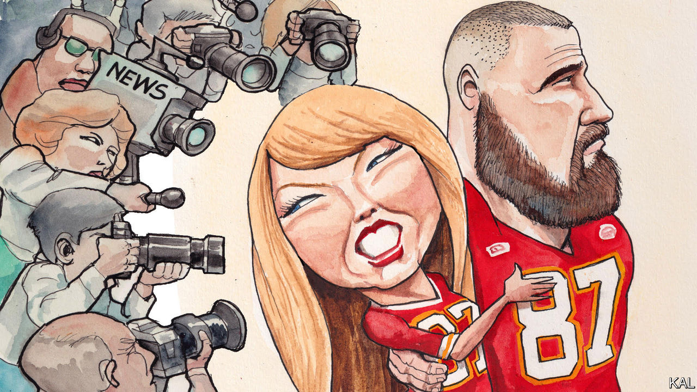

###### Lexington

# This is not a story about Taylor Swift and the Super Bowl 

##### Well, maybe a little 

 

> Feb 8th 2024 

This is not a column about Taylor Swift. It is possibly something more ridiculous, a column about all the columns about Taylor Swift. And yet attention must be paid, because so much attention is being paid. That is the ineluctable logic of the media-politics complex, a philosophical school of which Donald Trump is the American Aristotle. Ms Swift is no slouch, either. 

Any news organisation would be deceiving readers about the reality of American life by ignoring the  over the relationship between Ms Swift and Travis Kelce, a tight end for the Kansas City Chiefs, an American-football team competing in the Super Bowl on February 11th. And yet any news organisation must also reckon with the complexity that this reality has its basis in unreality, not in fact-free lies about a stolen election but in fact-free speculation about whether the romance is a real love affair, or a cross-branding triumph by two marketing savants, or, darker yet, a “psychological operation” hatched by the Pentagon to re-elect President Joe Biden. (The Pentagon has denied this.)

Having described that basic background, your news organisation approaches a fork in the road. Down one route lies further credulous or cynical conspiracy theorising. This is the route chosen by some stars of Fox News. Down the other, news organisations can poke at those who traffic in conspiracies while not ruling out the cross-branding theory, and speculating about if and with what effect Ms Swift might endorse Mr Biden, as she did in 2020.

As these news organisations intensify and prolong the attention to the artist and the athlete, they are doing their jobs: they are covering what has come to be defined as news. They are also harvesting the fruits of the fascination with Ms Swift, a subject all Americans appear to think about even more frequently than the males do the Roman empire. (Small wonder, by the way, that Super Bowls are gassily enumerated in Latin. This one is LVIII.)

There is a third branching from this particular fork, down which the self-loathing columnist, racked (yet also tickled) at the prospect of writing about Ms Swift and Mr Kelce, might venture in search of a high-minded rationale. Inevitably, that columnist will collide with Daniel J. Boorstin. Boorstin, a historian, set out to understand what had led Americans “to create the thicket of unreality which stands between us and the facts of life”.

In “The Image”, a book he published in 1961, Boorstin concluded that “we expect too much from the world.” When we pick up the newspaper, we anticipate learning of momentous events. Yet the real world does not supply spectacular novelty very often. This imbalance was not obvious when the first newspaper published in America, , appeared in Boston in 1690, promising news just once a month. But then came advances in technology—the rotary press in the 19th century, followed by radio and television in the 20th—and the definition of “news” began to inflate to fill all that space and, with it, all that yearning for something new, something interesting. 

Boorstin argued that the imbalance between demand and supply was corrected by the invention of the “pseudo-event”. This was a happening or statement that did not arise spontaneously, out of the natural flow of events in the world, but was created, often by a canny public-relations agent. This kind of news now so defines the daily representation of reality beyond our direct experience that it is hard to imagine apprehending the world without it. 

To Boorstin, the pseudo-event was a potentially dangerous means of distortion, a way to shape perception by exploiting the thirst for novelty. Joseph McCarthy, the red-baiting senator from Wisconsin, was “a natural genius” at generating pseudo-events, turning journalists into “reluctantly grateful” consumers and purveyors of his product: “Many hated him; all helped him.” Sound familiar? Boorstin was writing in what now seems a leisurely age, before the internet stretched the canvas for news to infinity while wrecking the economics of the industry, rewarding ceaseless nattering while discouraging costly reporting. These developments amplified the power of pseudo-events, as Mr Trump, always his own best publicist, has shown. 

Does Mr Trump mean it when he says that if elected president again he might impose tariffs of more than 60% on imports from China? It is possible that even he does not know the answer. It may matter someday, but it does not matter now, not for the ephemeral needs of news and politics. What matters is whatever next hyperbole will briefly sate those same ephemeral needs. Provided it keeps spinning, the process is accretive: the more attention Mr Trump gets, the more attention he will get.

Anti hero

One result of all the artificial novelty, according to Boorstin, was the debasement of achievement. People could become famous without doing anything heroic. The celebrity, Boorstin wrote, “is the human pseudo-event. He has been fabricated on purpose to satisfy our exaggerated expectations of human greatness.”

Ms Swift’s music is a mighty achievement, one that has made her not merely a celebrity but a hero to her , whatever pseudo-events she has confected along the way. She has courted publicity by appearing at Mr Kelce’s games, rather than privately cheering over nachos and chicken wings at home. Yet even Fox News interviewed a “body-language expert” who concluded that the feelings between the two were real. 

It remains possible that the romance is staged to be vivid and dramatic; that it has, in Boorstin’s terms, only an ambiguous relation to the underlying reality. But maybe all this coverage is a perfect, self-satirising crystallisation of this media era: a pseudo-pseudo-event, not devised by a publicist but created by media speculation itself—not something shallow being exaggerated into significance, in other words, but something profound being turned into something silly. One can hope. ■


