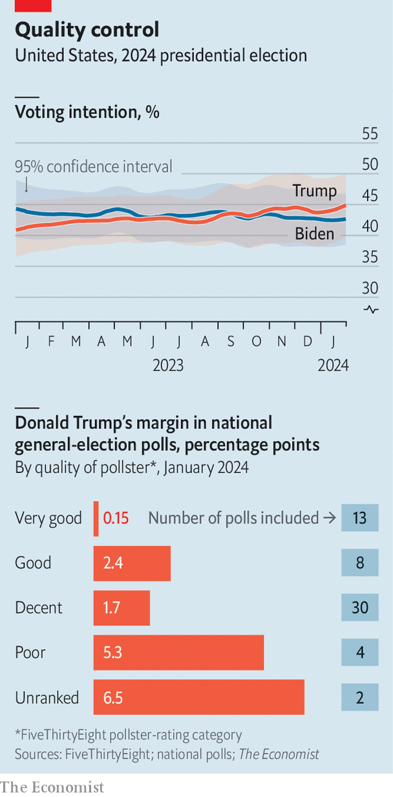

###### Poll positions

# Trump’s lead over Biden may be smaller than it looks 

##### Consider only the highest-quality national polls, and the Republican’s advantage melts away 

 

> Feb 4th 2024 

IF AMERICA were to hold its presidential election tomorrow, Donald Trump would be picking out curtains for the Oval Office. ’s  puts him up by 2.3 points over Joe Biden nationwide (see top chart). And across the six swing states expected to decide the election—Arizona, Georgia, Michigan, Nevada, Pennsylvania and Wisconsin—he leads by an average of 3.8 points. Betting markets list Mr Trump as a clear favourite. Never in his past two campaigns were his general-election polls this strong. Is it time for the world to ? 

The election is still nine months away. Historically, polls taken before the summer of an election year have been poor predictors of results. But no former president has sought to return to office since the advent of modern polling. Opinions about the omnipresent Mr Trump are much firmer than they are about typical challenger candidates, who at this stage of the race are usually still fighting to secure their party’s nomination. As a result, even though Mr Trump is not yet the presumptive Republican nominee, current head-to-head polls between him and Mr Biden may be unusually informative. 


Nationwide surveys over the past month have varied widely, ranging from an eight-point lead for Mr Trump to a six-point edge for Mr Biden. Polling averages, which blunt the effect of such outliers, suggest that Mr Trump holds a clear lead. But the polls that comprise such averages differ in their methods and degree of rigour. Democrats hunting for a silver lining can take solace in one clear pattern: pollsters with the best records of accuracy show better results for Mr Biden. Lower-quality pollsters are kinder to Mr Trump. 

Public trust in polling has weakened following the industry’s high-profile underestimates of Mr Trump’s support in 2016 and 2020 (although polling before the 2018 and 2022 midterm elections was accurate). Reliably estimating pollsters’ accuracy—measured by the size of their historical errors and whether they consistently exaggerate support for a particular party—requires a large sample of surveys across many elections. FiveThirtyEight, a data-journalism outfit, recently updated its ratings of American pollsters. It assesses them on a combination of their records and their methodological transparency.

 


Some pollsters are consistently more accurate than the field. But there are many ways to judge quality. ’s general-election polling average weights polls solely by sample size and recency, so larger and newer polls contribute a greater share to the overall score. On this basis, Mr Trump leads Mr Biden in national polls by 2.3 points. That compares with a 0.2-point lead for Mr Biden in an unweighted average that gives polls from six months ago the same weight as those from this past week.

The size of Mr Trump’s lead varies widely by the quality of pollster, as assessed by FiveThirtyEight (see bottom chart). This early in the election cycle, the pollsters in its highest tier have run polls only sporadically. (An exception is a weekly survey by YouGov, an online pollster, for .) However, in total, 13 polls have been conducted in 2024 by firms in this group. On average, they show a virtual tie between Mr Trump and Mr Biden. 

By contrast, most polls released in January 2024 have come from firms with good but not exceptional records. Polls in these (“good” and “decent”) tiers show Mr Trump with a 2.4-point and 1.7-point lead respectively. Meanwhile, pollsters with a poor record or no previous published results show Mr Trump with an average lead of around six percentage points. 

National polls reflect the general mood, and correspond to the popular vote. But thanks to the electoral-college system, winning the popular vote is no guarantee of electoral victory. In 2000 and 2016, for example, Republican nominees won the presidency despite losing the popular vote. In recent decades the electoral college has benefited Republican candidates. If Mr Trump were to win the popular vote by a six-point margin, he would almost certainly win at least 358 electoral-college votes, giving him the largest Republican victory since George H.W. Bush‘s in 1988. This would bring into play even states that Mr Biden won comfortably in 2020, such as Maine, Minnesota, New Hampshire, New Mexico and Virginia.

To those who think that all polls are created equal, Mr Trump has opened a modest but growing lead nationwide. But to those who insist that pollsters’ historical accuracy predicts future accuracy, the candidates are in a dead heat.■


