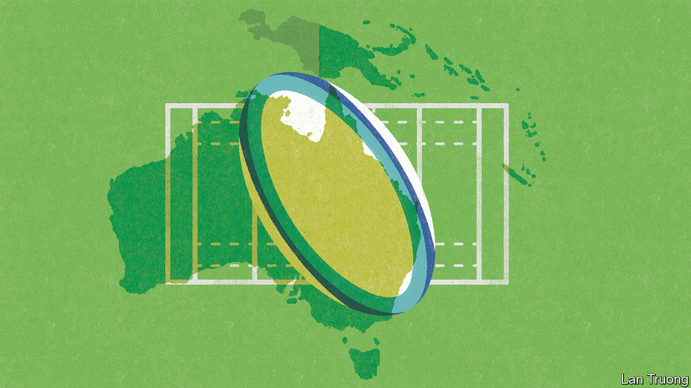

###### Banyan

# Australia needs to rethink its approach to its Pacific island neighbours 

##### They care more about development than hard security 

 

> Feb 15th 2024 

FROM AUSTRALIA’S perspective the Pacific’s island states have sat for decades in its backyard. Latterly a gate-crasher has stomped in. China has shaken Australian assumptions in the Pacific.

Australia has deep ties with the Pacific islands. It was the colonial administrator in Papua New Guinea (PNG) until independence in 1975. During unrest in the Solomon Islands between 2003 and 2017, it provided a policing mission. It has helped plug the budget holes of island states. They are “family”, as an Aussie prime minister once put it—a word tinged with paternalism. On February 8th family was celebrated in Canberra with the first-ever address to Parliament by a Pacific leader, PNG’s James Marape.

China is one reason behind the red carpet laid out for Mr Marape. PNG, immediately to Australia’s north, is vital to its security. But  Mr Marape with infrastructure and investment. It can point to the gleaming Chinese-built or -refurbished stadiums and police headquarters that adorn towns in Fiji, the Solomon Islands and the Cook Islands. Such overtures have helped Chinese state firms gain a hold in the Pacific. China buys or extracts about half of the region’s minerals, timber and seafood. Now another bonanza beckons, for seabed minerals.

China’s political gains are also striking. Since 2019 the Solomon Islands, Kiribati and Nauru have switched diplomatic allegiance from democratic Taiwan to China, helped by financial inducements to ruling politicians. Most controversially, in 2022 the Solomon Islands’ Australia-resenting prime minister, Manasseh Sogavare, signed a . Chinese police sit in the capital, Honiara. A potential military base in the Solomon Islands would represent a big threat to Australia.

Concerns in Canberra are thus understandable. China is securing resources, buying political influence and seeking military access. It hopes for regional hegemony. That would mean imposing its will on vulnerable island states, as well as destabilising the regional order; though China promises infrastructure, investment and access to a huge market, its approach can corrupt local politics. 

Yet Australia’s response can be heavy-handed, notably over demands that island states upgrade their security relationships with it. A case in point is tiny Tuvalu. Late last year the two countries signed a ground-breaking treaty whereby Australia promised to help the atoll nation tackle climate change while offering rights to Tuvalu’s citizens to settle in Australia. The treaty also included a security agreement to stop Tuvalu falling under China’s sway. But the government that negotiated the treaty has since fallen, and opposition to the security deal is building.

In truth, Pacific countries . Mark Brown, prime minister of the Cook Islands, says “development is the Pacific’s number-one security priority,” especially in the face of a warming planet. Even Mr Marape, a staunch friend of Australia’s, was reluctant in January to invoke PNG’s security treaty with Australia following deadly riots in the capital, Port Moresby, for fear of looking like Australia’s lapdog.

Mr Marape faces a vote of no confidence this month, with the riots a factor in the political turmoil. In the Solomon Islands a general election, always a turbulent time, is due in April. Meanwhile, Tuvalu remains without a government. Some Australians wring their hands: China, with its back-room blandishments, navigates such crises with ease.

Australia cannot begin to match China’s commercial clout. Still, its concerns are overblown; its Pacific strengths remain substantial. Whereas China’s aid to the Pacific has fallen since the pandemic, Australia’s still grows, accounting for two-fifths of all assistance, well ahead of the Asian Development Bank in second place and China in third. It offers education opportunities and technical assistance. A new infrastructure-financing facility competes with the corruption-heavy Chinese approach. It is boosting opportunities for work and immigration—hugely popular among Pacific islanders. And its “number-one weapon”, as Mihai Sora of the Lowy Institute, a think-tank in Sydney, puts it, is sports diplomacy, with offers to bring Pacific rugby teams into Australian leagues. China wields no such soft power. 

The lesson is clear. To counter China across the Pacific, Australia should broaden its horizons from security to match those of the island states themselves. There is no better way to trump the cynical Chinese approach. ■


