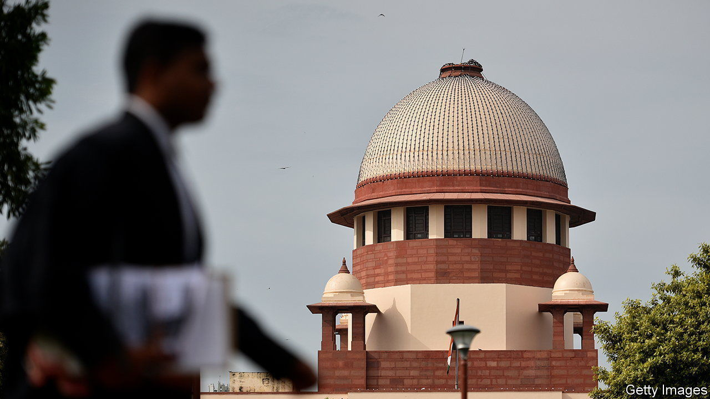

###### Junked bonds

# India’s Supreme Court delivers a rare setback for Narendra Modi 

##### It declared unconstitutional an opaque campaign-finance tool that chiefly benefited the ruling party 

 

> Feb 15th 2024 

WHEN NARENDRA MODI took office in India a decade ago, he pledged among many other things to halt the rampant use of illicit cash in politics. His big initiative on that front was the launch in 2018 of electoral bonds, which enabled Indian individuals and companies to donate to political parties anonymously, but legally. His Bharatiya Janata Party (BJP) hailed it as a roaring success. 

Opposition leaders and civic activists were thus elated when India’s Supreme Court ruled the scheme unconstitutional on Feb 15th. A five-judge bench headed by the chief justice, Dhananjaya Chandrachud, also ordered the State Bank of India (SBI), the only entity that sells the bonds, to stop issuing them. The ruling was a rare setback for Mr Modi in the run-up to general elections due by May. 

It is unlikely to affect the BJP’s prospects in the election, which it is expected to win. The Supreme Court took several years to reach its decision on challenges brought by activists and the Communist Party of India (Marxist). In the meantime, the BJP was by far the biggest recipient of donations via electoral bonds, with many apparently coming from companies, according to the Association for Democratic Reforms (ADR), a non-profit among the Supreme Court litigants.

Parties got 92bn rupees’ worth ($1.1bn) of bond proceeds in the first five years, of which 57% went to the BJP, according to Election Commission data analysed by ADR. Just 10% went to the BJP’s main national rival, the Congress. More than half the bonds bought by July 2023 were for the maximum 10m rupees, probably purchased by companies. About a third were used by parties just before the last general election in 2019, ADR says.

Purchases have also sped up in the past two years, reaching a total of 73bn rupees, according to SBI data obtained through right-to-information requests by another activist, Lokesh Batra. The bank does not give a breakdown of recipients but the BJP is presumed to have taken the lion’s share.

The case was an important test of the Supreme Court’s independence, which the opposition has often questioned under the BJP’s rule. It has also brought scrutiny to the links between Indian business and the prime minister. India’s companies have long made political donations, often funding incumbents and opponents simultaneously to hedge their bets. But Mr Modi is especially close to a handful of Indian tycoons who have thrived in the past decade. 

The BJP says that its donations reflect its share of seats in the national parliament and the number of state governments it controls (it governs 12 out of 28, versus three for Congress). In the BJP’s telling, Congress triggered the influx of illicit cash into politics after its prime minister, Indira Gandhi, banned corporate funding in 1969 (her son, Rajiv, lifted the ban when he was in power in 1985). Indian companies also see Mr Modi as an effective, business-friendly administrator, BJP officials say. 

Hogwash, say the scheme’s critics. They argue that it did little to curb political graft, and stopped donors from funding opposition parties for fear that the government could gain access to donor data from state-owned SBI. The Supreme Court ruled that the opacity of the scheme violated citizens’ right to information. The question now is: what is the alternative? ■


