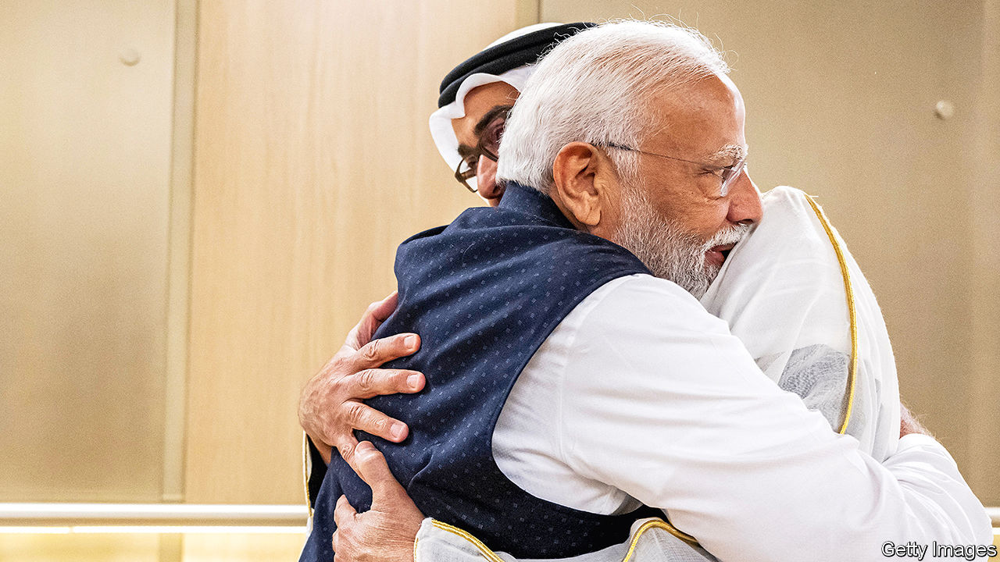

###### A historic shift

# India’s unprecedented love-in with the Middle East 

##### Amid a war Narendra Modi builds new Gulf ties 

 

> Feb 14th 2024 

AS A FLEX of India’s newfound geopolitical muscle, it was hard to top. Visiting the Middle East this week Narendra Modi stopped first in the United Arab Emirates (UAE), where he signed an investment treaty, headlined a rally of 40,000 Indian expatriates and opened a vast new Hindu temple. Then India’s prime minister headed to nearby Qatar, having just secured the release of eight Indians jailed there for espionage. All the while, a dozen Indian navy ships were in nearby waters, helping to protect global shipping under threat from pirates and Houthi missiles. 

The trip, which began on February 13th, thus neatly entwined some of the key strands—business, migration and security—of a historic shift in India’s approach to the Middle East. Mr Modi is now injecting new momentum into arguably his most important diplomatic initiative since taking office a decade ago: downgrading relations with Iran and aligning India with Israel and the Gulf Arab states

The shift could pay huge dividends for all sides, boosting foreign investment to India in particular. It could also help establish India as a competitor to China on infrastructure and technology in the region. And it could add ballast to efforts by America and its Gulf Arab partners to stabilise the Middle East. But there are risks too. And those have intensified in recent months as violence has spread from Gaza into the Red Sea and beyond, threatening India’s investments and expatriates, as well as its ships and cargo.

Mr Modi’s visit was, to some extent, about politics back home. With a general election in India due by May, the rally in Abu Dhabi was part of a global effort to mobilise overseas Indians, a big source of political funding. Opening the temple there will further energise his Bharatiya Janata Party’s Hindu-nationalist base, less than a month after he inaugurated one in northern India on the site of a mosque demolished by Hindu extremists in 1992.

The visit also reinforced a campaign message that Mr Modi is bolstering India’s global stature, including in the Islamic world. Indian expatriates say the results are palpable in the UAE, which he has visited seven times since 2015, when he became India’s first prime minister to go there since 1981. “Respect for Indians has really increased,” says Biswajit Ray, a 43-year-old Indian banker at the rally. “We see it in our offices. We feel it walking on the street.”

But electioneering is only a tactical cherry on the strategic cake. Though India’s links to the Middle East date back centuries, its diplomatic influence there waned for decades after independence in 1947, largely because of Arab states’ support for Pakistan. India’s ties to Iran and solidarity with the Palestinians also stymied relations with Israel. Mr Modi now seeks to re-establish India as one of the region’s essential players.

Consider the economic picture first. India’s business links with the region used to be defined by its imports of oil and exports of cheap labour. In the past few years, however, bilateral trade has diversified, with the UAE emerging as India’s second-biggest export market. Last year the two countries signed a free-trade deal aimed at doubling non-oil bilateral trade to $100bn by 2030. Indian commercial and political ties with Iran, by contrast, have dwindled after India stopped importing all Iranian oil in 2019 because of American sanctions.

At the same time, India has lured billions of dollars of investment from Gulf Arab states keen for a stake in the world’s fastest-growing major economy. Emirati investment flows into India totalled $9.8bn in the half-decade to 2023, almost triple the figure for the previous five years. The UAE’s largest sovereign-wealth fund has committed itself to investing $75bn in Indian infrastructure. Saudi Arabia’s has pledged $100bn. 

Big Indian companies have also won infrastructure contracts in the region as America presses Gulf Arab states to seek alternative partners to China. One of them, Larsen &amp; Toubro, says that some 30% of its $55bn order book stems from the region, mainly Saudi Arabia. And Indian commerce with the UAE is expected to grow faster with the agreements Mr Modi just signed, including the bilateral investment treaty, a deal to link the two countries’ , and a commitment to advance a plan backed by America and the EU to establish a trade corridor linking India to Europe via the Middle East. 

As , so too has the Indian diaspora in the Middle East. There are now some 9m Indian nationals in the Gulf Co-operation Council countries (Bahrain, Kuwait, Oman, Qatar, Saudi Arabia and the UAE), up from 7m in 2013. The UAE has about 3.5m, representing 36% of its population. 

They are still mostly blue-collar workers. But in recent years many more wealthy and middle-class Indians have been moving to the UAE, especially Dubai. Some migrated because of covid-19, which hit India hard. Many used the UAE’s “golden visas” which since 2019 have granted ten years’ residency to qualified professionals, entrepreneurs and investors. 

The influx also reflects the UAE’s efforts to emphasise inclusivity. Hence the new Hindu temple, which Mr Modi proposed in 2015. The UAE’s president, Muhammad bin Zayed, allocated 27 acres of land for it. At the Abu Dhabi rally, Mr Modi hailed Sheikh Muhammad as his “brother” and thanked him for looking after Indian expatriates. “We are partners in each other’s progress,” Mr Modi said, pledging to elevate to new heights a relationship “based on talent, innovation and culture”.

On the security front, the landscape has changed even faster. Israel has become one of India’s top three weapons suppliers in recent years. Along with several Gulf Arab states, it is an important Indian partner on counter-terrorism. And now India is making a notable contribution to maritime security in the region, with its biggest-ever naval deployment there. India’s navy has not joined the American and British force in the Red Sea that has hit Houthi targets in Yemen. It is focusing instead on piracy in the wider area, where it has investigated some 250 vessels, boarding 40. It is co-ordinating closely with America and Britain. 

Mr Modi’s pivot has suffered some setbacks. After breaking with Indian precedent by voicing  following last year’s Hamas attacks, his government had to adjust its position a few days later to reaffirm support for a two-state solution. That followed intense criticism of Israel among developing countries, including China, which India sees as its rival for leadership of the “global south”. India may have to recalibrate again if Israel’s actions prompt Gulf Arab states to harden their own positions. 

India was also shocked in October when a Qatari court condemned to death eight former Indian naval officers accused of spying for Israel. It is unclear how India secured their release but last week it signed a $78bn deal to extend imports of Qatari liquefied natural gas until 2048. There will no doubt be more challenges ahead. But as India’s Middle Eastern interests expand, so does its appetite for risk. “India is now playing a game in which you’ll get hurt sometimes, you’ll get pushed around or you have to push other people around,” says C. Raja Mohan of the National University of Singapore. “It’s part of joining the big boys’ club.”■


