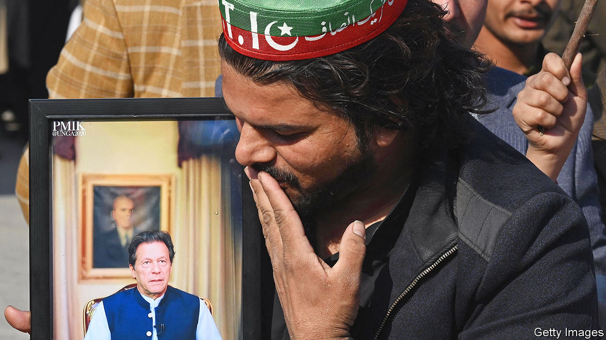

###### File under F for “fiasco”

# Pakistan’s voters tell the generals where to put it 

##### Imran Khan’s candidates won the most seats despite heavy-handed attempts to hobble them 

 

> Feb 12th 2024 

NO PARTY OBTAINED a majority in Pakistan’s election on February 8th. But the vote nonetheless produced a clear winner: Imran Khan, the imprisoned former prime minister who was barred from standing and whose party, Pakistan Tehreek-e-Insaf (PTI), was subject to a de facto ban. 

Voters disregarded the hints to shun Mr Khan (pictured), casting their ballots for his candidates anyway. Members of the PTI, standing as independents, bagged 92 of the 264 parliamentary seats being voted on (70 reserved seats will be allocated proportionally). The Pakistan Muslim League-Nawaz (PML-N) of , Mr Khan’s chief rival and a three-time former prime minister, was widely expected to win. It limped in second with 75 seats.

Yet the PTI will not form the government. Instead, Shehbaz Sharif, Mr Sharif’s younger brother and the president of the PML-N, is likely to become prime minister. On February 13th his party agreed to a coalition with the Pakistan Peoples Party (PPP), led by Bilawal Bhutto Zardari, which won 54 seats. Asif Ali Zardari, Mr Bhutto’s father, will be the nominee for president. The younger Mr Sharif appears to be backed in his efforts by the army chief, who praised the “free and unhindered” election and called for “stable hands” to put an end to “anarchy and polarisation” in the country. PML-N has also approached Mr Khan’s winning candidates to switch sides. At least one has already jumped.

Mr Khan’s party claims to have evidence that it would have won a majority of seats if the election had not been rigged. It has already begun to challenge the results in court. Mr Sharif’s party denies the allegations. “How can they claim rigging when they are the single largest party in the National Assembly?” says Khawaja Asif, a PML-N leader in Sialkot. 

Yet signs of tampering are plentiful. The election commission, which had been instrumental in obstructing Mr Khan and the PTI in the run-up to the election, blamed days of delay in releasing results on unspecified “internet issues”. It initially barred returning officers from certifying results and ordered a repeat of the vote in dozens of polling stations after reports of snatched and destroyed ballot papers. But it soon reversed course and confirmed results in disputed constituencies.

The dubious electoral process was preceded by a systematic campaign, orchestrated by the army, against Mr Khan and the PTI. The election commission stripped the party of its electoral symbol, a cricket bat, in effect dissolving it. The Supreme Court sealed the deal by overturning a successful challenge to this in a lower court. Many PTI leaders were imprisoned or disqualified. Those who stood as independents were prevented from campaigning openly. A week before the election Mr Khan,  on a separate charge,  to three long prison terms in quick succession on counts of corruption, disclosing state secrets and getting married illegally. 

That the PTI succeeded despite all this is a rebuke to Pakistan’s army, which for the past few months has ruled the country from behind the scenes through a loyal caretaker government and tried its best to force Mr Khan and the PTI into political irrelevance. The result may, some hope, prove a turning point in the generals’ ability to influence Pakistan’s politics. 

Yet the immediate consequence for Pakistani voters will be more of the same. Though blatant rigging in some instances could be reversed by legal challenges, the PTI will be confined to the opposition benches. The Sharif-Bhutto coalition set to take power is very similar to  after Mr Khan was forced from office in April 2022 and ruled until parliament was dissolved last August. The only difference is that it will enjoy even less legitimacy this time around. 

That bodes ill for Pakistan, which faces an economic crisis, an escalating threat from terrorism and an  neighbourhood. Pakistani voters have made it clear that they are tired of the old way of doing things. Their leaders, predictably, have once more dashed their hopes for something new.■

