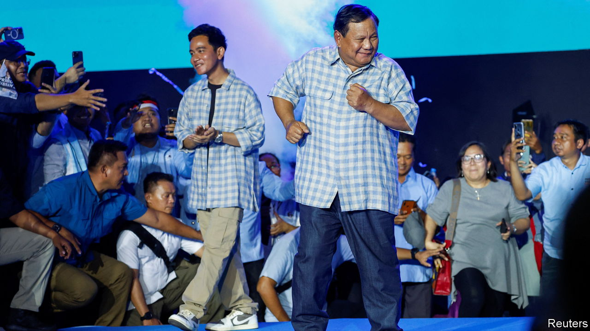

###### General, elected

# Prabowo Subianto will be Indonesia’s next president 

##### The controversial former general is unlikely to boost the country’s democratic credentials 

 

> Feb 14th 2024 

HOW HE HAS waited. In 1998, after the fall of Suharto, the dictator who ruled Indonesia for 32 years, Prabowo Subianto, his then son-in-law, manoeuvred to take over—unsuccessfully. In 2014 and again in 2019, Mr Prabowo ran to become president of what had by then become the . Both times he lost to Joko Widodo, better known as Jokowi (and both times he falsely claimed the election had been stolen). But as voting closed on February 14th there remained no doubt that Mr Prabowo had at last clinched his prize: with reliable pollsters showing he had won nearly 60% of the vote in the first round, he will be Indonesia’s next leader. 

Mr Prabowo is a controversial former general with  who has rebranded himself as a cuddly grandad. His victory casts a shadow over one of Asia’s democratic bright spots. Though Indonesia’s democracy is flawed, many Indonesians cherish their suffrage in a neighbourhood dominated by juntas and autocrats. But prominent Indonesian academics, activists and journalists have labelled this election the most undemocratic since the start of  an era of rapid democratic development after Suharto’s fall. 

Much of the blame lies with Jokowi, who remains wildly popular and backed Mr Prabowo. In recent years he has , including the once-independent anticorruption commission. And throughout the campaign he faced accusations of interfering in the election. Anies Baswedan and Ganjar Pranowo, former governors who ran against Mr Prabowo, accused state agencies of arbitrarily cancelling their rallies and intimidating Jokowi’s critics. 

Jokowi and Mr Prabowo reconciled in 2019 when Mr Prabowo was appointed defence minister. Jokowi’s eldest son, Gibran Rakabuming, ran as Mr Prabowo’s vice-presidential candidate after the constitutional court (whose chief justice at the time was Jokowi’s brother-in-law)  that in effect made Mr Gibran, who is 36, an exception to a rule that bars anyone under the age of 40 from running for president or vice-president. As Mr Prabowo declared victory to cheering fans at a sports stadium in Jakarta, a huge roar of support erupted when he mentioned Jokowi. Shouts of “Get back together!” went through the crowds when his former wife, Titiek Suharto, appeared on screen. 

Mr Prabowo ran on a , promising to build on Jokowi’s signature policies. These include moving the capital from Jakarta to a site in the jungles of Borneo and a nickel-centric industrial policy that requires foreign firms to process and manufacture raw ore in Indonesia. Mr Prabowo is “continuity with improvement”, says Burhanuddin Abdullah, one of his spokesmen. 

A more worrying continuity may be in the form of pressure on civil society and the press, which have suffered under Jokowi’s presidency. Now they are nervous about their place in Indonesia under Prabowo. At an event on February 10th, Mr Anies and Mr Ganjar both pledged to protect press freedom. Mr Prabowo was absent. Human Rights Watch, an advocacy group, said Mr Prabowo was the only candidate who did not respond to a questionnaire about human-rights issues important to voters. Mr Prabowo is accused of having kidnapped pro-democracy activists in the 1990s and of ordering the massacre of independence fighters in East Timor in the 1980s (he denies all wrongdoing). He has previously tried to abolish direct elections of regional leaders. What the country needs, he said, is an authoritarian leader. 

Yet worries that Indonesia may plunge into a full autocracy are overblown, suggests Marcus Mietzner of the Australian National University: “Indonesian democracy is now weak enough that Prabowo doesn’t need to completely overturn it,” he says. “After all, he just won the presidency.” That is not much consolation. Jokowi oversaw Indonesia’s rapid economic growth even as he weakened its democratic institutions. Mr Prabowo will continue at least one of those trends.■

