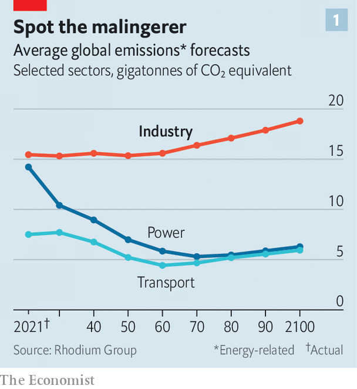

###### The burning question

# First electric cars. Next, electric factories? 

##### They could be a major new way to slow global warming 

 

> Feb 15th 2024 

BASF is in the business of molecules. As the world’s biggest chemicals firm, with operations in more than 90 countries, it makes a lot of them. When those molecules contain carbon atoms (and a great many do—they are a wonderfully versatile resource) those carbon atoms tend to come from fossil fuels. When their manufacture requires high temperatures, which is also often the case, that heat comes from burning fossil fuels. Until recently BASF’s massive plant in Ludwigshafen in Germany accounted for 4% of the country’s entire consumption of natural gas.

Conventional wisdom has it that such a firm cannot really hope to lower very much the number of carbon-dioxide molecules it creates in the course of its business. The path to decarbonisation will come instead from gathering up those molecules and disposing of them underground, a process known as carbon capture and storage (CCS). The same conventional wisdom holds that if BASF were to swear off burning molecules of gas to create heat, the obvious green alternative would be to burn hydrogen molecules instead. Those molecules would have to be manufactured, too, in an energy-intensive process.

That is why the recent declaration by Martin Brudermüller, the boss of BASF, that “the decarbonisation of energy-intensive industries can only be achieved through electrification” sounds, to many ears, like heresy. Electricity is for houses and light bulbs and maybe even for cars, but not for heavy industries built around burning heroic quantities of fossil fuel. Yet Dr Brudermüller is not alone.

BASF has joined a consortium including SABIC, a Saudi chemicals firm, and Linde, a European engineering firm, to develop an electric furnace that can generate heat intense enough for the chemical reactions that are their bread and butter. These firms are not the only recent converts to the electrification of industry. On February 8th Rio Tinto and BHP, both gargantuan mining firms, announced a joint effort to build Australia’s first electric smelter for iron ore. Fortescue, another mining giant, is introducing all-electric excavators and mining lorries, while Spain’s Roca Group recently unveiled the first electric industrial tunnel kiln for ceramics. Such innovations offer a new path to slowing global warming which may in many cases prove quicker and easier than approaches based on CCS and hydrogen. 

Industrial fail

According to the International Energy Agency (IEA), a research body, industry consumes a third of all global energy, with the generation of heat accounting for three-quarters of that. A staggering 90% of that heat is made by burning fossil fuels. All this makes industry a bigger source of greenhouse-gas emissions than power generation or transport. What is more, whereas carbon-dioxide emissions from power generation appear to have peaked and, if electric vehicles continue to proliferate, emissions from transport may soon stop growing, too, industrial emissions are projected to keep growing indefinitely (see chart 1). 

 


Aware that this is impossible to square with their commitments to slash emissions, governments in advanced economies have showered subsidies on hydrogen and CCS as the technologies most likely to help decarbonise industry. Both, however, have so far disappointed. Electrification, meanwhile, had long been dismissed for two reasons. First, it was argued, the very high temperatures and steam required by heavy industry would be difficult or at least uneconomic to produce with electricity. Second, the standard ways of making cement and steel require carbon as an input, which means emitting carbon dioxide is unavoidable even if clean electricity were to replace the burning of fossil fuels.

Yet McKinsey, a consultancy, predicts that 44% of the decarbonisation it foresees in Europe by 2050, should the EU stick to its net-zero targets, will come from electrification, more than double the share of hydrogen and CCS combined. Why is it so optimistic about an unheralded technology?

Electrification is suddenly getting a second look for several reasons, argues Jeffrey Rissman in a new book: “Zero-Carbon Industry”. Most obviously, green electricity has become much cheaper and more widely available thanks to the remarkable decline in the cost of wind and solar power. Another factor is growing wariness of reliance on natural gas, thanks to the global price shock that followed Russia’s invasion of Ukraine. Supplies of gas ran so low in Germany, for example, that the government considered rationing it for industrial users like BASF. 

But the best reason for reconsideration is innovation. Making things hot with electricity is not that hard; think of an electric kettle. Such technologies can scale: if you want ten times as much boiling water, get ten kettles or one bigger one. But if you want to get to 1,000°C instead of 100°C, until recently there were few electric options. That is now changing.

Electric avenue

For temperatures of up to 200°C, the technology attracting most attention is not the electric kettle but the industrial heat pump. Heat pumps, like refrigerators, move heat from one place to another. In a fridge the heat is removed from the inside (keeping the contents cooler) and dumped outside (making the kitchen a little warmer). Heat pumps, which are becoming increasingly common for domestic heating, take heat from outside and move it inside. Because the amount of energy needed to move heat this way is lower than the amount needed to heat things up directly, this can lead to big energy savings. And as the technology improves and sales increase, prices are falling. 

Some companies are betting that what works in the home can work in the factory, too. One such is AtmosZero, a startup that aims to reduce emissions at New Belgium Brewing, an American beermaker. AtmosZero is installing a heat pump that will soon replace one of the gas-fired boilers at New Belgium’s brewery in Fort Collins, Colorado. Like most industrial firms over the past 150 years, New Belgium burns fossil fuel to produce steam, which in its case then heats the ingredients required to make beer. AtmosZero’s heat pump will allow it to produce that steam without any burning. Since the electricity used to run the pump will be renewable in the future, that eliminates most greenhouse-gas emissions from the process. It is also more efficient, consuming less energy overall. And because the heat pump transfers warmth to water, just as in a conventional boiler, the equipment can be slotted into New Belgium’s existing factory, without the need for a complete overhaul.

 


Such heat pumps would allow a vast array of industrial processes that require heat of less than 200°C to be electrified, replacing fossil-fuelled dryers, stills, ovens and boilers. Using electricity to run a heat pump can be several times more efficient than using natural gas to heat a boiler. Using hydrogen, in contrast, is less efficient, because making hydrogen by splitting water molecules through hydrolysis powered by green electricity, although emission-free, involves a loss of at least 20% of the energy you started with (see chart 2). 

Some industrial heat pumps are in use in Europe and Japan, thanks both to subsidies and to a relatively high ratio of gas prices to electricity prices. Kobe Steel, a big Japanese industrial firm, sells commercial heat pumps capable of producing high-pressure steam at 165°C very efficiently. Heaten, a Norwegian startup boasting investment from the venture arm of Shell, a British oil giant, has developed a durable, low-maintenance heat-pump that can harness waste industrial heat to reach temperatures of up to 200°C. That makes it attractive for industries from pharmaceuticals to textiles that need middling heat.

Even in developing countries in Asia, electrification of relatively low-heat industries is making headway, despite the region’s abundance of cheap coal and lack of subsidies, which makes it harder for heat pumps and the like to compete. RMI, a think-tank, calculates that some four-fifths of the increase in industrial electrification globally since 2014 has taken place in Chinese light industries. The IEA predicts that the share of heat used in industry that is generated with electricity will rise from 4% in 2022 to almost 11% in 2028. China will account for almost half of that growth, boosting its use of renewable electricity to generate industrial heat more than five-fold.

In America, electrified solutions are making inroads even though natural gas is comparatively cheap. A study published in January by the Renewable Thermal Collaborative (RTC), an industry consortium, finds it costs no more to run a heat pump than a gas boiler when trying to attain temperatures below 130°C. That would make heat pumps competitive for 29% of industrial demand for heat, without any subsidy or technological improvements. The RTC expects heat pumps for temperatures of up to 200°C to become competitive by 2030. Harald Bauer of McKinsey expects that, in time, heat pumps will be able to reach temperatures of 500°C. 

For the time being, however, higher temperatures require different technology. “You are looking at the future of industrial energy infrastructure right here!” declares John O’Donnell, the head of Rondo Energy, a startup developing “thermal storage”. At first glance, the future does not seem that remarkable: the object of his enthusiasm is a big metal box.

It mainly contains bricks. Wires use electricity to heat the bricks, much as a toaster does bread, to temperatures over 1,000°C. The bricks, helped by extremely effective insulation, can then retain heat for days with only minimal losses. When it is needed, the heat can be released in controlled doses at variable temperatures. Air is blown through channels in the bricks, transferring heat.

Rondo’s thermal batteries are cheaper to manufacture than electric ones that require cobalt or lithium. The heat stored is intense enough to power a lot of heavy industry. As with AtmosZero’s heat pumps, they can be slotted into existing factories without a complete redesign. And since each battery is so efficient, it can consume electricity to heat the bricks when power is cheapest but dispense heat any time.

The box is generating lots of enthusiasm. Rondo recently raised $60m in financing from the venture-capital arms of such corporate titans as Microsoft, a software colossus, Aramco, the Saudi national oil company, and Rio Tinto. It counts various luminaries of tech investing among its backers. After a widely viewed TED talk and a recent lecture to the great and the good at the World Economic Forum in Davos, Switzerland, Mr O’Donnell chuckles, he is known as “the brick guy”.

Mr O’Donnell is planning a big global expansion. With the help of Thailand’s Siam Cement Group, an investor with plenty of experience making bricks, Rondo hopes to manufacture enough boxes each year to store 90GWh of electricity—double the capacity of Tesla’s “gigafactory” for batteries in Nevada.

Other companies are developing variations of these “rocks in a box”. Brenmiller, an Israeli firm funded in part by the European Investment Bank, uses volcanic rock as a storage medium. Antora, a Californian startup, uses big cubes of solid carbon to store heat as intense as 1,800°C. Boston’s Fourth Power uses molten tin flowing through a system of graphite bricks (and graphite plumbing) to provide storage at 2,400°C. Because the tin glows white hot, specialised photovoltaic cells inside the system mean that energy can be withdrawn in the form of electricity as well as heat. In areas with variable power prices, it can run at a profit simply by storing heat when power is cheap and dispensing electricity when the price rises. 

The hardest industrial processes to electrify are those that require intense heat around the clock, especially if they use fossil fuels not only to generate heat but also to provide some sort of chemical necessity—such as the carbon used in steelmaking. This is the most experimental end of the spectrum of electrifying industry, but also potentially the most rewarding, since steel, chemicals and cement together account for more than half of industrial heat and thus for a similar proportion of industrial emissions of greenhouse gases.

Several well-funded startups are pursuing radical innovations in aspects of steelmaking, one of the world’s most polluting industries. Electra, which is backed by Amazon and BHP among others, has found a way to make pure iron in a fire-free furnace. A picture of Arnold Schwarzenegger’s Terminator—who met a molten end in a steelworks—glares down at researchers at its laboratory in Colorado as they dissolve iron ore in a chemical cocktail and zap it with electricity. This “electrowinning” technique produces pure sheets of iron without using any coking coal or fossil fuels and so emitting hardly any greenhouse gases. The firm is chasing rivals including SSAB, from Sweden, which plans to commercialise green steel by 2026.

 


A more tried and tested method of reducing the carbon emissions from steelmaking replaces blast furnaces with electric-arc furnaces. These typically use electricity to melt and recycle scrap metal, rather than making steel from scratch using iron ore and coking coal. That makes the most sense in places with a carbon price, plenty of scrap and relatively stable demand for steel—rich countries, in other words. In January Tata Steel announced it would shut down blast furnaces and shift to electrified steelmaking in Britain. Wood Mackenzie, a research firm, predicts investment of $130bn in electric-arc furnaces in the coming years. That would allow low-emission steel production, currently 28% of global output, to rise to 50% by 2050.

Cement is another tricky industry to decarbonise because, like steelmaking, its emissions come from the chemical reactions involved, as well as from burning fossil fuels to generate heat. Sublime Systems has found a way to obtain the necessary chemicals without emissions at room temperature, using electrolysis—a process in which chemical reactions are stimulated by running an electric current through a solution. “We are basically replacing the kiln,” explains Leah Ellis, the firm’s co-founder. Investors including Siam Cement poured in $40m last year.

The third giant, sooty industry is chemicals. One radical form of electrification involves feeding chemical precursors into a super-speedy rotor, spinning at more than 20,000 revolutions a minute. Coolbrook, a Finnish firm, is pioneering this sort of “roto-dynamic reactor”. It is backed by Braskem, a Brazilian firm, Cemex, a Mexican one and SABIC, a Saudi one. In December it announced it had used this technique to crack (break down) naphtha, a common process for the industry. 

Some chemicals firms are also looking at nuclear power as a source of electricity and heat. Dow, an American one, plans to build four small modular reactors made by X-energy, a startup, at a plant in Texas. These will replace gas-fired boilers that currently provide electricity and steam. 

Amping up

Even if such technologies work as advertised, electrifying industry will take time. Frederic Godemel of Schneider Electric, a big French manufacturer of industrial equipment, reckons existing technologies can in theory electrify 30% to 50% of heavy industry. In practice, however, he thinks only 10% is electrified now. That is because, even when new electrical kit is competitive over the long run with existing equipment, factory bosses often resist switching because it involves high upfront costs, disruptive stoppages, training on the new gear and so on. 

Carbon pricing or other incentives to cut emissions would obviously help. So do technologies that minimise the disruption. Addison Stark, the chief executive of AtmosZero, has explained that his firm explicitly set out to overcome managers’ objections by designing its electric boiler to slot into existing factories easily and so reduce the hassles of installation. “Steam powered the first Industrial Revolution,” he declares, “and decarbonised steam will power the next one.”

One indication that electrification may live up to its promise is the interest shown by oil and gas companies, whose products the technology is intended to supplant. Equinor, Norway’s state-owned oil firm, has long been electrifying its offshore rigs to reduce the emissions involved in pumping for oil. Its most efficient offshore operations emit less than 1kg of carbon dioxide for every barrel of oil produced (or for the equivalent amount of gas) compared with a global average of 15kg a barrel. Oil firms drilling in America’s Permian basin, under pressure from regulators to cut emissions, are spending billions to replace conventional equipment prone to leaking methane (a potent greenhouse gas) with electric alternatives. If even the natural enemies of electrification can see its worth, its prospects must be decent. ■


