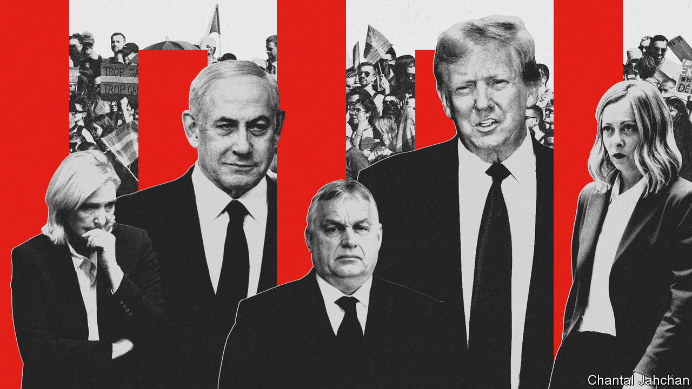
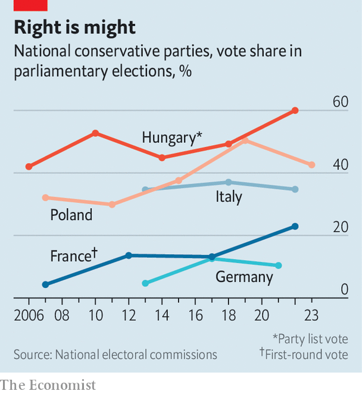
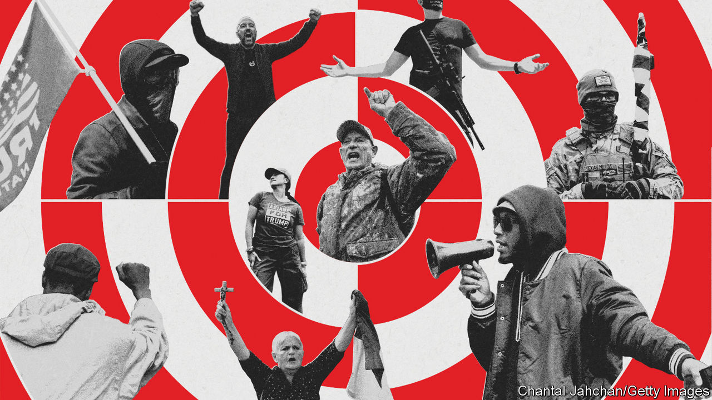

###### Nationalists of the world, unite!

# “National conservatives” are forging a global front against liberalism 

##### The alliance may be incoherent, but that does not make it harmless 

 

> Feb 15th 2024 

YOU MIGHT call Budapest a Mecca, were Islam not anathema to the pilgrims flocking there. An anti-Davos would be a better description: a place where conservative nationalists from all over the world gather to compare notes on how to defeat international liberalism. Either way, Hungary’s capital is at the heart of a global movement to reinvent right-wing politics.

Viktor Orban, Hungary’s prime minister since 2010, is one of the main proponents of the “national conservatism” that is newly ascendant in much of the world. “Hungary is saying outspokenly and loudly some anti-establishment things about migration, about the role of family, about gender, about the role of national sovereignty,” says Balasz Orban, the prime minister’s (unrelated) political director.

The Hungarian government has spent a lot of time and money trying to propagate this ideology. State-sponsored institutes and think-tanks have cultivated warm ties with right-wing American outfits expounding the politics of Donald Trump. Conferences bring together national conservative notables from around the world. At first glance, these powwows seem rather forced: the main thing Mr Orban, Mr Trump and Giorgia Meloni, Italy’s prime minister, have in common is a tendency to rail against wokery, immigration and international institutions.

 


But just because the networking is orchestrated rather than organic does not make it meaningless. At the level of pure political power, the movement has been doing extraordinarily well. The Republican Party has been captured by Donald Trump and his merry band of America Firsters. All over Europe, national conservative parties are on the rise (see chart).

Ms Meloni, who leads the Brothers of Italy, a party descended from admirers of Mussolini, took power in Italy in 2022. Of the European Union’s five most populous countries (Germany, France, Italy, Spain and Poland) four have hard-right parties in government or polling at 20% or more (Spain is the exception). Right-wing populists that were once excluded from governing coalitions, such as the Sweden Democrats and the Finns Party, have become too popular to sideline. Coalition negotiations in the Netherlands could yet install Geert Wilders, a national conservative firebrand, as prime minister. Another, Marine Le Pen, is leading in early polls for France’s next presidential election, to be held in 2027.

This new form of conservatism marks a radical departure from the sort that prevailed in the era of Ronald Reagan and Margaret Thatcher. Instead of sunny optimism and a view of America as a “shining city on a hill”, as Reagan had it, it sees decline and “American carnage”, as Mr Trump puts it. In place of muscular internationalism is a profound scepticism of foreign wars and multilateral organisations. Its economic policy is much more aligned with the left’s style of thinking: sceptical of big business, willing to accept a large welfare state, concerned with working-class hardship and keen to preserve domestic industry and jobs through protectionism.

The time is right

Proponents of national conservatism argue that elections this year will cement it as the West’s dominant right-wing ideology, dispelling any notion that it is simply a flash in the pan. “Just like in June 2016 when the Brexit vote shadowed Trump’s November victory, I think you’re going to see the European parliamentary elections in June of this year foreshadow a big sweeping victory for the populist movement in the United States,” says Steve Bannon, a former adviser to Mr Trump who has spent years trying to light populist fires. “President Trump is our leader in this movement, but this movement has got permanency to it. Now it’s in the process of building institutions. It’s not going away. It’s only getting more powerful and bigger.”

Several concerns distinguish national conservatism from the “default liberalism of neocons and libertarians”, says Yoram Hazony, an Israeli-American who runs a series of conferences called “NatCon” that aims to bring the movement around the world together: “immigration, hostility to what we could call wars of expansion…and the question: has the free market damaged the social fabric of the country?” In addition, “An awful lot of nationalists genuinely feel there is something like a neo-Marxist takeover of the educational institutions and the bureaucracies.”

In his book, “The Virtue of Nationalism”, Mr Hazony takes issue with foundational tracts of liberalism by Jean-Jacques Rousseau and John Locke, whose “political theory summoned into being a dream-world, a utopian vision, in which the political institutions of the Jewish and Christian world—the national state, community, family and religious tradition—appear to have no reason to exist.”

Another influential thinker is Patrick Deneen of the University of Notre Dame, who argues that the current elite should be replaced with “a better aristocracy brought about by a muscular populism” who will use state power to advance the “common good”—at least as he understands it. In a book published in 2023, “Regime Change”, Mr Deneen decrees this common good to be “integration”, about which he is simultaneously verbose and vague, but which seems to mean, among other things, reuniting church and state. 

Right mind

These intellectuals and like-minded politicians are actively forging ties. Past attendees at Mr Hazony’s “NatCon” gatherings include Mr Orban, Ms Meloni and prominent figures from America’s new right, including Ron DeSantis, Florida’s governor, and Josh Hawley and J.D. Vance, both senators. In Washington, established conservative think-tanks such as the Heritage Foundation have been overhauled in the national conservative manner. “It is national conservatism—and not the corporatist, secular, neoliberal establishment—that bears the standard of Thatcherism and Reaganism in the 21st century,” declared Kevin Roberts, the president of Heritage, at a speech at NatCon in London in May.

On February 13th one of the architects of Heritage’s Project 2025, a detailed plan to defang the deep state in a second Trump presidency, arrived in Budapest to present his findings at an event hosted by a state-sponsored think-tank. CPAC, an annual meeting of the American right, invited Mr Orban to Dallas to give a speech in 2022. (“The globalists can all go to hell; I have come to Texas,” Mr Orban exulted.) CPAC has begun holding annual conferences in Hungary, too, co-sponsored with the Centre for Fundamental Rights, a think-tank which receives government funding, albeit indirectly. Mr Wilders is expected to speak at the conference this year. 

In Hungary national conservatism is a state-led project. In 2020 the Hungarian parliament donated shares in state-owned companies worth $1.7bn to the Mathias Corvinus Collegium (MCC), which educates talented young Hungarians at little cost, but with a distinct nationalist slant. As a share of Hungarian gdp, the donation  was bigger than the combined endowments of Harvard, Yale, Stanford and Princeton are, relative to the American economy.

Kim Lane Scheppele of Princeton University considers MCC “a boot camp for Orban” that is “expanding its training programme to include right-wing allies from other states”. Its leadership denies that it is a tool of indoctrination. “The main purpose is to find the most gifted, most talented people,” says Zoltan Szalai, the director-general, who is also editor-in-chief of a pro-government weekly magazine called . Mr Orban, the prime minister’s political director, is chairman of the board.

MCC has branches in Hungary, Romania and Slovakia. It has opened a centre in Brussels that advocates a Europe of “sovereign states” and “strong borders”. It is “against the culture war” and “unshackled from environmentalism”. It has also set up outposts in Berlin and Vienna and plans to do so in Britain, too. 

The Hungarian government also funds conservative think-tanks. It channels money to a foundation which in turn distributes it to think-tanks like the Centre for Fundamental Rights, the co-sponsor of CPAC Hungary, and the Danube Institute, which gives fellowships to foreign conservative intellectuals. The same foundation pays for two English-language publications, the  and . Istvan Kiss, the executive director of the Danube Institute, says its purpose is to be “a kind of beltway between our region and the Anglosphere”. Its chairman, John O’Sullivan, is a former speechwriter for Margaret Thatcher and editor of the , an American conservative journal.

He is not the only Anglophone intellectual drawn to Budapest. Gladden Pappin, one of the first political philosophers to try to intellectualise Trumpism, is president of the Hungarian Institute of International Affairs, which reports to the prime minister. Mr Pappin says, “Hungary has a national interest in fostering like-minded, nationally oriented parties in the European level.” That is necessary, he explains, because “Conservatives felt that liberal globalism was a kind of divide-and-conquer ideology and that conservatives had been kept incommunicado.”

The networking has allowed national conservatives to borrow ideas from one another. Jaroslaw Kaczynski, the leader of Poland’s former ruling party, PiS, imported techniques of state capture from Hungary. In Florida Mr DeSantis approved a law banning lessons on homosexuality and gender ideology months after Mr Orban’s government did the same. Another Floridian law banning the teaching of critical race theory in universities and the takeover of a small college deemed too liberal also echo Mr Orban’s politics.

Human right

There are shared policies on the family, too. The phrase “family friendly Hungary” is plastered across the airport in Budapest in multiple languages. Women who have large numbers of children receive big tax breaks, student-loan forgiveness and considerable aid in buying homes. In Poland one of PiS’s most popular policies was a grant of 500 zloty ($125) a month for every child, which helped reduce child poverty markedly. In America, too, some on the right support payments for working parents (“workfare”) as a way to help families, despite misgivings about the welfare state.

The desire to defend the family sometimes manifests itself as a fixation with fertility. “Perhaps you weren’t expecting to have to think about making babies at 9 o’clock on a Monday morning,” mused Miriam Cates, a Tory MP, at NatCon in 2023, “but if you want to be a national conservative, you need a nation to conserve.” At a recent conference hosted by Ms Meloni, Elon Musk, the world’s richest man, urged those present to “make more Italians to save Italy’s culture”. 

Despite all these exchanges, however, national conservatives are a disparate bunch with lots of disagreements. There are deep divisions on economics, foreign policy and social affairs. America Firsters and Fidesz are resoundingly opposed to giving Ukraine additional aid to resist Russia’s invasion, but PiS was among Ukraine’s staunchest allies when it was in government. In America, Hungary and Poland nationalists worry about gay and trans indoctrination of children; the most prominent nationalist conservatives in France and the Netherlands, Ms Le Pen and Mr Wilders, are more supportive of gay rights (which they trumpet in part as a way to bash Islam). 

Mr Trump wants to impose big tariffs to protect domestic industry, whereas as much as Hungary’s government rails against bureaucrats in Brussels, it has no plans to leave the EU and its single market. “We are against globalism as an ideology, not globalisation,” explains Mr Orban, the prime minister’s political director. 

Ms Meloni provides a good case study of the internal contradictions of the coalition. Given her belligerent Euroscepticism before becoming prime minister, many had feared that she would ally with Mr Orban in his constant feuding with the EU. “While defending Italian sovereignty, we cannot forget to defend Viktor Orban’s Hungary or Kaczynski’s Poland, once again under attack from the European progressive mainstream,” she declared at a NatCon conference held in Rome in 2020. 

Yet in office she went along with other European leaders to suspend billions of euros in payments to Hungary over its dubious commitment to the rule of law. Ms Meloni has also strongly supported aid to Ukraine despite Mr Orban’s objections, and helped twist his arm to allow a recent tranche of €50bn ($54bn) to go through. Since 1998 Ms Meloni has organised an annual conservative conference called Atreju (named after a character from the fantasy series “The Neverending Story”). In 2019 her honoured guest was Viktor Orban. Last year it was the thoroughly conventional prime minister of Britain, Rishi Sunak. 

There is little agreement among national conservatives about what a post-liberal international order should look like. To win broader support—and perhaps after witnessing the painful contortions of Brexit—European national conservatives have backed away from Frexit, Huxit and Nexit. Hungary has used its veto within the EU and NATO to win concessions from its fellow members, but does not want either supranational organisation—from which it draws big benefits in the forms of direct subsidies and security guarantees—to be disbanded. For all of the complaints about globalism, most national conservatives do not seem to want to go it alone. 

 


Indeed, some argue that national conservatism is so inchoate and incoherent that it is not worth taking seriously. But even movements with deep internal inconsistencies can reshape the world. In America, the Reagan revolution relied on “fusionism”, an awkward assemblage of anti-communist hawks, anti-abortion social conservatives and libertarian free-marketers, in order to rewrite the meaning of conservatism for decades. The First International and Second International were motley 19th-century assemblies of left-wing groups that collapsed in acrimony, but nonetheless helped propagate both communism and social democracy. 

In 1934 Italian fascists convened a conference in Montreux, Switzerland, with the aim of sketching a universal theory of fascism. The effort was a complete failure. Nazi Germany had been excluded due to diplomatic conflicts with Italy. “The delegates at Montreux disagreed on almost everything of ideological substance: the centrality of fascist corporatism; race and the so-called ‘Jewish question’; the role of Christianity…and, eventually, over the very balance between national independence and international collaboration,” writes Aristotle Kallis, a historian of fascist movements. And yet, as divided as the fascist movement was, it still proved capable of igniting the second world war.

Right and wrongs

Modern-day national conservatives are not fascists, and are at pains to distinguish their movement from the destruction of the 1930s. Mr Hazony, for instance, claims that the Nazis were not true nationalists, but imperialists who sought to conquer Europe, and that real nationalism entails opposition to imperialism and other totalising ideologies, including liberalism.

Of course, in practice, nationalists often overlook the distinction Mr Hazony is drawing. Vladimir Putin, Russia’s president, bases his authoritarian power on corruption and the appropriation of nationalist causes. He embraces the Russian Orthodox church, seethes at Western thanklessness about the Soviet Union’s sacrifices during the second world war and telegraphs revulsion for foreign immorality. To justify his invasion of Ukraine, he served up a smorgasbord of nationalist propaganda, insisting that the two countries were part of the same Slavic nation.

When George Orwell pondered the question of nationalism in the waning days of the second world war, he wrote of its dangers this way: “Nationalism is power hunger tempered by self-deception. Every nationalist is capable of the most flagrant dishonesty, but he is also—since he is conscious of serving something bigger than himself—unshakeably certain of being in the right.”

Much the same criticism could be levelled at many national conservatives. Although some, like Ms Meloni, govern within the rules, many of the movement’s most prominent figures, including Mr Trump, Mr Orban and Mr Kaczynski, are so convinced of their own correctness that they do not mind subverting the state to maintain power. Courts are not seen as an important independent check on the executive, but as an obstruction that ought to be made more pliant. The media are treated in much the same way. Mr Trump even went as far as trying to overturn an election.

National conservatives insist that their movement is compatible with, not antagonistic to, democracy, yet most of its prime exponents are intent on retaining power. It already dominates right-wing politics across much of the Western world. The elections of 2024 could help it to dominate politics, full stop. ■

