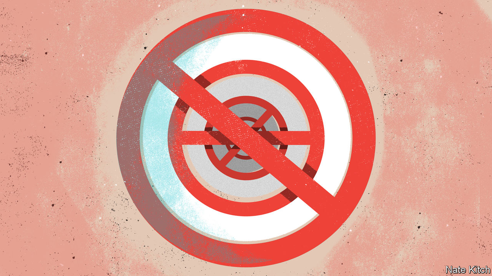

###### Bagehot

# Ban it harder! An unwelcome new trend in British politics 

##### Do not abduct that cat 

 

> Feb 14th 2024 

CATS are not like diamond necklaces or Rolex watches. For one thing, they have minds and legs of their own. “They are known to occasionally make themselves at home on other people’s sofas,” acknowledged Mark Spencer, a government minister, to a committee of MPs on January 31st. The facts of feline behaviour have not deterred the government from backing a new bill that will make the “abduction” of a pet cat or dog punishable by up to five years in prison. The act of “inducing” a cat (perhaps with a tin of sardines) will also be caught by the new offence.

The problem with the bill, which is sponsored by Anna Firth, a Conservative backbencher, is not only, as a government “pet-theft taskforce” found, that public fears of this dastardly act far outweigh its actual incidence. It is that stealing is already punishable under the Theft Act of 1968 by up to seven years in prison, and that the stiffest sentences are already handed out for crimes that cause emotional distress. Ministers used to argue as much themselves until they yielded to a campaign by pet lobbyists. For when it comes to tackling an injustice that is already against the law, the answer can be simple: ban it harder. 

What is true for cats and dogs is also true for war memorials. Vandalism has long been a crime. But in 2022, amid concern that activists might topple monuments to contentious historical figures, Parliament created a new provision of “criminal damage to memorials”, punishable by up to ten years in prison. More is to come. Cops already have broad powers to tackle “disorderly conduct” and people “causing public nuisance”. Still, the Metropolitan Police’s hands-off approach to recent pro-Palestinian protests in London led the government to announce on February 8th that it would seek to make “climbing on war memorials a specific public order offence”, punishable by three months in prison. 

Britain is in the grip of a bad bout of statutory inflation, in which public demand for tough new laws outstrips the supply of social ills that have not yet been legislated upon. The result is lawmaking that renders the already illegal even more illegal.

This sort of legislative micromanagement would have appalled the version of the Conservative Party that  led in opposition during the 2000s. The defence of liberties against the authoritarian culture of New Labour was a big theme of the party’s 2010 manifesto. “Labour continues to use ever more new legislation as a kind of rhetorical tool, a parliamentary squawk to indicate its attitudes, while totally neglecting to use and enforce the existing law,” wrote one Boris Johnson, then a Tory backbencher and star columnist, in 2006 of the proposed offence of “glorifying terrorism”. A noble sentiment and one Mr Johnson had completely forgotten by 2019, when he put forward a law that states, with epic redundancy: “It is recognised that the Parliament of the United Kingdom is sovereign.”

Banning it harder is eye-catching, free and reassuringly tough, which is why Labour is still keen on the tactic. Questionable procurement during the covid-19 pandemic has become a running sore for the government, so Labour is considering a new offence of “fraud against the public purse”. Yet fraud is already a crime. So is assault, but that has not deterred Labour from proposing a “new specific offence of assault against retail workers” in response to a wave of increasingly violent . 

Such measures can have unanticipated consequences. The problem with offering certain occupations a special legal protection from violent crime was apparent after a similar law was introduced in Scotland in 2021; soon groups representing cabbies and bus drivers lobbied for provisions of their own. New offences are also a clumsy tool for serious problems. Spiking, in which a victim’s drink is drugged in order to rob or assault them, is a terrifying crime. It was already prosecutable under seven separate offences before the Home Office proposed legal amendments in December 2023 to show “without any doubt, spiking is illegal”. But the reason why prosecutions are rare, and the true scale of spiking hard to define, is because hospitals do not routinely test for drugs in emergency wards. A new offence is unlikely to change that. 

Syntax error

Ban-it-harderism may nonetheless seem harmless. Britons like their pets; they do not, as a rule, like their politicians. Reasserting existing laws in a loud voice is a more benign way to bridge the gap between governing and governed than, say, stirring a trade war with China. Yet it is a symptom of two malaises in British politics.

The first concerns the role of MPs. Ms Firth told the Commons that, for one constituent, the loss of her dogs (Mandy, Micky, Ruby and Chara) had been “as if her babies had been taken”. Parliament, too, has been infantilised. MPs’ time is misallocated. They are increasingly incentivised to think of themselves as super-councillors, tasked with sorting out constituency casework and championing local causes, rather than as . It is a brave MP who tells constituents that their idea for a bill, prompted by a local tragedy, would be an unhelpful complication to existing law. 

The second malaise concerns law enforcement. The police response to pet theft is “virtually non-existent”, said Ms Firth. If incidents of kittynapping were logged under a separate law, she argues, officers would take it more seriously. That logic is a common thread through bills to ban it harder. MPs have little visibility or control over the police, who are operationally independent. Restating the law in increasingly specific terms is a blunt attempt to jolt the police into affording certain offences a higher priority. It is akin to pounding the keyboard of a frozen computer in the hope of stirring it to life. The problem is that the list of crimes which overstretched and undermanaged police forces struggle to solve—rape, burglary, online fraud—is long. Cat theft is a low priority because much graver crimes are competing for attention. It is possible to ban things harder. They cannot all come first. ■


