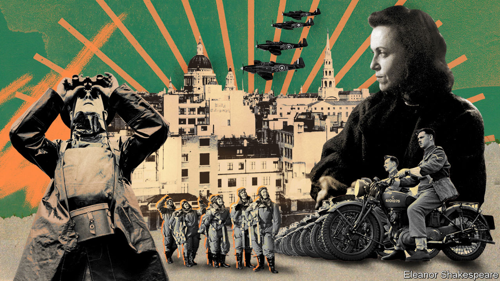

###### A life more ordinary

# British lives are getting duller 

##### Good news for Britons, bad news for obituarists 

 

> Feb 15th 2024 

They are dying out. Last month the final surviving member of the died. A year or so ago the last “Dambuster” pilot died. A few years before that, the last Battle of Britain Spitfire ace did. Britain’s finest hour has long since passed; now those who fought in it are passing, too. Those who never surrendered are now surrendering. And as they go, Britain must face the loss not only of a generation and of a direct connection to history but also, somewhat less seriously, of a niche literary genre: the late-20th-century obituary. 

The genre emerged in the 1980s. Before then obituaries tended to serve readers a diet of fresh corpses and stale prose—respectable judges, unimpeachable wives and phrases in the “she passed away peacefully” and “tributes poured in” vein. Then things changed. Led by Hugh Massingberd, an obituaries editor at the , the in-house journal of the upper classes from which almost all of the excerpts below are drawn, the British press saw the possibility in chronicling . Suddenly obituaries started to offer characters such as “Brigadier ‘Slasher’ Somerset” and “the last Wali of Swat” and phrases such as “he tried slithering along a sewer” or “cowering in the back of a hayloft in…Lower Silesia”.

The history of the 20th century offered ample material. Wars and revolutions may offer death on an unprecedented scale but they also offer life on it, too. No previous century could have offered the undertaker one Lady Paget, who “spent much of her life rescuing English governesses stranded in Soviet Russia”; Field Marshal Sir Gerald Templer, who was “injured by a looted grand piano, which had fallen from a passing truck on to his car”; or the redoubtable Major-General Eric Harrison, who, having given “distinguished service” in both world wars, also found time to be a “representative rugby player, an Olympic athlete, a legendary rider to hounds [and] pig-sticker”. Today LinkedIn is lamentably low on pig-stickers. 

Empires and changing borders also provided a distinctive canvas. Countries were still being administered, and even created, by mere handfuls of people in much of the 20th century. Their obituaries are duly filled with sentences of the “her mother [helped] to found Czechoslovakia” sort. 

Class helped shape the genre, too. It is studded with aristocrats as well as autocrats. There is much to criticise about outmoded, unjust, elitist English aristocrats. Dullness is not high on the list. Their obituaries are filled with the sort of names—not just “Slasher” but also “Tishy”, “Cockie”, “Loppy” and “Pudding”—that signify only the properly posh (or possibly Labradors). They chronicle the sort of lives that wouldn’t disgrace the pages of Evelyn Waugh or P.G. Wodehouse: Lord de Clifford, a colonel and door-to-door dogfood salesman; Baroness de Koenigswarter, an aviatrix who painted portraits in “milk, Scotch whisky, and scent”; and Dame Violet Dickson, who was “mountainously large” and “spoke Arabic in a Bedouin dialect”. All the best people do.

Such idiosyncratic characters now had their own idiosyncratic chroniclers. All historians would have recorded the death of Hitler. It required an obituarist to see the pleasure of Jeanette Schmid, a “professional whistler” who performed with Marlene Dietrich and Edith Piaf but who “had been born a man and had fought in Hitler’s Wehrmacht before undergoing a sex change in a Cairo clinic”.

Lives of this vintage are now almost all over. To read about them is to be confronted by a species of human that already feels as exotic and outmoded as a Regency rake. In an era in which people now begin to climb the career ladder at school, it is fascinating to encounter the third Lord Moynihan (“bongo-drummer, confidence trickster, brothel-keeper”) for whom the word “career” was more verb than noun. In an age that frets over microaggressions, it is sobering to read of those who coped stoically with the macro-kind: phrases such as the “bullet passed through his chest and killed the man behind” pepper these reviews like shot. (Though even this generation had its qualms: when asked to land in a pineapple plantation during the second world war, General Sir Nigel Poett, who had earlier commanded a brigade in the D-Day landings, suggested that “a rubber estate might be less prickly”.)

Such characters are not entirely extinct; opportunities for adventure still exist. When confronted with the option of derring-do, however, most Britons derring-don’t. According to Rory Stewart, a former MP whose life would not shame the better British obituary (he was a deputy governor in Iraq before walking across Afghanistan, Pakistan and Iran), “the interesting question is why other people don’t do it, not really why I did.” 

And if the fading of a particular type of life is a matter of regret to obituarists, there are reasons for almost everyone else to be grateful. Most obviously, war is not “a sort of glorious romp”, says Max Hastings, a historian. Although the general tone of these obituaries is droll, they are pierced with lines—“his two other sons were killed, one at Monte Cassino”—that hint at the kind of pain no pen can capture. 

Which is perhaps why, confronted with the unbearable tragedy of the 20th century, its obituarists often turn instead to comedy. One cannot be sure of happiness in life but one can at least be entertained. Or, as the 98-year-old Dowager Countess of Elgin and Kincardine put it when she entered her final year, she was looking forward to her 99th birthday as “that will be interesting”. She then planned “to look forward to my 100th”. But “I may die before that, and that will be very interesting too.” ■


