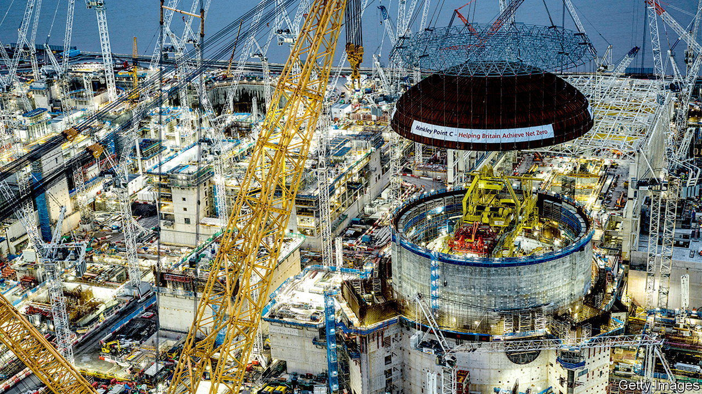

###### Hotting up

# Climate will be a battleground in Britain’s next election 

##### The Conservatives and Labour both have weaknesses 

 

> Feb 15th 2024 

Climate change has never been a core issue at a British general election. At the next one it will be. That partly reflects rising salience: since the last ballot in 2019, the environment has risen to become one of voters’ bigger concerns, alongside the economy, the National Health Service and immigration. But there is also an increasingly acrimonious divide between the two big parties over green policy. 

Take the Conservatives first. Earlier this month, the government announced that Britain had become the first big economy to cut its territorial greenhouse-gas emissions by half since 1990. That sounds impressive, and it is. But celebrating past success masks the fact that Britain has done well on the easier bits of decarbonisation, such as closing down coal-fired power plants, while failing to develop plans for tackling emissions in tougher areas, like home heating and agriculture.


Last June the Climate Change Committee, a watchdog, said that, for the government to meet its emissions target for 2030, it would need to quadruple the rate of emissions reduction outside the power sector. In fact Britain has gone backwards in some areas. In September Rishi Sunak, the prime minister, criticised his predecessors for imposing unnecessary costs and delayed a target for banning new gas boilers.  have slowed, in part because a ban on the sales of new petrol and diesel cars has been deferred. 

Plans to generate clean energy took a knock when the government’s most recent auction round failed to secure any new offshore wind projects. A  contained a lot of pleasing promises but was overshadowed by news of yet another delay at Hinkley Point C, a nuclear-power station being built in Somerset. (Ministers did manage to approve a new round of North Sea oil and gas licences.) 

Mr Sunak is currently mulling what would be his biggest bit of climate backsliding to date: scrapping a regulation, due to come into force in April, that would require boiler manufacturers to produce a rising proportion of heat pumps over time. The move would please some manufacturers as well as some Tory MPs who consider heat pumps bothersome and un-British. But it would leave the government’s targets looking even less credible and open it up to legal challenges (because of legislation requiring net-zero emissions by 2050). 

All of which offers plenty of ammunition for other parties to target the Conservatives on the environment. Tory MPs in some southern seats already fret about the threat from the Liberal Democrats, who are stirring up anger about sewage in rivers. But the climate is also an issue where Mr Sunak spies an opportunity to take the fight to Labour, which remains far ahead . He would like to paint the opposition as green radicals who want to kill the oil-and-gas industry, jack up the cost of driving and rip out your boiler. 

A decision on February 8th by Sir Keir Starmer, the Labour leader, to slash the party’s decarbonisation plans does not close down this line of attack. Worried by charges of fiscal irresponsibility, Sir Keir  ($35bn, or 1.2% of GDP) per year by the end of the parliament on cutting emissions and building up green industries. Labour now plans to spend less than a fifth as much, £23.7bn ($30bn) over five years, with half of the money coming from borrowing and half from a windfall tax on oil-and-gas firms. 

Labour still has big ambitions. It aims to decarbonise Britain’s electricity supply by 2030. GB Energy, a new publicly owned clean-energy company, would be given an initial capitalisation of £8.3bn ($10.4bn); it is meant to be a “national champion” in the mould of Orsted or Vattenfall, state-owned renewable-energy firms in Denmark and Sweden. A separate “national wealth fund” would invest in industrial projects, though even enthusiasts struggle to articulate the exact purpose of the two new bodies. Labour says it will look more to private finance to achieve its green aims, including ways to encourage people to pay for home upgrades. The Tories will doubtless argue that if Labour is not going to borrow its way to net zero, it will tax or regulate its way there. (Ministers have already instructed officials to cost Labour’s plans.)

Optimists might hope that the ground is being laid for an invigorating debate about the next wave of climate policies and the relative merits of taxes, regulations, subsidies and industrial strategy. The reality will almost certainly be dirtier and more depressing. Everyone will attack the Tories as wanton polluters. The Tories will say that Labour cares more about the environment than the struggles of the average voter. And the political consensus that once prevailed over the climate will continue to fracture. ■


