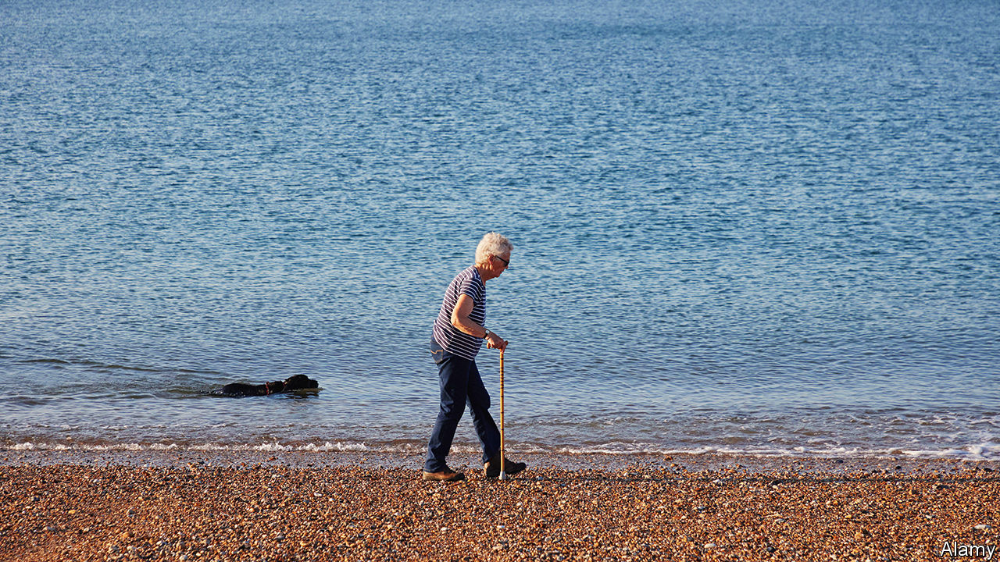
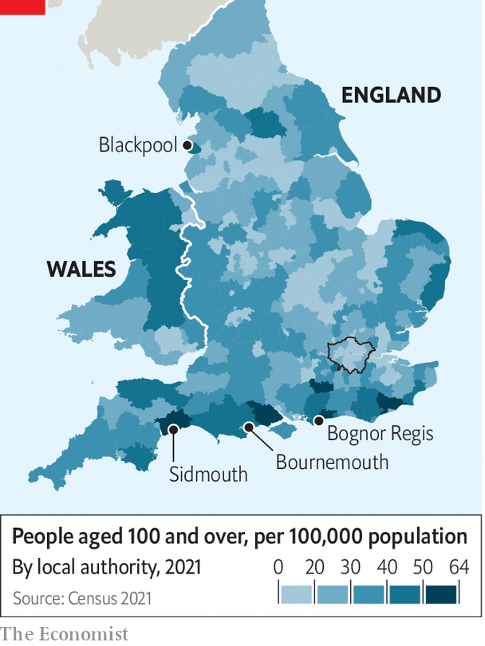

###### Britain’s silver zones

# How to live to one hundred 

##### Have good genes and move to East Devon 

 

> Feb 12th 2024 

“EASY TO FIND and hard to leave.” That is how Sidmouth’s tourism website describes the small seaside town in East Devon, where the red cliffs turn the ocean water pink. The tagline could apply to lives as well as holidays. Almost a third of residents are over 75; locals refer to Sidmouth as “God’s Waiting Room”. “We get a lot of people well into their 90s, 100s,” says a woman in a funeral parlour as an undertaker in a top hat tiptoes past. A card shop has sold “three or four” 100th-birthday cards since it opened in November. 

Life expectancy in Britain has been stagnating for a decade but the country still produces a lot of very old folk. Britain ranks 29th in the world for life expectancy (at 81 years) but seventh for centenarians per 100,000 people. That puts it ahead of Italy and Greece, both of which are known for their “”, a term used to describe areas where people claim to live exceptionally long lives. 

 


The secret to Sidmouth’s long-lived population is not the food. Islands like Sardinia and Icaria have the Mediterranean diet—heavy in olive oil, seafood and fresh vegetables. East Devon, which is home to the highest concentration of centenarians in England, has the pensioner’s special: a small fish and chips and a large pot of tea. 

The sea air must help, says Graham Brooks, a 76-year-old who helps look after Sidmouth’s antiques shop and whose mother, Audrey, turned 100 last November. (Mrs Brooks probably owes more to genes, luck and the fact that she never smoked and does not drink, with the exception of half a glass of wine at Christmas.) 

There are lots of opportunities in Sidmouth for old people to stay active and socially connected, both good ways to delay the grim reaper. At Fields, the local department store, the café is music-free, the better to hear elderly friends. There are brass-rubbing classes, a ukulele club and jazz evenings. In the window of Toto’s, a dog-toy shop “for dapper dogs”, is a poster for a film screening of “A Matter of Life and Death”, a classic released in 1946. 

But places like Sidmouth are the silver lining to a darker story. Although some of its citizens enjoy very long lives, Britain excels at producing much shorter ones, too. Britain’s middling life-expectancy figures disguise extremes. Centenarians tend to cluster more on the south coast, in areas like Bournemouth and Bognor Regis as well as in East Devon. But in many other coastal towns, such as Blackpool, life expectancy is much lower than the national average. London is also not a place for the very old: of the eight local authorities in England and Wales with fewer than ten centenarians per 100,000 population, six are in the capital.

Rather than blue zones, where a specific environment is associated with , it seems more likely that Britain has silver zones, places which attract longer-lived people in middle age or upon retirement. Marjorie Hodnett, who grew up in London, will be 110 in April. Her biggest health complaint relates to a prescription toothpaste sent to the wrong pharmacy (at 105 she still had 26 of her own teeth; now she is down to 21). She left Sidmouth for Merseyside in 2020, but only to be nearer relatives after six decades in the area. “It’s a lovely place,” she says wistfully. The first thing she asks your correspondent is whether the daffodils are out. ■


