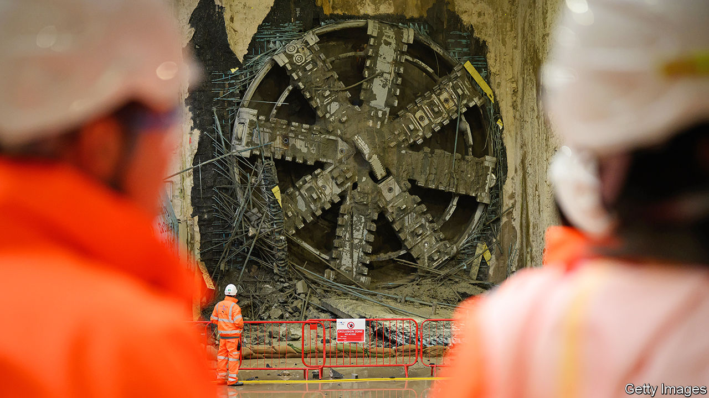
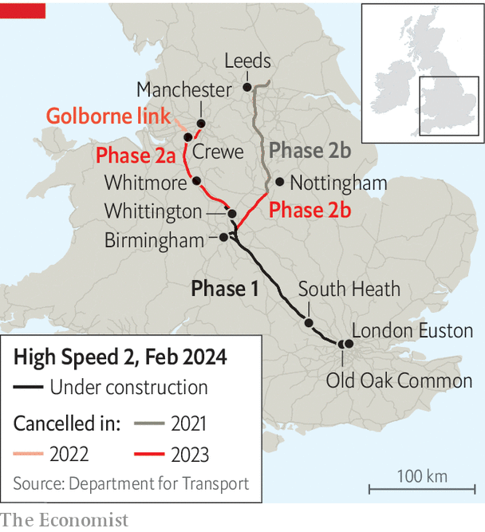

###### Getting nowhere fast

# The horror story of HS2 

##### How a flagship project became a parable of Britain’s problems 

 

> Feb 15th 2024 

“It’s not ideal,” says James Richardson, a tunnelling engineer at Old Oak Common station in west London. He is standing in a vast hole: almost a kilometre long, 70 metres wide, 20 metres deep. Some 2,000 people are working at the site: by the early 2030s Old Oak Common should be one of the largest stations in Europe, with six underground platforms for high-speed trains whizzing in and out of London. But Mr Richardson isn’t sure where to dig next. 

Last October the prime minister, Rishi Sunak, decided to amputate , a railway project turned national trauma. He announced that the northern leg of the line would not extend beyond Birmingham to Manchester. Mr Sunak said that the London terminus for HS2 would still be Euston, some 10km east of Old Oak Common, but that private investors would have to pay for the tunnel connecting the two. That money is far from certain to materialise, which is why Mr Richardson’s team is soon to bury two giant tunnel-boring machines (TBMs) at Old Oak Common. They will be entombed there, pointing eastward, until things become clear. 

Proponents of HS2 dreamed of a railway to rival those in Japan and France, linking Britain’s big cities in a feat of engineering worthy of the country’s Victorian pioneers. Instead the project has shown that Britain cannot build. The rump line from London to Birmingham will be one of the most expensive in the world, costing up to £67bn ($84bn) or £300m per km of track. It will also be one of the most pointless. A totemic project to  will end up mostly benefiting London. A huge investment to increase capacity and cut journey times will, for some routes, do the reverse. 

 


What went wrong? It is tempting to say everything. But several problems stand out. The initial plan was far too optimistic, not least because ministers kept changing it; legislation ensured that costs ratcheted up; and the company in charge botched important decisions. To see how the project went awry, step aboard for a journey along the line (see map).

Begin in London, where in March 2010 the then Labour government announced plans for a 540km (335-mile) Y-shaped railway linking Euston to Birmingham, with an eastern branch to Nottingham, Leeds and Yorkshire and a western branch to Manchester and the north-west. The trains zipping along the route would be among the fastest in the world.

Even at the outset, the economics were debatable. Passenger demand was growing and the existing lines were creaking. But Britain is smaller than France or Japan. Its large cities are closer together; they were already connected by rail. The initial budget was also hopelessly optimistic. 

At Euston, for example, the idea was to squeeze 11 platforms into a small triangular plot between the existing station and a warren of residential streets. Immediately there were problems. When archeologists began to exhume 45,000 skeletons from a graveyard next to the station, they discovered an infestation of Japanese knotweed. Experts had to be drafted in to separate old bones from invasive perennial. 

That was just the start. The work at Euston was supposed to cost just £3.2bn (all figures are in today’s prices). The budget almost doubled even as the number of platforms was cut to ten and then six. Euston was a portent of wider issues. In 2010 the government had said that the whole line could be completed for £57.2bn. The Conservatives were happy to go along with that, but the numbers were flimsy. 

Budgets are much harder to stick to when politicians fiddle. “If there is one thing with , it’s don’t make changes after you’ve started,” says Professor Bent Flyvbjerg of the Saïd Business School at Oxford University. Yet that is exactly what successive prime ministers and transport secretaries have done. 

Tunnelling between Euston and Old Oak Common has started and stopped before now; plans changed so often that in 2020 £120m of design work for Euston had to be scrapped. The eastern arm of the Y to Leeds was severed in 2021. Another spur went in 2022. In early 2023 the Euston site was mothballed. Then came Mr Sunak’s decision. Contractors call this “political risk”, and Britain pays a premium. 

Changes did not just come from ministers. Continue 50km along the line, a journey of around ten minutes when trains finally start running, and stop at South Heath, a village in the Chilterns in Buckinghamshire. These are the hills the project died on. For almost three years two TBMs, Florence and Cecilia, have been chomping through the chalky earth beneath the Chilterns, lining parallel 16km-long tunnels as they go with precast concrete segments. They have cost around £750m to dig before a track has been laid.

As well as those in the Chilterns, five “green tunnels”, some almost 3km long, will protect residents’ views and “connect wildlife habitats”. Almost a quarter of the journey from London to Birmingham will happen underground. Another third of the journey will be through cuttings, where high banks line the tracks. In a 45-minute journey passengers will have “meaningful” views for less than ten minutes.

Ensuring hedgehogs can get around is a fine goal. The tunnels through the Chilterns were extended after a vociferous local campaign. But tunnels cost about ten times as much as normal tracks; cuttings five times. A big part of HS2’s budget has gone on making sure a small group of people in the south of England will never have to see or hear it. As a result many more in the north won’t either. 

That points to another problem with the project: the way Parliament legislated for it. The bill in 2017 which gave HS2 Ltd, a public body, the power to acquire land detailed so many specifications that it ran to 50,000 pages. Critically, it gave councils the power to petition for design changes and to hold up work if they were unhappy. Having asked for tunnels, for example, councils then tried to stop them by denying access routes for lorries. 

One case brought by Buckinghamshire council ran for nine months before the High Court threw it out. The council could be litigious partly because it had 15 dedicated planning officers paid for by HS2. Keep on for another 170km and, just before Lichfield, look out of the window to admire the Whittington Heath Golf Club. HS2 Ltd needed £400,000-worth of land from the club; to smooth things over it bankrolled a £7m development, including a new clubhouse (the chairman was “delighted”). 

Since 2017 HS2 has had to obtain more than 8,000 planning and environmental consents. It has gone to court more than 20 times. Such hold-ups are the biggest cause of uncertainty and higher costs in Britain, says Ricardo Ferreras of Ferrovial, which has built high-speed lines around the world. Other countries, notably France, grant sweeping planning powers and take a standardised approach to compensation.

Another big issue was the failure of HS2 Ltd to control costs. Effective project management and accounting should have led to tough questions. Instead, one civil servant complained that HS2 acted “like kids with the golden credit card”. 

The company asked firms to take on construction work without basic information about ground conditions. That led to rampant over-engineering, according to Andrew McNaughton, one of the scheme’s architects, such as contractors insisting on installing concrete pile foundations where they were not needed. HS2 also signed huge contracts on a “cost-plus” basis, where firms are paid a percentage of the total value of the work. Sir Jon Thompson, who became executive chair last year, calls that “extraordinary”: it gave contractors an incentive to go over-budget and the company no “levers” to stop them. 

 


As costs spiralled, the route was pruned and the project’s benefit-cost ratio sagged (see chart). In October Mr Sunak decided to cut his losses. In fact, he has made a bad situation worse. To see the problems HS2 now faces, continue another 55km along the original route to make a final stop at Whitmore, a village in Staffordshire. 

Edward Cavenagh-Mainwaring, a dairy farmer in Whitmore, has been getting letters from HS2 for a decade. In early 2023 it finally acquired part of his farm, including one of his wildflower meadows. More of his fields were bought days before Mr Sunak announced that the Manchester leg would be scrapped. HS2 has spent over £600m ($755m) on land and property like this that it apparently no longer needs. Before it can be sold off again, there are miles of fences to take down and 1,800 boreholes to fill. Compulsory purchase is a slow and painful process. Undoing it will be, too. 

Yet returning Mr Cavenagh-Mainwaring’s farm would not solve the real problem, which is that the rump line makes no sense. According to Mr Sunak, HS2 trains will run at up to 360kph (225mph) to Birmingham before switching to old tracks to trundle up to Manchester. But high-speed trains were not designed to run on the old track; they cannot tilt as they go round corners, meaning they would take longer than the current Pendolino trains. 

The original plan was for 400-metre-long HS2 trains, capable of carrying 1,100 passengers, to run from London to an upgraded station at Manchester Piccadilly. With that station no longer being built, trains will need to be split, leaving them with less capacity than current trains. It is already too late to make changes to the rolling stock HS2 has ordered, Sir Jon has told MPs. As a result services from Birmingham northward are likely to be worse once HS2 has been completed. 

The only way to rescue any value from the project would be to complete the section between Birmingham and Crewe, says Jim Steer, a civil engineer. This bit is critical because it would relieve pressure on the most congested section of the existing line. Sir Keir Starmer, the leader of the opposition, says Labour won’t complete the whole project but will look at options if it enters government after an election later this year. But whatever it decides, Britain’s  has turned into a nightmare. ■


