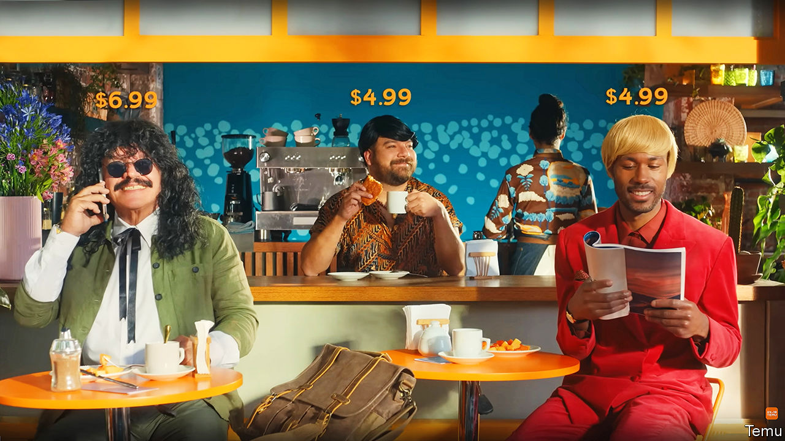

###### Boxing match

# How worried should Amazon be about Shein and Temu? 

##### Dirt-cheap products and marketing splurges are catching clicks 

 

> Feb 15th 2024 

“Shop like a billionaire.” With that enticing slogan Temu touted itself to Americans watching the Super Bowl on February 11th. Football fans had been treated to a similar advert from the e-commerce company at last year’s event. But this time the message was hammered home. In all, Temu’s ad played five times. That won’t have been cheap. A 30-second slot during this year’s Super Bowl cost around $7m. JPMorgan Chase, a bank, reckons the company will spend $3bn on marketing this year, up from $1.7bn in 2023.

Temu, based in Boston, is an offshoot of Pinduoduo, a Chinese e-commerce firm. It is attempting to replicate the success of Shein, a Chinese fast-fashion seller, which shot to success in America in 2021 helped by clever marketing and ultra-low prices. In their bid to win over American shoppers the duo are spending so lavishly on digital ads that their footprints show up in big tech companies’ earnings. On February 1st Susan Li, the chief financial officer of Meta, a social-media giant, said that Chinese advertisers contributed 10% of her firm’s revenue last year and five percentage points to its worldwide revenue growth. In November Josh Silverman, the boss of Etsy, an online marketplace for artisan knick-knacks, blamed Temu and Shein for pushing up the price of digital advertising.

All that spending has bought some brand recognition. Last year Temu was the most downloaded app in America, Britain, France and Germany, according to Business of Apps, a research firm. Shein is already a shopping sensation among American teenagers. But can the firms win over American shoppers en masse?

Although Temu stocks a broader range of items, from children’s toys to industrial tools, than Shein, which mostly sells clothing, they have similar business models. For both, the main advantage is price. Michael Morton of MoffettNathanson, a research firm, estimates that the same items of women’s clothing on Temu are two to four times dearer on American websites. Temu offers electric toothbrushes, sunglasses and backpacks for about $1 each.

The pair keep costs low in many ways. One is to cut out middlemen and deal directly with Chinese factories. Another is to charge merchants lower fees than American rivals do. They also eschew enormous logistics operations in America like Amazon’s. Instead they ship products from warehouses in China and have them delivered to shoppers in America by UPS, FedEx or the post. Customers thus get low prices, but not speedy delivery. Packages can take weeks to arrive.

For now, Temu is focused on market share rather than profit. Bernstein, a broker, reckons that it loses around $10 per item sold in America. It may be able to keep this up for a while, bankrolled by Pinduoduo’s domestic success. Last year the parent firm generated $12bn in cash from operations. Shein, by contrast, is looking to raise more funds. In November it filed for an initial public offering in America. If the listing happens, it will be huge: at its most recent funding round in May 2022 the company was valued at $66bn. 

So far the pair have made only small inroads into America’s e-commerce market. Temu and Shein both have shares of about 1%, according to Bernstein. Amazon has 38%. Even so, the local giant is taking them seriously. In December Amazon said it would cut merchants’ fees for clothing priced under $15, probably in response to the twin threat. In September it rolled out an end-to-end supply-chain service in which it picks up goods from merchants’ factories and ships them to customers, mirroring what its Chinese rivals do.

But Amazon is unlikely to be hurt first, or most. Clothing and accessories account for only 16% of its sales, according to eMarketer, a research firm, so Shein is probably a bigger threat to fast-fashion labels such as Forever 21. And for Temu, the absence of a local logistics network will make it difficult to compete with Amazon when it comes to goods customers want quickly, such as dishwasher tablets. It is probably a bigger threat to eBay or Etsy.

That may eventually change. Both firms have bought warehouse space in America and struck partnerships with local logistics firms. Shein is reportedly poaching supply-chain specialists from Amazon. Temu may also start to sell dearer goods, such as smartphones, a shift its parent pulled off in China. That would put it into more direct competition with Amazon and the similarly mighty Walmart.

Cheap shots

Plenty could still go wrong for the two. Each must compete both with American incumbents and with each other. TikTok Shop, a marketplace run by the social-media firm that launched in America in September last year, may also get in their way. Geopolitics may hurt them, too. A committee of American senators is probing their alleged links to forced labour. (Both firms deny any such connections.) Analysis by Morgan Stanley, another bank, suggests that Americans’ willingness to shop at Temu may already be waning, perhaps as the novelty has worn off.

That said, Mark Shmulik of Bernstein argues that increasing market share from zero to 1% is more difficult for new e-commerce firms than raising it from 1% to 5%. Getting consumers to first take notice is tricky. Once a brand is familiar, it is easier to sell customers more things—and more expensive ones, too. Temu and Shein may have already done the hardest part of making it in America. ■


