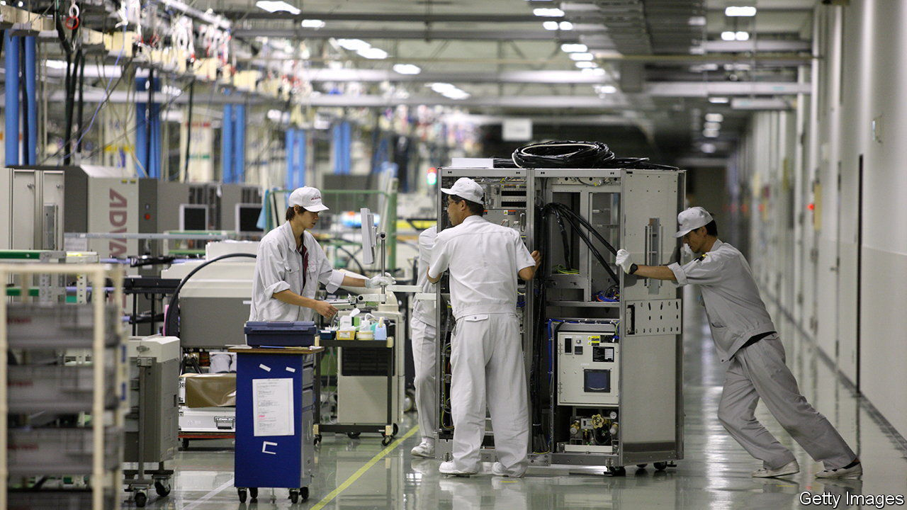

###### Tokyo Electrified

# Japan’s semiconductor toolmakers are booming 

##### How long will it last? 

 

> Feb 15th 2024 

Corporate Japan, long snubbed by investors, has been the source of much attention lately. That is especially so for the country’s manufacturers of chipmaking tools. On February 13th Tokyo Electron’s share price jumped by 13% after it reported higher profits than expected for the final quarter of last year, pushing its market value above $100bn, roughly ten times what it was worth a decade ago. It is now Japan’s fourth-most-valuable company, trouncing better-known peers such as Mitsubishi, Nintendo and SoftBank Group.

 


Tokyo Electron is the largest among a crowd of Japanese purveyors of chipmaking tools for which business has been booming. The combined market capitalisation of the five most valuable—Tokyo Electron, Advantest, DISCO, Lasertec and SCREEN Holdings—has doubled, in dollar terms, over the past year (see chart). These companies, which suffered from a post-pandemic slump in sales of electronics that caused chipmakers to slash investments, are now on the up. The Semiconductor Equipment Association of Japan, an industry body, expects a 27% increase in sales of machinery this year and a further 10% rise in 2025, more than reversing the fall of 19% in 2023. 

The latest rally is about more than the ups and downs of a notoriously cyclical industry. Demand for increasingly complex chips capable of handling artificial-intelligence functions means demand for more equipment to make them. One estimate from McKinsey, a consultancy, puts the cost to build and equip a factory that produces five-nanometre (nm) chips at around six times the cost of one that produces 28nm chips, which were cutting-edge a decade ago.

Japanese toolmakers have long played dominant roles in niche areas of the semiconductor supply chain. Tokyo Electron controls roughly 90% of the market for tools which apply photoresist coating—a light-sensitive chemical applied to a semiconductor wafer in the manufacturing process. DISCO holds a similarly dominant share of the precise cutting and grinding tools needed for chipmaking.

The revenues of these firms have thus far not been crimped by new export controls introduced by America on the sale of certain types of advanced chipmaking machinery to China. In fact, as China has raced to develop its own chipmaking capacity, sales of equipment to its neighbour to the east have surged. Almost half of Tokyo Electron’s sales in the final quarter of last year came from China.

Yet that also points to risks ahead. If relations between Beijing and Washington worsen, the Japanese government could be prodded into implementing broader restrictions on the sale of its chipmaking tools to China. Meanwhile, China is expanding its effort not only to make its own chips, but also the machinery that produces them, which could squeeze out Japanese firms (see previous article). For Tokyo Electron and its peers, the deteriorating relationship between America and China is a boon for business today. In the future, though, it may become a strain. ■


