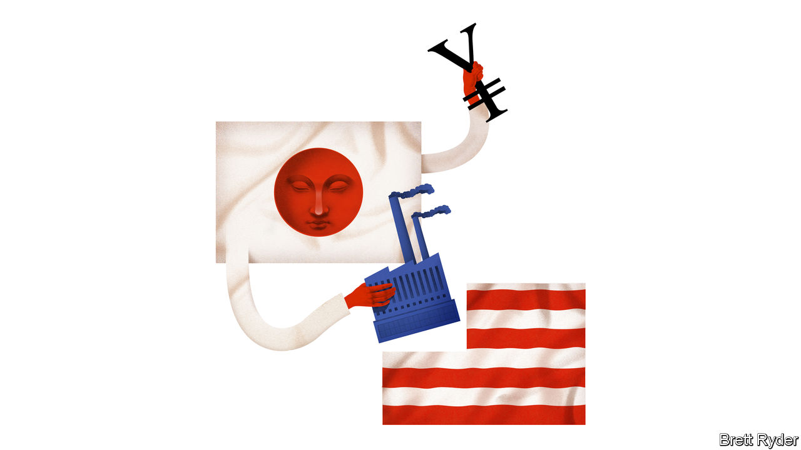

###### Schumpeter

# The row over US Steel shows the new meaning of national security 

##### Should a Japanese buyer really be blocked from acquiring the American firm? 

 

> Feb 15th 2024 

Last summer US Steel was considering taking the capitalists’ way out—by selling itself. American steelmaking has suffered decades of decline, ostensibly as a result of foreign competition. At home traditional integrated producers like US Steel have been overtaken by “mini-mills” powered by electricity and non-union workers. In August Cleveland-Cliffs, a rustbelt rival, announced that it had made an offer to buy US Steel and had been rebuffed. Dozens of suitors emerged. In December Cleveland-Cliffs made a final bid of $54 per share, to be paid in cash and stock.

It was bested by, of all things, foreign competition. On December 18th US Steel said it had agreed to be bought by Nippon Steel, Japan’s biggest steelmaker, for $15bn (or $55 per share) in cash. The offers from Cleveland-Cliffs and Nippon promised shareholders almost identical financial value, but came with very different risks. Combining with Cleveland-Cliffs would attract antitrust scrutiny; a fleet of carmakers complained that the merged company would dominate the automotive steel market. Selling to Nippon would rile politicians and require the blessing of the Committee on Foreign Investment in the United States (CFIUS), America’s increasingly strident inbound-investment watchdog. US Steel’s lawyers were sanguine about the risks of selling a corporate icon to a Japanese firm. Nippon won.

The ensuing pile-on has been a case study in America’s protectionist creep. Lael Brainard, one of President Joe Biden’s economic advisers, said the deal merited “serious scrutiny” from CFIUS. The union representing steelworkers called it “greedy”. Lourenco Goncalves, the boss of Cleveland-Cliffs, chastised US Steel’s board for ignoring national security. He told investors that US Steel had been “hell-bent” on selling to a foreign firm. “I would block it instantaneously,” said Donald Trump, the runaway favourite to be the Republican nominee for the presidential election.

Despite the furore, US Steel expects to complete the deal during the second or third quarter of this year. Investors are less confident—shares in the company change hands at $46 apiece, nearly a fifth below Nippon’s offer price. Once the deal lands on cfius’s desk, the body has 90 days to investigate; if the president wishes to block the takeover, he then has 15 days to say so. (In practice, the process can be extended if a firm withdraws its formal notice to CFIUS and then resubmits it.)

Nippon’s bosses face an emboldened committee whose brief has expanded along with American politicians’ definition of national security. In September 2022 Mr Biden directed CFIUS to focus its attention on the security of supply chains and technological leadership. Such changes have made CFIUS busier and tougher. In 2022 it reviewed a record number of notices despite foreign direct investment in America falling by half. Transactions that were approved increasingly came with strings attached.

Yet the handwringing over Nippon’s acquisition of US Steel is misguided. The national-security risks posed by a deal can be seen as a combination of the intentions of the buyer and importance of the seller. A Chinese company shopping for American firms producing cutting-edge technology that could help its country’s armed forces should, and does, set off warning sirens. Nippon’s acquisition should not.

Look, first, at the buyer. Competition with Japan during the 1980s empowered CFIUS by codifying the presidential power to block deals. Today, though, Japan is a crucial ally in America’s higher-stakes competition with China. That has not eased the scrutiny of would-be Japanese buyers: between 2020 and 2022 only Chinese firms filed more notices with CFIUS. Some of America’s politicians see the folly in that. In December a bipartisan committee of lawmakers tasked with examining US-China relations published a shopping list of nearly 150 policy recommendations, among them to add Japan to the “whitelist” of countries whose firms are exempted from some onerous CFIUS rules.

Consider also the seller. The importance of America’s third-largest producer of steel to national security has probably been overstated. Tariffs on steel imports, such as those imposed by Mr Trump in 2018, have been justified on the grounds of maintaining domestic capacity should a war break out. But Nippon could be compelled to keep US Steel’s operations running as part of a deal. And in the case of a war US Steel’s operations could be requisitioned from a disobliging foreign owner. 

So what really lies behind politicians’ opposition to the deal? A closer look reveals that their main motivation is preserving jobs. And whereas workers’ rights are probably not yet at issue in the White House situation room, the notion of “foreign policy for the middle class” is stretching the definition of national security beyond recognition. One group of rustbelt lawmakers wrote to Janet Yellen, America’s treasury secretary, to argue that CFIUS should consider the effects of the deal on stakeholders including workers in its assessment. Four signatories to a letter demanding similarly broad scrutiny were members of the same committee that less than a month earlier had advocated adding Japan to CFIUS’s whitelist. Mr Trump’s comments were made at a meeting with the boss of a union. Given the industry has seen its workforce decline by more than a third since the turn of the century, largely under domestic ownership, even this anxiety looks misplaced. 

Two roads diverged

It is only natural that bosses at US Steel ponder the deal not taken. Although America’s trustbusters have been unpredictable under the stewardship of Lina Khan, a number of her crusades have struggled in court, and anti-competitive behaviour is still an issue that can be argued with numbers. The decisions of CFIUS, by contrast, are almost entirely beyond the reach of judges. And arguments around national security are increasingly swallowing the light around them. ■


