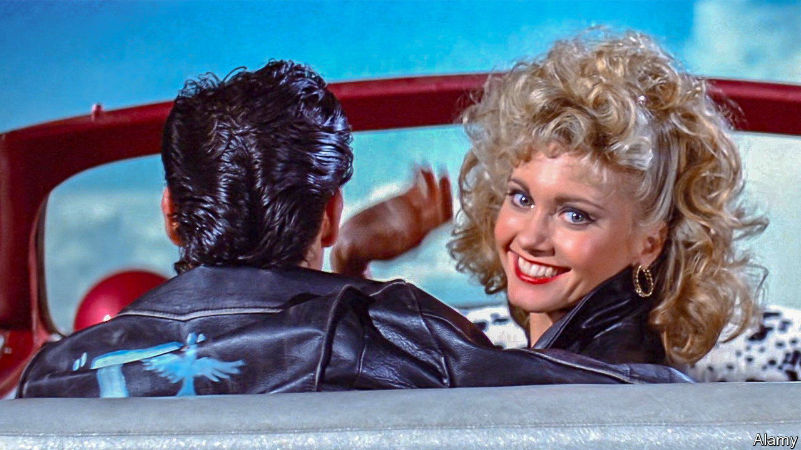

###### Paramount’s paramours

# Would-be suitors are wooing Paramount 

##### The drama highlights the parlous state of the entertainment industry 

 

> Feb 15th 2024 

From “GREASE” to “Breakfast at Tiffany’s”, Paramount Pictures has produced plenty of good romances during its 112-year history. Now the Hollywood studio is itself the subject of a courtship drama involving streaming rivals, private-equity buccaneers, a billionaire’s son and the owner of the Weather Channel. The wooing of Paramount Global, the studio’s parent company, has begun because Shari Redstone, president of National Amusements, which has a controlling stake in the firm, appears ready to sell. The battle to buy Paramount from the Redstones marks the fading of a Hollywood dynasty—and shows the sorry state of the entertainment industry.

Paramount, the last big studio still based in Hollywood, has seen lots of action in recent years. Ms Redstone had to wrestle control of the firm from the former girlfriends of her father, Sumner, who died in 2020 after building an empire from a chain of cinemas he had inherited from his own father. Paramount Global today comprises the film studio, the Paramount+ streaming service and old-school “linear” tv networks from cbs to mtv.

It is in trouble. Linear tv, which makes up nearly 80% of Paramount’s revenue, is sinking as cable subscribers cancel their contracts. Streaming is supposed to provide the company with a lifeboat. Paramount+ has more than 60m subscribers and plenty of hits, including a series of “Yellowstone” spin-offs. But it lost $1.2bn in the first nine months of 2023 and appears to be years away from breaking even. Paramount’s market value has fallen by half in the past two years, to under $9bn.

In recent weeks Ms Redstone has been mulling various proposals. David Zaslav, head of Warner Bros Discovery (wbd), went to Paramount just before Christmas to sound out a possible takeover. In January Apollo, a private-equity firm, was reported to be circling. David Ellison, head of Skydance, a production company, made an offer later that month. Then Byron Allen, who owns the Weather Channel and other media assets, said he too had made a bid.

Mr Ellison’s deal is said to have progressed farthest. His partners include kkr and RedBird Capital, a pair of private-equity firms; his father, Larry, who co-founded Oracle, also has a fortune of $130bn handy. The main attraction for Skydance seems to be Paramount’s film studio. The linear-television assets, meanwhile, might be sold on—perhaps to Mr Byron, who says he is more interested in the waning tv networks, which at least still make money, than the studio or streamer.

The possible carve-up points to wider disruption in Hollywood. All of the “legacy” studios—that is, ones that began in the era of celluloid rather than streaming—share at least some of Paramount’s problems. As linear tv declines, they have spent a fortune on trying to make streaming work, collectively losing $25bn on the enterprise between 2020 and 2023, according to Bernstein, a broker. wbd’s streaming business broke even last year, after ruthless cost-cutting. Disney says it will get there this year. But for smaller streamers like Paramount+, nbcUniversal’s Peacock and Fox’s Tubi, there is “no clear sight of profitability”, Bernstein believes. Even those no longer losing money are nowhere close to the profit margins of the linear era.

The best hope of competing with the bigger streamers, like Netflix, may be to partner up. There are already signs that is happening. On February 6th Disney, Fox and WBD unveiled a plan to bring their most valuable sports content together onto a new streaming platform. Bigger tie-ups may still be to come.

Yet by pooling their resources the media giants would also be pooling their problems. A marriage between wbd and nbcUniversal, perhaps the most likely new combination, would result in a company that made nearly half its revenue and nearly two-thirds of its profit from linear tv, points out MoffettNathanson, a firm of analysts. “The situation in us media has increasingly progressed from challenged to desperate,” MoffettNathanson argues. Time for Ms Redstone to make a match. ■


