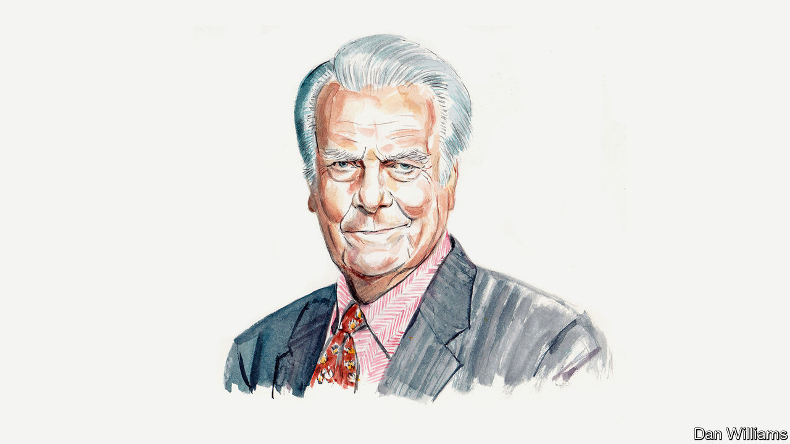

###### Politics and ageing

# David Owen argues that Joe Biden and Donald Trump are both too old to be president 

##### Nor should anyone else over 70 be considered for the job, says the politician and former neurologist 

 

> Feb 12th 2024 

SOME PARTS of most people’s brains that are involved in higher cognitive thinking are subject to an  starting from 60-70 years of age and continuing until death. In particular, there is a shrinkage of the brain’s frontal lobe and, deeper in, of an area called the hippocampus. The brain’s surface areas can also thin and nerve fibres shrink, which slows the way the brain processes information. Among the chemical changes that researchers think occur during brain ageing are a decrease of neurotransmitters, particularly dopamine, serotonin and acetylcholine, in parts of the brain.

I was a neurologist, a doctor of medicine who specialises in the brain, and a research fellow at St Thomas’s hospital, across the Thames from Britain’s House of Commons, before I became a Labour MP in 1966. I continued to do medical research after going into politics as the Commons in those days didn’t sit until the afternoon. I was lucky enough to have as co-researcher David Marsden, who was by then already on the road to becoming one of the world’s best neuroscientists specialising in dopamine. In 1968, when I became a minister, I stopped working as a doctor.

As the years went by watching fellow politicians take decisions often under great stress, not just in Britain but around the world, as foreign secretary, I began to analyse their decision-making and wrote a book, “In Sickness and In Power”. In that book I analysed in some depth President Franklin Roosevelt’s decision to stand again as president of the United States in 1944 when his own health had deteriorated quickly during the previous two years. 

It is sometimes suggested that Roosevelt should not have been “permitted” to run, but who permits a president? This president was determined to run, and on July 11th 1944 at a press conference Roosevelt read from a letter he had written to the chairman of the Democratic National Committee: “All that is within me cries out to go back to my home on the Hudson River, to avoid public responsibilities…Reluctantly, but as a good soldier, I repeat that I will accept and serve in the office, if I am so ordered by the Commander-in-Chief of us all—the sovereign people of the United States.”

Roosevelt then travelled to Yalta in February 1945 to meet Joseph Stalin and Winston Churchill. On February 8th, towards the end of the conference, Roosevelt developed pulsus alternans, in which a weak and strong pulse alternate. This is indicative of a very serious heart condition, left ventricular heart failure. I studied carefully all the evidence of doctors and observers, and though there are very good grounds for arguing that Roosevelt should not have stood for re-election, Yalta is not one of them. 

America now faces a situation where both presidential candidates would be way past any normal retirement age when their term ended. Joe Biden would be 86 and Donald Trump 82. In a poll conducted by ABC News/Ipsos last week, almost nine out of ten Americans said they believe Mr Biden is too old to serve a second term; 62% believe that Mr Trump is too old to serve again. Against those facts, both the House of Representatives and the Senate should legislate now to stop any presidential candidate standing who would be over the age of 70 on taking office. 

Business has already shown the way in establishing limits and there are increasingly rules which restrict the age at which someone can serve on a company’s board. According to new data compiled by a law firm, nearly three-quarters of S&amp;P 500 companies have instituted mandatory-retirement age limits—typically around 70 years old—for board directors.

In Mr Biden’s case we have highly relevant information that relates to the inquiry into his handling of classified documents when vice-president in Barack Obama’s administration. According to a behind-closed-doors interview by Robert Hur, a special counsel, Mr Biden twice failed to recall the dates he served as vice-president and could not remember when his son Beau had died. His memory was so poor, his investigators claimed, that it was not worth bringing a prosecution against him for mishandling national secrets because a jury would be likely to take pity on him as a “well-meaning, elderly man with a poor memory”. There are also many instances in media reports of Mr Trump’s mental state that call in question his fitness for another term in office.

Of course, it can be argued that Mr Trump was a successful president but that term of office finished five years ago and many people have had an opportunity of seeing Mr Trump’s mind operate since then. Experience of office is helpful, to be sure, and that can be said for Mr Biden as well as Mr Trump. Many people believe, as I do, that as president Mr Biden has successfully handled some very difficult issues, helped by having an excellent secretary of state and national security adviser. But that is the past. And already legitimate questions have been asked about Mr Biden’s cognitive deterioration. The whole point of having fixed terms for business, military and political leaders is to avoid deterioration in the future. It is an extreme arrogance of political leaders that they believe they can be judged by different criteria from those who run multinational companies. 

Against this factual background all future holders of the single highest executive office in democratic governments should ideally face a mandatory medical examination from a reputable, independent medical practitioner specialising in the brain before putting themselves forward as a candidate. The result of that examination should be released well before the start of any election period. The relevant medical tests should include, but not be limited to, state-of-the-art brain imaging.

I can only conclude, as a politician and a doctor, that the president should announce that he will not be running for another term and should ask that this summer’s Democratic National Convention choose an alternative candidate.■


