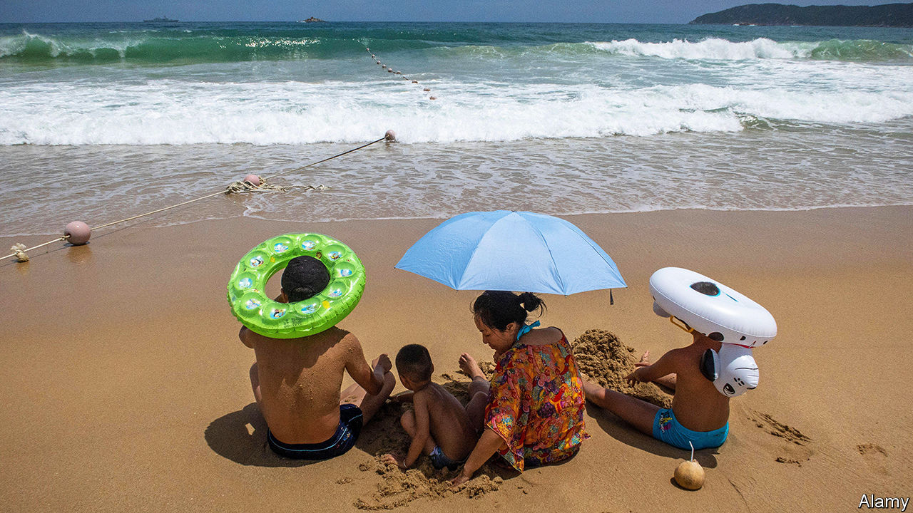
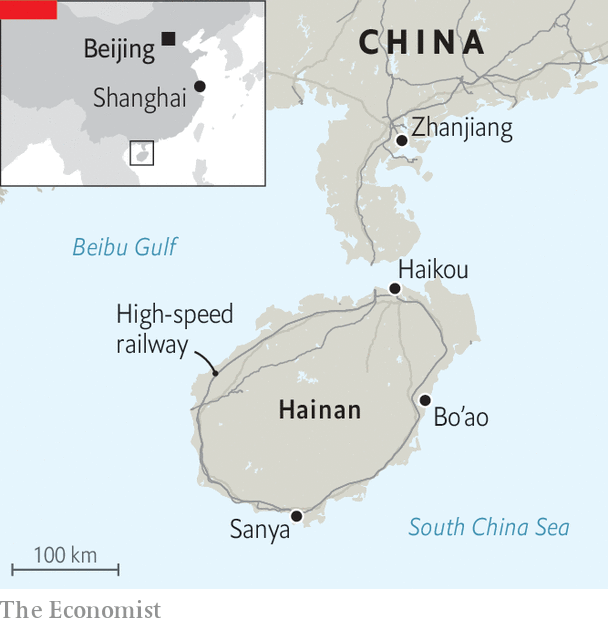

###### Life’s a beach

# China is trying to boost domestic tourism 

##### Even “China’s Hawaii” may not tempt them 

 

> Feb 15th 2024 

Surfing is harder than Huang Shimin had expected. Alongside a bunch of other wet-suited novices, she is trying it out on the golden sands of Hainan, a tropical island roughly the size of Taiwan, off China’s southernmost tip. The young professional from Shanghai is exactly the kind of high-spending tourist that China’s government hopes will holiday within China now the pandemic is over. The lunar-new-year break, which began on February 10th, will be a test of the push to spur domestic consumption through tourism.

Hainan should be a model for this policy. When Xi Jinping, China’s leader, visited in 2013, he urged locals to harness the “green mountains, clear waters, blue seas and azure skies” to build “an international tourism island”. As in many peripheral areas where Mr Xi has bolstered the travel industry, including Tibet and Xinjiang, he also has a political agenda. China’s vast size means that the central government’s control is often weaker in these far-flung provinces. Hainan is strategically important, located on the South China Sea, where China has been militarising reclaimed islands. It is also home to a giant naval base, as well as space and satellite launch sites, and hosts the annual Bo’ao forum, a meeting of bigwigs often dubbed “Asia’s Davos”.

 


Mr Xi’s directives have led to new airports, high-speed railways and giant expressways on the island. Chinese tourists have long been able to purchase items there duty-free. In 2020 their allowance was tripled to 100,000 yuan ($14,000), a direct appeal to affluent Chinese consumers accustomed to buying designer goods abroad. At first glance, these efforts appear to have been successful. In 2021, when domestic tourist numbers and revenues elsewhere in China nearly halved, visits to Hainan stayed close to 2019 levels. Covid gave the island province a boost: from 2020 to 2022, gdp per person rose faster than in the preceding ten years, when China’s economy was growing more rapidly. Even after China lifted covid restrictions and unsealed its borders in 2023, Hainan attracted 90m visitors, more than any previous year.

The Chinese government is committed to serving high-spending shoppers in fancy hotels. And in 2022 a new 3m-square-foot duty-free mall, the world’s largest, opened in Haikou, the island’s capital. But as the domestic tourism market matures, says Yang Yang of Temple University in Philadelphia, many Chinese are looking for experiences beyond staying in posh hotels. The local government is now promoting inland hiking trails through its tropical forests. Music and film festivals are being staged to attract an artier crowd. 

The most innovative new attraction is medical tourism. One 39-year-old man standing in the lobby of a swanky hospital is in Hainan for a faecal transplant, having heard about “experimental health vacations” on television. “Managing my health is like maintaining a car,” he says of his choice to spend ten days at the facility. The government wants to attract thousands of tourists to giant new hospitals in Hope City, a purpose-built medical district near Bo’ao, where patients are offered everything from cosmetic surgery to stem-cell therapy. Hainan already has a large community of pensioners from elsewhere who spend winter on the island. 

Yet the uptick of visitors in 2023 may be deceptive. International-flight volumes last year remained well below pre-pandemic levels. As a more normal level of international travel resumes, Hainan may struggle to attract China’s wealthy travellers. International bookings are up for the lunar new year, particularly to Malaysia, Thailand and Singapore, where Chinese citizens do not need visas.

Faced with strong foreign competition, the island’s current strategy risks looking outdated. Prices on Hainan are so high that many who go there could easily afford an international break. Other Chinese destinations now have duty-free outlets, and more people are buying domestic brands. 

What is more, there is unlikely to be an increase of international tourists. Foreigners must use Chinese apps for payment, cope with an internet firewall that precludes roaming and navigate gridlocked cities where most signs are in Chinese. 

 The rewards of tourism are proving elusive for local people. Despite government transfers and crowds of tourists, Hainan is still one of China’s poorest provinces. Only Ningxia, Qinghai and Tibet, in China’s west, rank lower. Tourism is dominated by a small number of often foreign-owned hotels and outlets. Restaurant-owners and businesses in Sanya say they benefit little from tourist traffic even in high season. Many of the island’s 9m residents are still poor farmers. Even with such high traffic during the pandemic, gdp per person fell, relative to other provinces, from 16th in 2019 to 21st in 2022. Hainan will need a lot more surfers to turn the tide. ■


