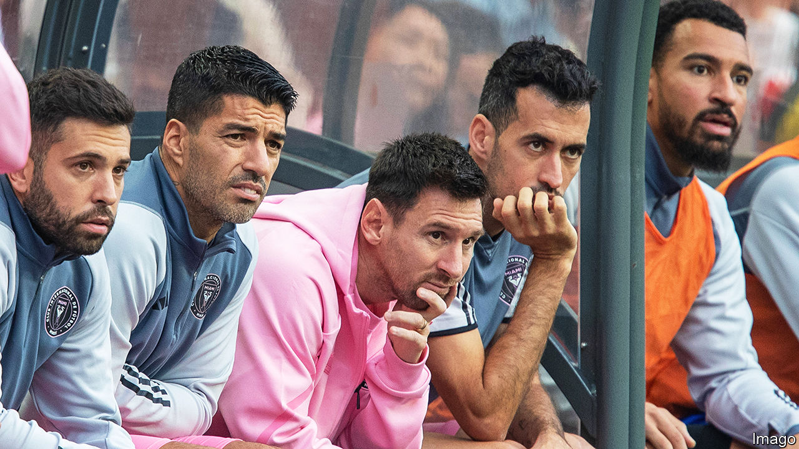

###### Messy for Messi

# Hong Kong is struggling to restore its image as a global city 

##### Efforts have been tripped up by nationalists 

 

> Feb 15th 2024 

As China has struggled with reopening to the world, so too has Hong Kong. The former British colony has long branded itself “Asia’s world city”, a more international place than the mainland. But on top of the pandemic, a sweeping national-security law enacted in 2020 has crushed dissent and spooked foreigners. Some 34m tourists still visited last year, but that was only 57% of pre-pandemic numbers. 

Hong Kong officials had hoped that holding some big events might help. To that end, they offered HK$16m ($2m) to help fund an exhibition football match featuring Lionel Messi, an Argentine superstar. Promoters plastered Mr Messi’s face on billboards across the city. On February 4th Inter Miami, Mr Messi’s club, played a local team in Hong Kong’s biggest stadium. Nearly 40,000 people paid up to HK$4,880 to watch.

They were disappointed. Mr Messi (pictured) spent the match on the bench, apparently suffering from a groin strain. The crowd booed Inter Miami off the pitch. To make things worse, three days later Mr Messi played a game in Japan, China’s long-time rival. The injury not only soured the football game; it also ignited a nationalist firestorm.

Regina Ip, a pro-mainland lawmaker in Hong Kong, said on social media that Mr Messi had made a “deliberate and calculated snub” to the city. She suggested that “black hands”—code for foreign plotters—were to blame. An editorial in the , a state-run tabloid, speculated that foreign powers were trying to undermine Hong Kong’s economy. Mr Messi’s account on Weibo, a social-media platform, was swamped by angry commenters. 

Authorities in Beijing and Hangzhou then said that they would no longer host Argentina’s national football team in two friendly matches scheduled for March. The decision was made “for the reasons everyone knows,” according to officials in Hangzhou. Tatler Asia, the organiser of the match in Hong Kong, has pledged to return 50% of the price of the tickets. 

All of this has made Hong Kong look worryingly like the mainland, where brands and celebrities are wary of offending thin-skinned nationalists. As well as the football, Hong Kongers have been talking about “Expats”, an Amazon Prime show about wealthy foreigners living in the city. Officials had hoped it would be good for Hong Kong’s image. In 2021 they even bent quarantine rules to allow Nicole Kidman, an Australian actress, to film on location. But some politicians have said the series portrays the city negatively. When it premiered on January 26th, Amazon did not make it available to viewers in the territory. 

Undeterred, Hong Kong officials say they are planning dozens more “mega-events” to attract tourists. A new 50,000-seat stadium is set to open later this year. But in Hong Kong, as in mainland China, sports stars and other celebrities will need to tread more carefully. ■


