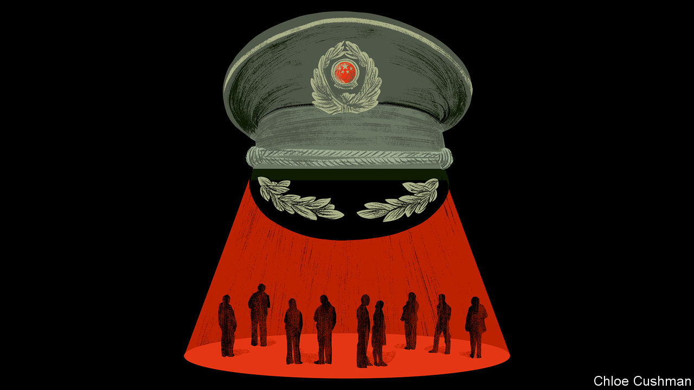

###### Chaguan

# How China stifles dissent without a KGB or Stasi of its own 

##### A secret policeman on every street 

 

> Feb 15th 2024 

Much thought has gone into making the Beijing Police Museum a family-friendly attraction. Housed in a classical mansion near Tiananmen Square, the museum is big on crime-fighting heroics. Glass cases show guns used by Chinese police. A model of a police dog sports a bullet-proof vest, commando-style helmet and protective boots on its paws. During the lunar-new-year holidays, a recent weekday found parents and children admiring displays about police helicopters, drug squads, traffic patrols and cyber-officers keeping the internet “healthy”. Political repression earns a passing mention—but in a historical section. An old photograph shows student protesters being arrested by plain-clothes agents, decades before the Communist Party took power.

Finding that museum’s opposite—a site that symbolises the dark side of the police state—would not be a straightforward task. China has no direct equivalent of the Soviet-era kgb, meaning a secret-police agency with armies of officers. There is nothing in Beijing like the kgb’s Lubyanka building, a notorious city-centre prison whose name struck fear into Muscovite hearts. For all that, political protests against Communist Party rule are vanishingly rare. That is because the party has built the most capable surveillance state in history, argues “The Sentinel State: Surveillance and the Survival of Dictatorship in China”, a new book by Minxin Pei. 

China’s system of “preventive repression” is designed to deter, detect and frustrate critics of one-party rule before they can organise or act, writes Mr Pei, of Claremont McKenna College in California. In part, that involves high-technology tools that have made headlines worldwide, from facial-recognition cameras and vehicle number-plate readers to mobile-phone tracking devices. Digital firewalls surround China’s internet, and algorithms monitor messaging services and online comments. Cross an unseen red line, and police will soon be pounding on the door. For good measure, the book weighs the potential of a still unfinished “social-credit system” that assigns citizens scores for social and anti-social behaviour in their business and private lives.

Yet Mr Pei suggests that gadgets cannot explain China’s success in suppressing dissent. That, he argues, is mostly explained by overlapping networks of thoroughly analogue human beings. Most of these are not full-time spooks. When the Berlin Wall fell in 1989, East Germany employed one Stasi officer for every 165 citizens. China would need 8.5m secret police to match that ratio, but actually employs a small fraction of that number. The Ministry of State Security, China’s main civilian spy agency, handles overseas espionage and domestic counter-intelligence. MSS branches around the country watch foreigners, Chinese with overseas connections and ethnic minorities with cross-border ties or an international profile, including Tibetans and Uyghurs. State-security agents wield fearsome powers to intimidate and detain targets without charge. But the MSS is relatively small and has “limited purview with respect to domestic surveillance”, notes the book. 

A more significant secret-police agency lurks within the Ministry of Public Security, China’s regular police service, Mr Pei writes. This force-within-a-force is known as the political-security protection unit (for short). The total number of Chinese police officers is not made public, but is thought to be over 2m. Drawing on provincial, municipal and county yearbooks and publications, Mr Pei estimates that 3-5% of all police work for the at the national and local level. That equates to 60,000-100,000 officers, or one for every 14,000-23,000 citizens. They are complemented by the , a police unit that watches cultural and educational establishments, especially universities. 

Another elite outfit is the Political and Legal Affairs Commission, a party body. It runs surveillance operations and “stability-maintenance offices” tasked with smothering strikes and protests before they start. A powerful agency, it oversees security policy generally, and vets police and legal officials for political reliability.

China does not need a secret-police agency with millions of officers, the book suggests. That is because its surveillance state rests on other pillars that offer part-time but invaluable help. The first is rank-and-file officers in neighbourhood police stations. In Chinese propaganda, there is nothing sinister about such police. They are hometown heroes who battle crime and keep the public safe. But tracking political dissent or public discontent is their job, too. The police oath mentions upholding “the absolute leadership of the Communist Party” before it talks of protecting the public. 

The police work that is not shown to children

Police stations are required to monitor “key personnel”, a formal term for millions of Chinese with police files, including ex-convicts and criminal suspects but also those deemed threats to “state security”. Police stations also watch millions more “key individuals”, a group that includes rights activists, religious believers and people petitioning the government for legal redress. 

All of that involves a second pillar of the surveillance state: informants. Mr Pei quotes documents in which city governments and police districts boast of recruiting express couriers, shopkeepers, security guards, hotel clerks and building managers as informants. Xi’an, a western city, once reported one in 12 city taxi drivers working for police. Universities report that foreign faculty and Uyghur students are under close watch, thanks to students recruited to spy on teachers and classmates alike. Millions more party members and community volunteers are asked to report suspicious acts as well as colleagues and neighbours unhappy with the authorities. The system fights crime and defends the party’s monopoly on power: no clear line separates these two tasks.

This complexity suits the party. It has eyes and ears everywhere, while avoiding a stand-alone Chinese KGB or Stasi that might alarm the public or grow too mighty to control. China’s surveillance state, it turns out, is hiding in plain sight.■


