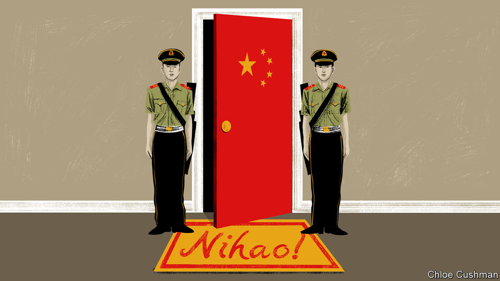
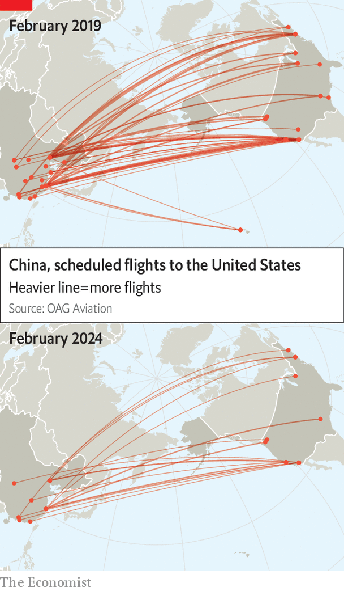
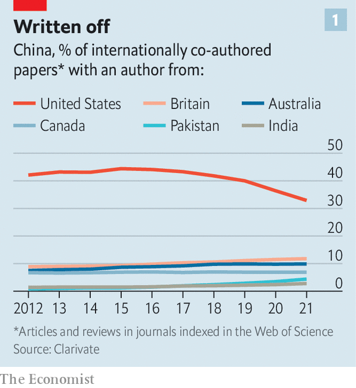
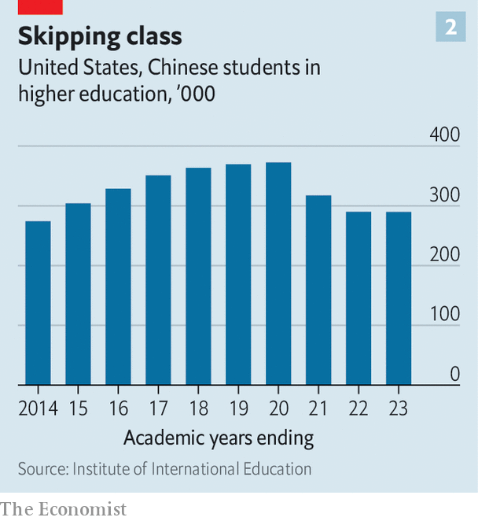
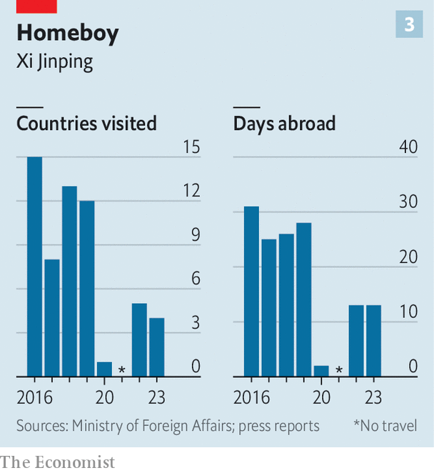
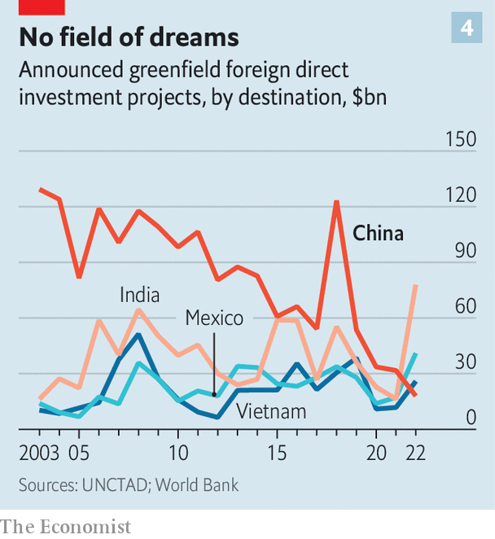
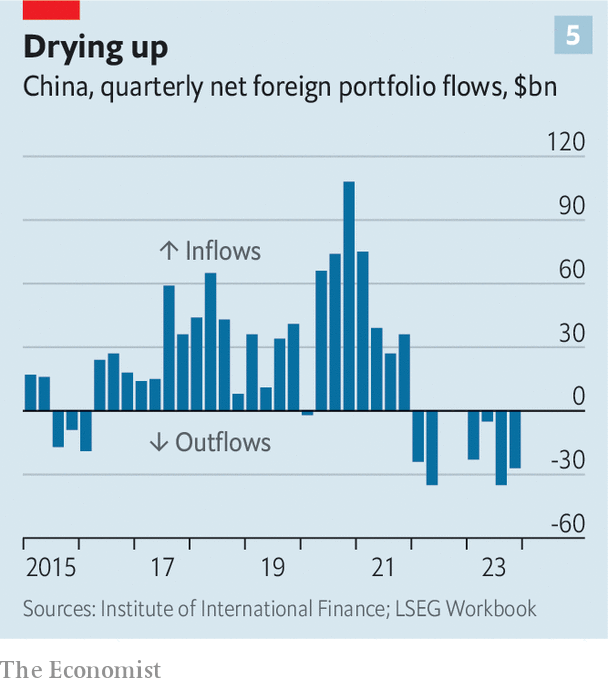
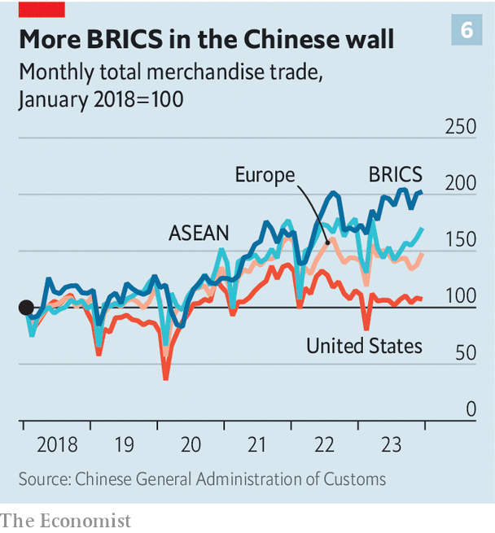

###### China and the world

# Xi Jinping’s paranoia is making China isolated and insular 

##### From his personal travel plans to capital flows, cross-border exchange is shrinking 

 

> Feb 12th 2024 

“NIhao, china” is the name of the country’s latest effort to attract foreign visitors. The logo accompanying the phrase (which means “Hello, China”) features a panda—an image always handy when China wants to seem cuddly. Chinese officials have been touring the West to promote the campaign, helped by a video in which happy-looking foreigners intone the Chinese greeting. Those with a deeper grasp of the language might sense a different mood, including billboards on city streets warning people to look out for foreign spies, and government propaganda on social media urging vigilance against threats to national security. The Communist Party often tells people that tourists, journalists and businesspeople could all be after China’s secrets. 

More than a year after Chinese leaders scrapped the “zero-covid” policy which had kept the country sealed off from most foreign visitors from early 2020 to the end of 2022, they are now pushing in two contradictory directions. Parts of the government appear eager to court foreigners. Last month China sent a large delegation to the World Economic Forum in Davos, Switzerland. Li Qiang, the prime minister, told the gathering that “no matter how the world changes, China will…open its door still wider to the world.” 

In at least one key respect this is true: China’s trade in dollar terms is 31% higher than in 2019. But  has looked at a range of other measures, from the number of flights and visits to China by foreign tourists to levels of academic exchange, investment flows and even the personal travel schedule of China’s leader, Xi Jinping. They suggest a country overshadowed by a profoundly changing relationship with the West, a more security-driven style of policymaking at home and by the parlous state of its economy. China has become more inward-looking, as the West has become more wary. 

At the most basic level, far fewer outsiders are crossing borders into China. Last year the country recorded about 62m fewer entries and exits by foreigners than in 2019, before the pandemic began—a drop of more than 63%. 

Behind these figures lie deeper trends. Take the geopolitical environment. In the three years during which China shut its borders to prevent the spread of covid, and its leaders hunkered down at home, the West, led by America, was engaged in a wide-ranging rethink of how to cope with China’s rise as a global power. 

President Donald Trump focused on trying to cut America’s trade deficit with China, but his administration sought to push back on other fronts, too, including efforts to contain China’s military activity. There was no let-up after Joe Biden became president in 2021. In the following year Russia’s invasion of Ukraine drove the wedge between the West and China even deeper. China had just called itself a “no-limits” partner of Russia. Mr Biden ramped up controls on the export to China of advanced semiconductors. 

The invasion threw up an unexpected obstacle to the restoration of normal flows of people between China and America. In response to Russia’s aggression, America and its allies barred Russian airlines from using their airspace. Russia imposed a tit-for-tat ban. This has impeded the reopening of aviation routes between America and China that were severed during the pandemic: America does not want to give an advantage to Chinese airlines by allowing routes to reopen, when those airlines could save time and fuel, and therefore gain passengers, by flying over Russia. 

 


At a meeting in November Mr Biden and Mr Xi agreed to “work towards a significant further increase in scheduled passenger flights”. According to oag, a travel-data firm, in February 2019 there were 1,219 scheduled direct flights from China to America. In February 2024 there are 269 (see map). According to FlightAware, an American flight-tracking website, Chinese airlines are avoiding Russia on newly approved routes. 

In part, America is to blame for a reduction in contacts between the two countries that were once considered routine. In 2022 it ended a Trump-era campaign by the Department of Justice, known as the China Initiative, whose aim was ferreting out Chinese spies in American academia and business. The scheme had become mired in accusations of racial profiling. But ditching it has not put scientists at ease. 

 


Worried about being accused of helping China by sharing advanced know-how, American researchers have become increasingly wary of collaborating with their Chinese counterparts. In 2020 the number of science papers jointly produced by Chinese and American researchers began to fall. “That is certainly a consequence of the political environment” in America, says Jonathan Adams of Clarivate, an analytics firm. Of China’s internationally collaborative research papers, the share involving American co-authors has fallen from a peak of 47% in 2013 to 32% in 2022, the company’s data show (see chart 1). 

Journeys to the West

At America’s borders, officers have become twitchier about Chinese entering for study. Chinese diplomats complain that some students with valid visas are being subjected to lengthy interrogations, often about Chinese government backing for their projects. They say a few of them have been sent back. Deborah Seligsohn of Villanova University in Pennsylvania, who has been studying Sino-American exchanges in science, says she knows Chinese academics whose research is “completely uncontroversial” who have been subjected to such questioning. 

Among foreigners mulling trips to China, memories have been slow to fade of the sometimes brutal enforcement of its zero-covid measures. China now all but ignores covid (it abolished the last vestige of pandemic control in November, by ending the need to fill out a health-declaration form on arrival). But potential visitors are “still fearful at the back of their minds about potential lockdowns,” says John Grant of oag. “You know, the horror stories that we’ve all heard about…all of that impacts consumers’ perceptions of the market.” 

 


China’s state-controlled media like to highlight examples of American mistreatment of Chinese people. Such cases serve a propaganda campaign that portrays the West as racist and a builder of barriers and of menacing security networks that are aimed at keeping an innocent China in its place. Perhaps intentionally, this depiction of the West may be deterring some Chinese students from going to America: in the academic year of 2022-23 they numbered about 290,000, down from a peak of more than 370,000 in 2019-20.

 


Mr Xi likes to present his own country as a champion of global engagement (in a world laden with doubt about globalisation, he describes it with striking confidence as an “irreversible trend of the times”). In reality he seems less inclined to travel abroad. In 2023, after the better part of three years without venturing overseas, he spent only 13 days outside the country, compared with a more typical 28 days in 2019. In September last year he shunned an annual gathering of g20 leaders in India, despite having attended previous such events in person or online. He did, however, travel to San Francisco in November for a summit of the Asia-Pacific Economic Co-operation forum. There, at his first face-to-face meeting with Mr Biden for a year, he insisted that for America and China, “turning their backs on each other is not an option”. 

Many Chinese officials survey their struggling economy, with its collapsing property firms and mountains of debt, and still see benefit to be gained from the West’s markets, capital and technology. Mr Xi is maintaining military pressure on Taiwan but does not appear ready for an all-out clash with the West that an assault may entail. In December China resumed military-to-military communications with America, having suspended them for more than a year in protest against high-level contact between America and Taiwan. The door is barely ajar: China’s armed forces share little in such dialogue. But the message is that Mr Xi wants a stable relationship with the West. He appears not to want Westerners to rush for the exits. 

That is evident in the “, China” campaign. Since December tourists from France, Germany, Italy, the Netherlands, Spain and Switzerland, as well as Malaysia, have been allowed to visit China visa-free for 15 days. Russians may be close friends, but they do not enjoy such a concession. 

 


Many Western businesspeople, however, worry about China’s shaky economy and the government’s heavy hand over it. Foreign direct investment in greenfield projects in China has declined from more than $87bn in 2013 to less than $18bn in 2022 (see chart 4). Flows of portfolio investment into China have been negative for the past four quarters as global funds dump Chinese equities (see chart 5). Foreign businesspeople are anxious about the growing assertiveness of China’s secret police: raids last year on foreign consulting firms in China rang alarm bells. On February 1st the American Chamber of Commerce in China released its annual survey of member companies’ mood. Nearly 40% said they believed foreign firms were less welcome in China than they were in 2022, a year when many businesses were battered by covid-related lockdowns. Mr Xi is “living in his own world, surrounded by the security people”, says a prominent Western businessman in Beijing. “And then you have these economic decision-makers around him who find it very difficult to find time with him, to alert him and to stop this erosion in sentiment.”

 


Mr Xi keeps railing against what he sees as “ideological infiltration” by the West, and talking up the need to make China’s economy “self-reliant”. The West’s heightened resolve to counteract harmful behaviour by China abroad has stiffened his sinews. In response to America’s chip war, his government is  to help them produce cutting-edge technology by themselves (see Business section). 

 


What about the big exception to the trend of isolation, China’s soaring trade flows, which reflect its continuing role as an industrial powerhouse? Even they tell a story. During Mr Xi’s rule, the share of China’s foreign trade with major rich-world economies has been falling. In recent years, trade with the ten-member Association of South-East Asian Nations and the other countries of brics—namely Brazil, Russia, India and South Africa—has grown more rapidly than its trade with Europe and America (see chart 6). 

For Mr Xi, although America remains important, “south-south co-operation” is growing fast as a strategic and economic priority. What he means by this is the creation of an alternative centre of world power—one that pivots around China, with the West at a safe distance. China is stepping up efforts to woo countries of the “global south”, as Mr Xi calls it, trying to secure them to China’s orbit with implicit promises of economic gain in return for their acquiescence to China’s worldview. China is opening a new door. This time it is setting the terms for those allowed to enter. ■


