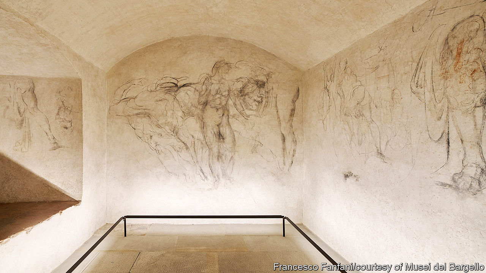

###### Indecipherable fingerprints

# A secret room in Florence boasts drawings by Michelangelo 

##### The artist’s fingerprints are all over the walls—or are they? 

 

> Feb 15th 2024 

Standing in THE mausoleum of the Medici Chapel in Florence, among tombs and elegant sculptures designed by , you could be excused for failing to notice the doorway to the left. It leads to a cloakroom, where a trap door opens to a flight of narrow steps. At the bottom is a small vaulted room. The eggshell-white walls are covered with graceful nude figures, a falling Phaethon (son of the sun god), a looming horse’s head and several shapely legs drawn in shadowy charcoal—sketches, the museum claims, by the great Renaissance artist himself. 

This (secret room) had long been closed. Only scholars and bigwigs like  and Leonardo DiCaprio were allowed entry by the National Museum of the Bargello, of which the chapel is a part. But in November the basement room was opened for a trial period of four months to 100 pre-booked visitors a week; they are allowed in for 15 minutes in groups of four. Tickets sold out. Officials recently extended the experiment until July. 

Entering the room, which is bare except for ankle-level strips of LED lighting, is like stepping back in time—not just into the Renaissance, but also into an earlier era of tourism, when attractions lacked explanatory placards and were free from madding crowds. Most of all, it feels like entering someone’s head, or their notebook, filled with drafts and doodles, some finely wrought, some cartoonish. You can imagine the middle-aged master in here, perhaps drawing by night. In several places, the walls appear to be scorched with black soot from a burning torch. Near a rendering of a muscular figure, there is even a smudged handprint.

Legend has it that Michelangelo holed up in this  for a few months in 1530. Following a popular uprising three years before, the artist sided with those who preferred a republic to rule by the , Italy’s wealthiest family, even though he had designed the mausoleum that bears their name. When the Medicis returned, the artist was in danger. This small room, conveniently furnished with a well, might have seemed like a safe haven. 

The drawings were rediscovered in 1975 by the Medici Chapel’s then director, who suspected that what was then a coal-storage room might be hiding something. Paola D’Agostino, director of the Bargello until mid-January, felt it was important to finally make the room accessible to the public. It shows “Michelangelo’s human aspect”, she says, though she admits that it is impossible to attribute the drawings securely to the master and concedes that some of the doodles are probably not his work.

Other experts doubt it was Michelangelo’s hand who drew them. Antonio Forcellino, who has written two biographies of the artist, believes that none of the drawings is of high enough quality to merit firm attribution. William Wallace, a professor at Washington University in St Louis and a leading expert on Michelangelo, thinks that only a couple may be by the artist—a head that resembles the famous Laocoon statue Michelangelo had seen in , as well as a standing male figure gracing a whole wall near the stairs—and that most were made by some of the 50 or so workmen employed to build the chapel above. 

As for Michelangelo hiding in the room? “That’s totally bogus,” according to Mr Wallace. The already-famous artist is more likely to have been protected by a friend. Yet Mr Wallace argues that the room is a landmark finding nonetheless, because Michelangelo’s workmen “are in some ways equal in importance to Michelangelo” himself. Greatness does not exist in isolation. 

Just as the little guys are often overshadowed by the old masters they worked for, drawing often loses out to flashier forms like painting and sculpture. But the humble medium communicates the presence of hands, and minds, in motion. 

Looking at these walls, you feel as if the artists who adorned them nearly five centuries ago—perhaps hiding from the summer heat, or taking a drink from the well—have just left. Even if this is not the work of Michelangelo, it evokes his world. ■


